# Домашнее задание к занятию "3.1. Работа в терминале, лекция 1"

1. Скачал дистрибутив и установил средство виртуализации [Oracle VirtualBox](https://www.virtualbox.org/). 
      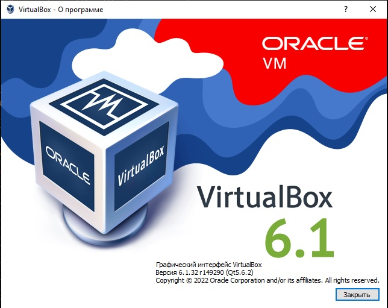
1. Скачал дистрибутив и установил средство автоматизации [Hashicorp Vagrant](https://www.vagrantup.com/).

1. В основном окружении подготовил терминал Windows Terminal в Windows
	
1. С помощью базового файла конфигурации запустиk Ubuntu 20.04 в VirtualBox посредством Vagrant:

	* Создал директорию `C:\Users\lint\vagrant`, в которой будут храниться конфигурационные файлы Vagrant. </br> Выполнил `vagrant init`. И заменил содержимое Vagrantfile по умолчанию следующим:

		```bash
		Vagrant.configure("2") do |config|
			config.vm.box = "bento/ubuntu-20.04"
		end
		```

	* Выполнил в этой директории `vagrant up` - установился провайдер VirtualBox для Vagrant, был скачан необходимый образ и запущена виртуальная машина.

1. Ознакомился с графическим интерфейсом VirtualBox:
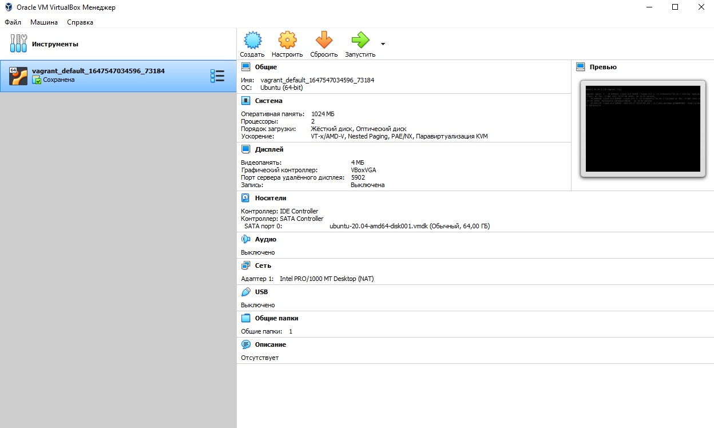

1. Ознакомился с возможностями конфигурации VirtualBox через Vagrantfile: [документация](https://www.vagrantup.com/docs/providers/virtualbox/configuration.html). Добавил оперативную память до **2048** и количество ядер процессора до **4**:
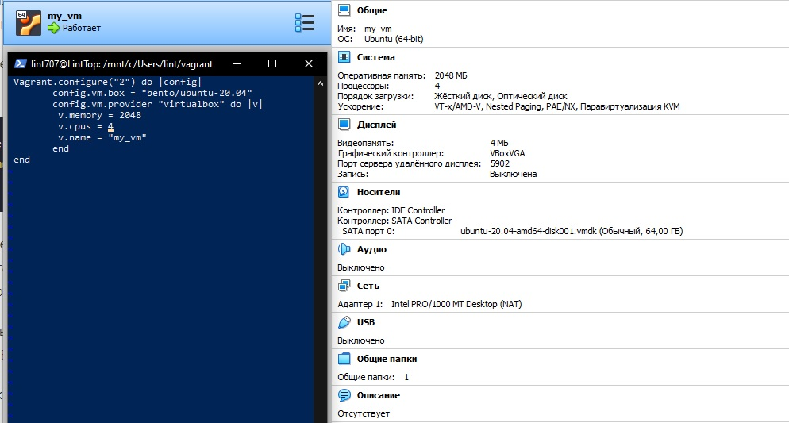

1. Выполнил команду `vagrant ssh` из директории, в которой содержится Vagrantfile:
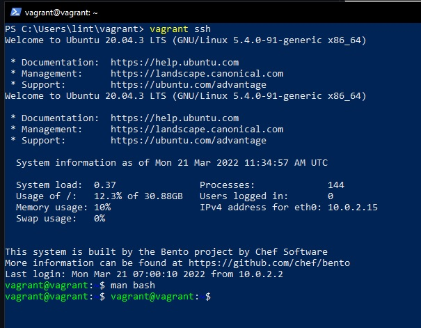

1. Ознакомился с разделами `man bash`:
    * Переменной `HISTFILESIZE` можно задать длину журнала `history`, описывается это на cтрочке `846`.
    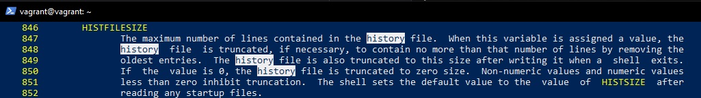
    
    * директива `ignoreboth` - сокращение для `ignorespace` и `ignoredups`, выполняет обе директивы.
	`ignorespace` - не сохраняет команды начинающиеся с пробела, 
	`ignoredups` - не сохраняет команду, если такая уже есть в истории
	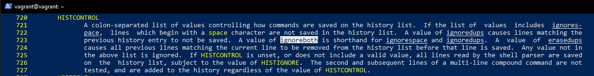
 
1. `{}` - это зарезервированные слова, список, исполнятся в текущем инстансе. Строка: 166
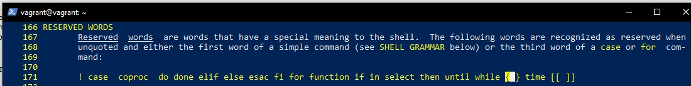

1. При выполнении `touch {000001..100000}.txt` - в текущей директории будет создано указанное число файлов.</br>
При попытке выполнить `touch {000001..300000}.txt` - файлы не создадутся, слишком длинный список аргументов.

1. В man bash выполиним поиск по `/\[\[`. Конструкция `[[ -d /tmp ]]` возвращает `0` или `1` в зависимости от выражения внутри. Успешное выполнение команды даёт в результате код возврата - `0`, что в данном случае это будет - `"true"`, т.к. выражение внутри проверяет существует директория  `/tmp`. 
	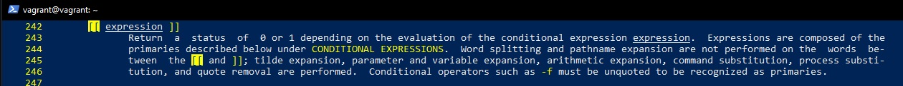
	
1. Основываясь на знаниях о просмотре текущих (например, PATH) и установке новых переменных; командах, которые мы рассматривали, добейтесь в выводе type -a bash в виртуальной машине наличия первым пунктом в списке:

	```bash
	bash is /tmp/new_path_directory/bash
	bash is /usr/local/bin/bash
	bash is /bin/bash
	``` 
	Результат: </br>
	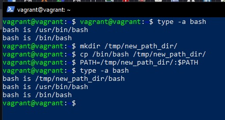
1. Чем отличается планирование команд с помощью `batch` и `at`? </br>
`at` - команда запускается в указанное время (в параметре) </br>
`batch` - запускается когда уровень загрузки системы снизится ниже 1.5  или значения, указанного при вызове atd.
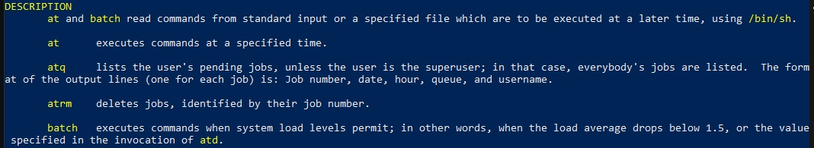

1. Завершил работу виртуальной машины чтобы не расходовать ресурсы компьютера и/или батарею ноутбука: </br>
	_*`vagrant suspend` выключит виртуальную машину с сохранением ее состояния (т.е., при следующем `vagrant up` будут запущены все процессы внутри, которые работали на момент вызова suspend) </br>
	*`vagrant halt` выключит виртуальную машину штатным образом.
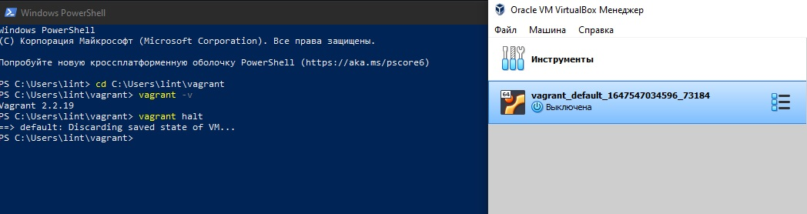
 
 ---
