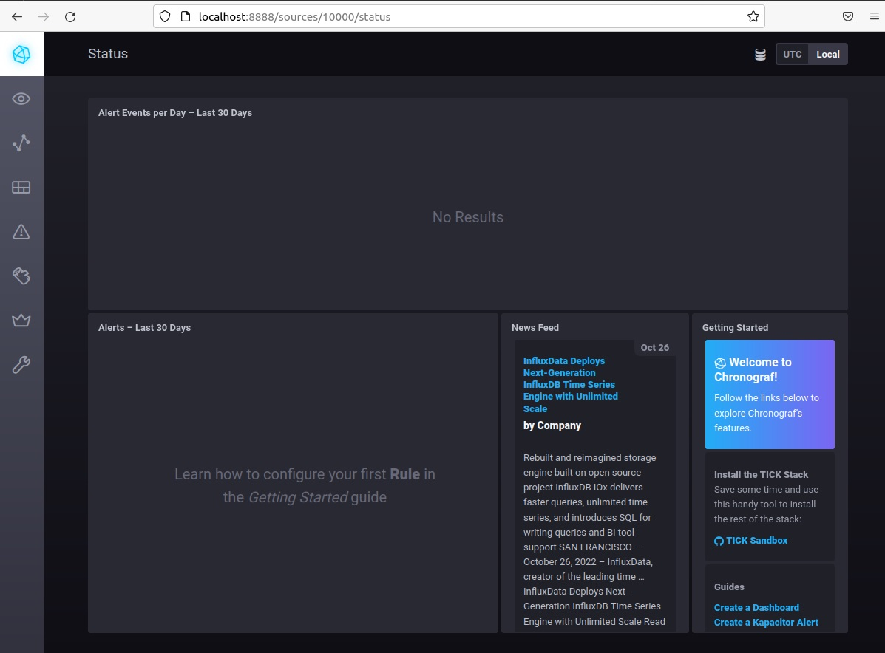
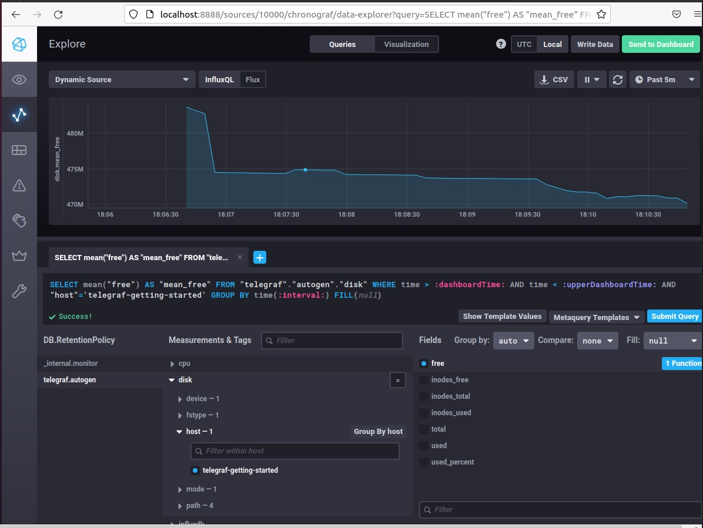
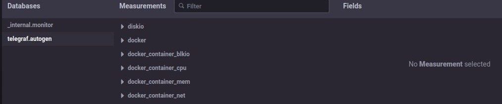

# Домашнее задание к занятию "10.02. Системы мониторинга"

## Обязательные задания

1. Опишите основные плюсы и минусы pull и push систем мониторинга.
#### Ответ:

●Push-модель подразумевает отправку данных с агентов (рабочих машин, с которых собираем мониторинг) в систему мониторинга, посредством вспомогательных служб или программ (обычно посредством UDP).  
**Плюсы:**  
> Модель удобна для использования в динамически создаваемых хостах к примеру для контейнеров, так как иначе система мониторинга должна будет узнавать о новых хостах для их опроса.  
> UDP является менее затратным способом передачи данных, но в данном случае остаётся проблема с гарантией доставки пакетов.  
> Более гибкая настройка отправки пакетов данных с метриками, когда на каждом клиенте можно задать объем данных и частоту отправки.  
 
**Минусы:**  
> Передача данных от агентов в открытом виде, есть риск потери данных при недоступности хоста или при недоступности системы мориторинга.  
> Передача данных в открытом виде по сети, при наличии "персональных данных" в метриках есть риск их утечки.  
> Сложнее собирать логи с агентов.  

●Pull-модель подразумевает последовательный или параллельный сбор системой мониторинга с агентов накопленной информации из вспомогательных служб.  
**Плюсы:**  
> Контроль над метриками с единой точки, возможность конеккта по SSL к агентам.  
> Лучший контроль за источниками метрик, всегда известно кто откуда что передает.    
> Возможно выподнять запросы метрики с изменяемой переодичностью и запрашивать метрики в ручном режиме в обход систем сбора.  

**Минусы:**  
> Неудобство для динамических машин или контейнеров, нужно динамически собирать статистику о наличии машин, нужен дополнительный оркестратор.  
> Сетевое взаимодействие по протоколу TCP менее быстро, но компенсируется надёжностью.  
> Сложнее организовать репликацию данных между разными системами мониторинга или их резервными копиями.  

2. Какие из ниже перечисленных систем относятся к push модели, а какие к pull? А может есть гибридные?

#### Ответ:
- `Prometheus` - PULL, но есть компонент, в который можно пушить метрики - push gateway.
- `TICK` - Гибридная.
- `Zabbix` - Гибридная.
- `VictoriaMetrics` - Гибридная.
- `Nagios` - PULL

3. Склонируйте себе [репозиторий](https://github.com/influxdata/sandbox/tree/master) и запустите TICK-стэк, 
используя технологии docker и docker-compose.(по инструкции ./sandbox up )
В виде решения на это упражнение приведите выводы команд с вашего компьютера (виртуальной машины):

#### Ответ:
```
user@user-VirtualBox:~/ansible_ntl/sandbox$ curl http://localhost:8086/ping -v
*   Trying 127.0.0.1:8086...
* TCP_NODELAY set
* Connected to localhost (127.0.0.1) port 8086 (#0)
> GET /ping HTTP/1.1
> Host: localhost:8086
> User-Agent: curl/7.68.0
> Accept: */*
> 
* Mark bundle as not supporting multiuse
< HTTP/1.1 204 No Content
< Content-Type: application/json
< Request-Id: 74c822a7-585d-11ed-8046-0242ac130002
< X-Influxdb-Build: OSS
< X-Influxdb-Version: 1.8.10
< X-Request-Id: 74c822a7-585d-11ed-8046-0242ac130002
< Date: Sun, 30 Oct 2022 14:16:33 GMT
< 
* Connection #0 to host localhost left intact
```
```
user@user-VirtualBox:~/ansible_ntl/sandbox$ curl http://localhost:8888
<!DOCTYPE html><html><head><link rel="stylesheet" href="/index.c708214f.css"><meta http-equiv="Content-type" content="text/html; charset=utf-8"><title>Chronograf</title><link rel="icon shortcut" href="/favicon.70d63073.ico"></head><body> <div id="react-root" data-basepath=""></div> <script type="module" src="/index.e81b88ee.js"></script><script src="/index.a6955a67.js" nomodule="" defer></script> </body></html>
```

```
user@user-VirtualBox:~/ansible_ntl/sandbox$ curl http://localhost:9092/kapacitor/v1/ping -v
*   Trying 127.0.0.1:9092...
* TCP_NODELAY set
* Connected to localhost (127.0.0.1) port 9092 (#0)
> GET /kapacitor/v1/ping HTTP/1.1
> Host: localhost:9092
> User-Agent: curl/7.68.0
> Accept: */*
> 
* Mark bundle as not supporting multiuse
< HTTP/1.1 204 No Content
< Content-Type: application/json; charset=utf-8
< Request-Id: a1951191-585d-11ed-804a-0242ac130005
< X-Kapacitor-Version: 1.6.5
< Date: Sun, 30 Oct 2022 14:17:48 GMT
< 
* Connection #0 to host localhost left intact
```

А также скриншот веб-интерфейса ПО chronograf (`http://localhost:8888`). 


P.S.: если при запуске некоторые контейнеры будут падать с ошибкой - проставьте им режим `Z`, например
`./data:/var/lib:Z`

4. Изучите список [telegraf inputs](https://github.com/influxdata/telegraf/tree/master/plugins/inputs).
    - Добавьте в конфигурацию telegraf плагин - [disk](https://github.com/influxdata/telegraf/tree/master/plugins/inputs/disk):
    ```
    [[inputs.disk]]
      ignore_fs = ["tmpfs", "devtmpfs", "devfs", "iso9660", "overlay", "aufs", "squashfs"]
    ```
    - Так же добавьте в конфигурацию telegraf плагин - [mem](https://github.com/influxdata/telegraf/tree/master/plugins/inputs/mem):
    ```
    [[inputs.mem]]
    ```
    - После настройки перезапустите telegraf.
 
    - Перейдите в веб-интерфейс Chronograf (`http://localhost:8888`) и откройте вкладку `Data explorer`.
    - Нажмите на кнопку `Add a query`
    - Изучите вывод интерфейса и выберите БД `telegraf.autogen`
    - В `measurments` выберите mem->host->telegraf_container_id , а в `fields` выберите used_percent. 
    Внизу появится график утилизации оперативной памяти в контейнере telegraf.
    - Вверху вы можете увидеть запрос, аналогичный SQL-синтаксису. 
    Поэкспериментируйте с запросом, попробуйте изменить группировку и интервал наблюдений.
    - Приведите скриншот с отображением
    метрик утилизации места на диске (disk->host->telegraf_container_id) из веб-интерфейса.  


5. Добавьте в конфигурацию telegraf следующий плагин - [docker](https://github.com/influxdata/telegraf/tree/master/plugins/inputs/docker):
```
[[inputs.docker]]
  endpoint = "unix:///var/run/docker.sock"
```

Дополнительно вам может потребоваться донастройка контейнера telegraf в `docker-compose.yml` дополнительного volume и 
режима privileged:
```
  telegraf:
    image: telegraf:1.4.0
    privileged: true
    volumes:
      - ./etc/telegraf.conf:/etc/telegraf/telegraf.conf:Z
      - /var/run/docker.sock:/var/run/docker.sock:Z
    links:
      - influxdb
    ports:
      - "8092:8092/udp"
      - "8094:8094"
      - "8125:8125/udp"
```

После настройки перезапустите telegraf, обновите веб интерфейс и приведите скриншотом список `measurments` в 
веб-интерфейсе базы telegraf.autogen . Там должны появиться метрики, связанные с docker.


Факультативно можете изучить какие метрики собирает telegraf после выполнения данного задания.

    ---
