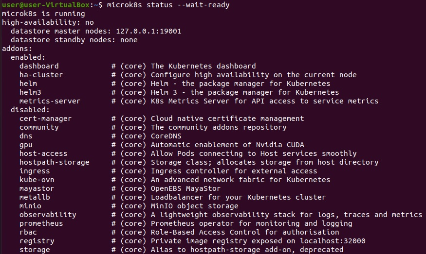
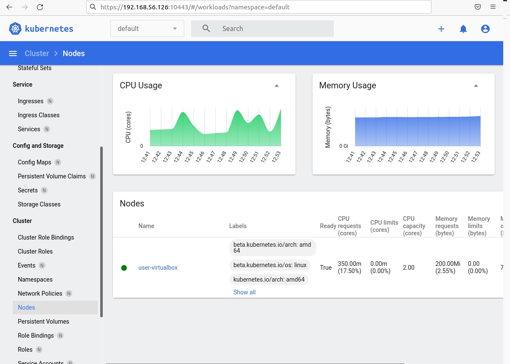

# Домашнее задание к занятию "Kubernetes. Причины появления. Команда kubectl"

### Задание 1. Установка MicroK8S

1. Установить MicroK8S на локальную машину или на удаленную виртуальную машину
2. Установить dashboard
3. Сгенерировать сертификат для подключения к внешнему ip-адресу

------

### Задание 2. Установка и настройка локального kubectl
1. Установить на локальную машину kubectl
2. Настроить локально подключение к кластеру
3. Подключиться к дашборду с помощью port-forward

------

### Правила приема работы

1. Домашняя работа оформляется в Github в своем репозитории в файле README.md. Выполненное домашнее задание пришлите ссылкой на .md-файл в вашем репозитории.
2. Файл README.md должен содержать скриншоты вывода команд `kubectl get nodes`, а также скриншот дашборда

------
