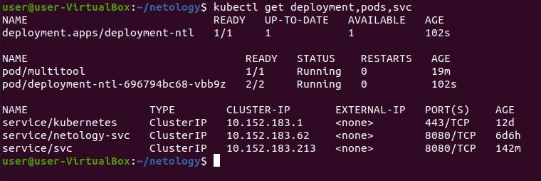
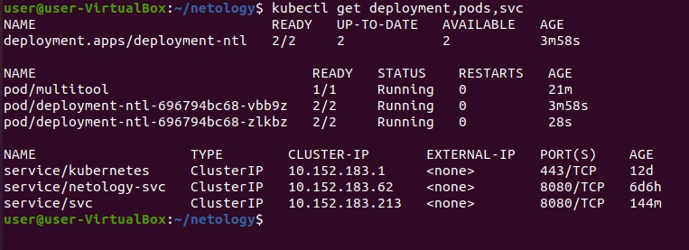
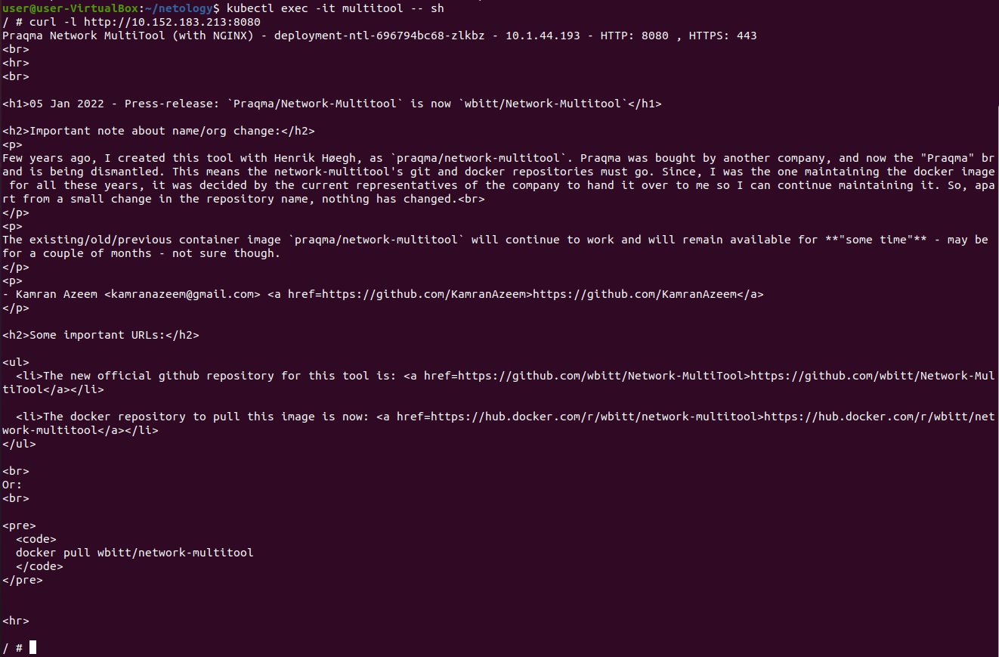
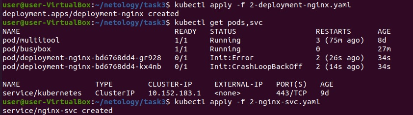
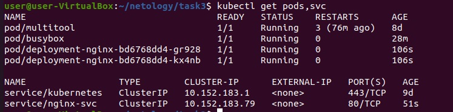

# Домашнее задание к занятию "Запуск приложений в K8S"

### Чеклист готовности к домашнему заданию

### Задание 1. Создать Deployment и обеспечить доступ к репликам приложения из другого Pod'а

1. Создать Deployment приложения состоящего из двух контейнеров - nginx и multitool. Решить возникшую ошибку
2. После запуска увеличить кол-во реплик работающего приложения до 2
3. Продемонстрировать кол-во подов до и после масштабирования

4. Создать Service, который обеспечит доступ до реплик приложений из п.1
5. Создать отдельный Pod с приложением multitool и убедиться с помощью `curl` что из пода есть доступ до приложений из п.1
  
  
[deployment](file/1-deployment-netology.yaml)  
[pod-multitool](file/1-pod-multitool.yaml)  

------

### Задание 2. Создать Deployment и обеспечить старт основного контейнера при выполнении условий

1. Создать Deployment приложения nginx и обеспечить старт контейнера только после того, как будет запущен сервис этого приложения
2. Убедиться, что nginx не стартует. В качестве init-контейнера взять busybox
3. Создать и запустить Service. Убедиться, что nginx запустился

4. Продемонстрировать состояние пода до и после запуска сервиса
  
[deployment](file/2-deployment-nginx.yaml)  
[service](file/2-nginx-svc.yaml)  

------
