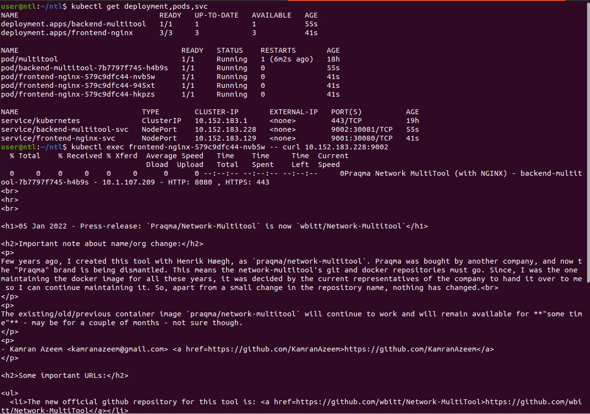
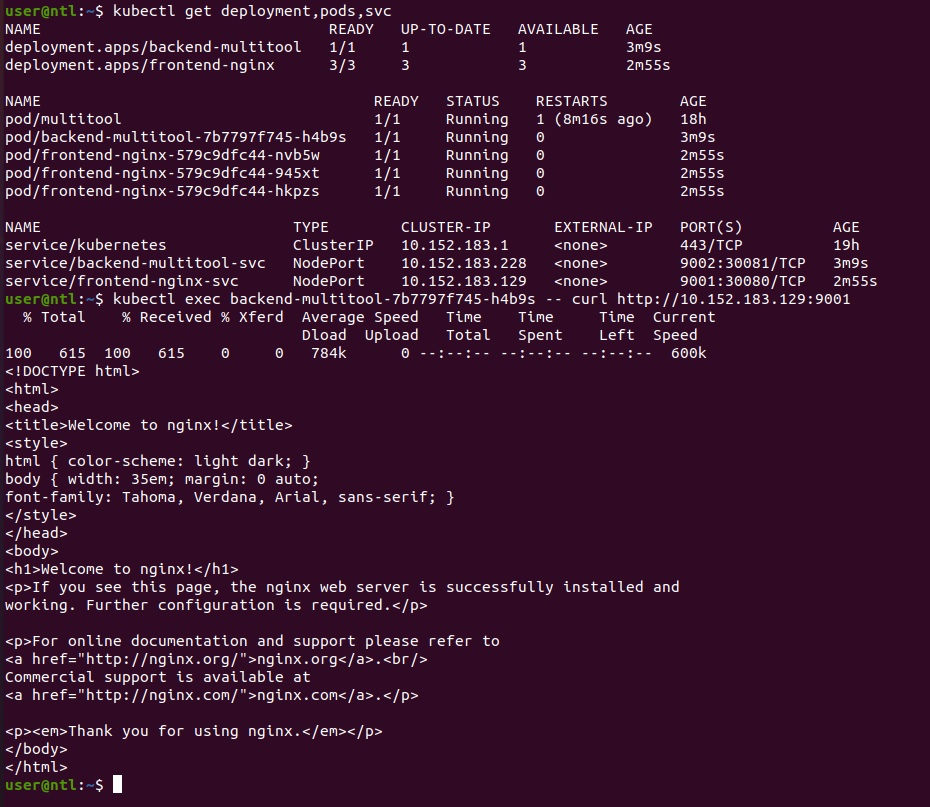
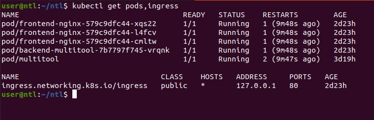
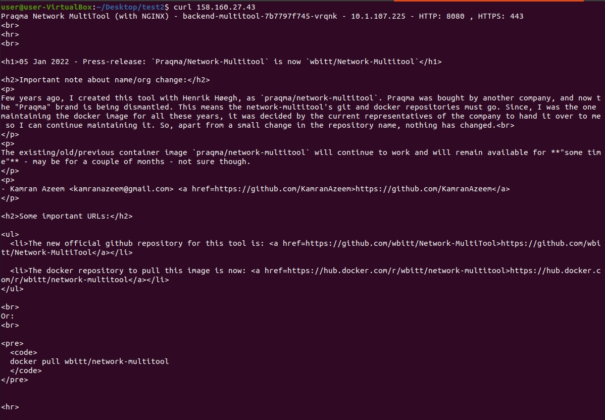
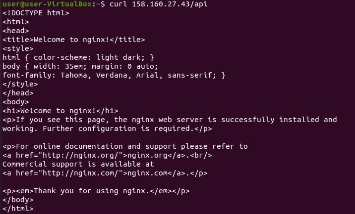

# Домашнее задание к занятию "Сетевое взаимодействие в K8S. Часть 2"

### Задание 1. Создать Deployment приложений backend и frontend

1. Создать Deployment приложения _frontend_ из образа nginx с кол-вом реплик 3 шт.
2. Создать Deployment приложения _backend_ из образа multitool. 
3. Добавить Service'ы, которые обеспечат доступ к обоим приложениям внутри кластера. 
4. Продемонстрировать, что приложения видят друг друга с помощью Service.  
  
  
  
5. Предоставить манифесты Deployment'а и Service в решении, а также скриншоты или вывод команды п.4.  
[deployment-frontend](file/deployment-frontend.yaml)  
[deployment-backend](file/deployment-backend.yaml)  

------

### Задание 2. Создать Ingress и обеспечить доступ к приложениям снаружи кластера

1. Включить Ingress-controller в microk8s
2. Создать Ingress, обеспечивающий доступ снаружи по IP-адресу кластера microk8s, так чтобы при запросе только по адресу открывался _frontend_ а при добавлении /api - _backend_
3. Продемонстрировать доступ с помощью браузера или `curl` с локального компьютера  

  
  
  
  
4. Предоставить манифесты, а также скриншоты или вывод команды п.2  
[ingress](file/ingress.yaml)  
[deployment-frontend](file/deployment-frontend.yaml)  
[deployment-backend](file/deployment-backend.yaml)  

------
