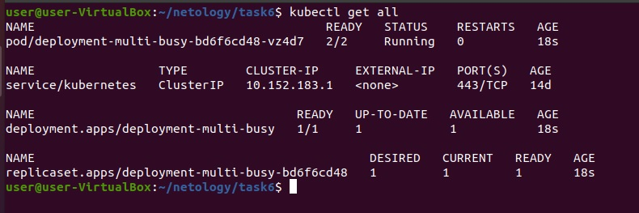
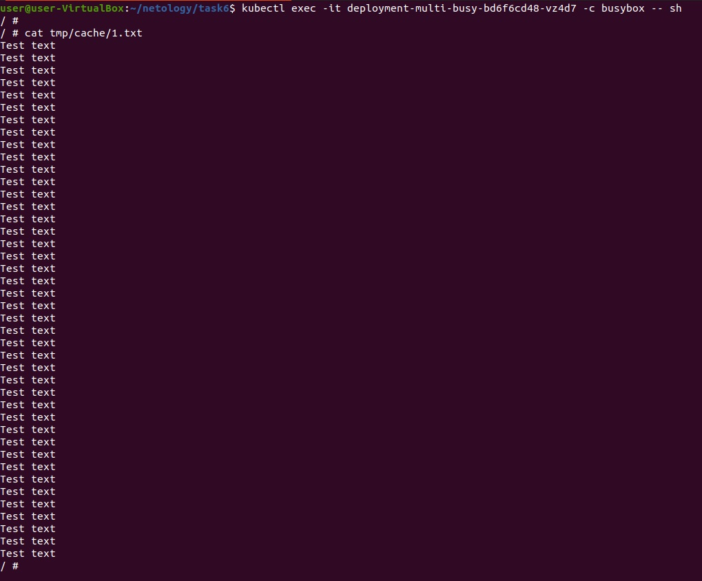
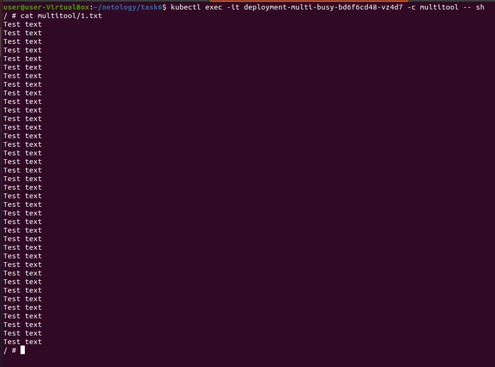
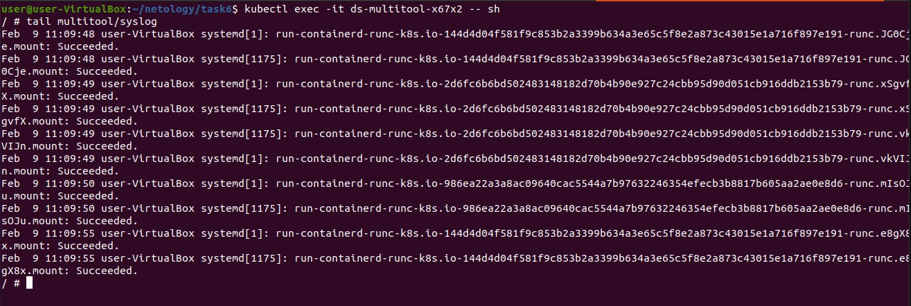

# Домашнее задание к занятию "Хранение в K8s. Часть 1"

### Задание 1. Создать Deployment приложения, состоящего из двух контейнеров и обменивающихся данными

1. Создать Deployment приложения, состоящего из контейнеров busybox и multitool.  
2. Сделать так, чтобы busybox писал каждые 5 секунд в некий файл в общей директории.  
3. Обеспечить возможность чтения файла контейнером multitool.  
4. Продемонстрировать, что multitool может читать файл, который периодоически обновляется.  
  
  
  
5. Предоставить манифесты Deployment'а в решении, а также скриншоты или вывод команды п.4  
[Deployment](file/13_1-Deployment.yaml)  

------

### Задание 2. Создать DaemonSet приложения, которое может прочитать логи ноды

1. Создать DaemonSet приложения состоящего из multitool.  
2. Обеспечить возможность чтения файла `/var/log/syslog` кластера microK8S.  
3. Продемонстрировать возможность чтения файла изнутри пода.  
  

4. Предоставить манифесты Deployment, а также скриншоты или вывод команды п.2  
[DaemonSet](file/13_1-DaemonSet.yaml)  

------
