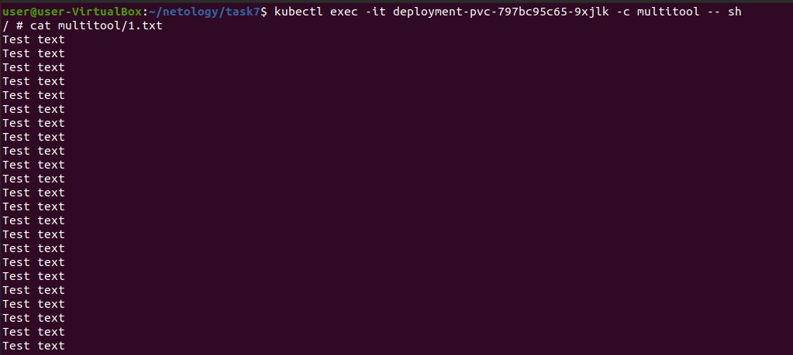
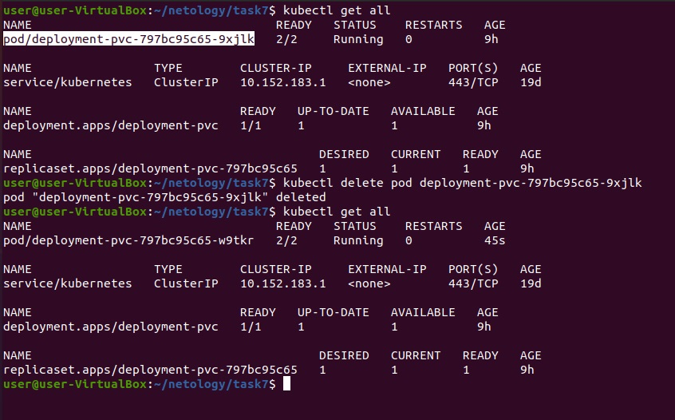
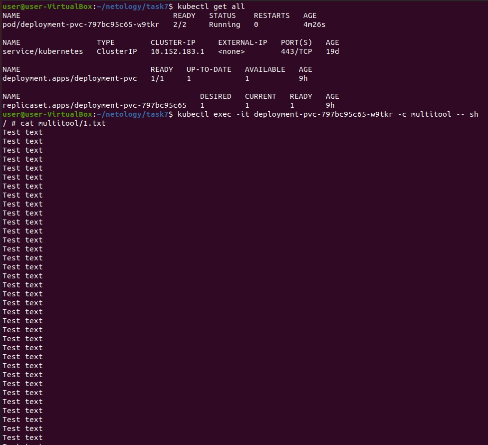
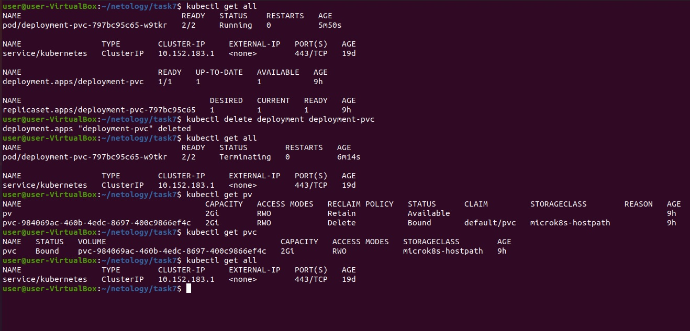
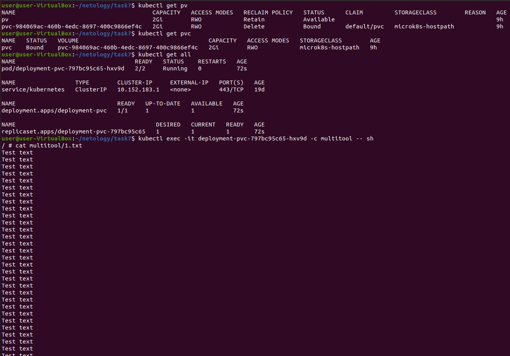
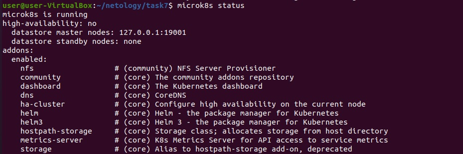
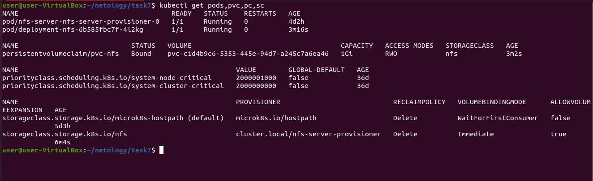

# Домашнее задание к занятию "Хранение в K8s. Часть 2"

### Задание 1. Создать Deployment приложения, использующего локальный PV, созданный вручную

1. Создать Deployment приложения состоящего из контейнеров busybox и multitool.
2. Создать PV и PVC для подключения папки на локальной ноде, которая будет использована в поде.
3. Продемонстрировать, что multitool может читать файл, в который busybox пишет каждые 5 секунд в общей директории.  
  

4. Продемонстрировать, что файл сохранился на локальном диске ноды, а также что произойдет с файлом после удаления пода и deployment'а. Почему?  
  
  
После удаления пода, автоматически создаётся новый и он так же имеет доступ к ранее настроенным `PV` и `PVC`.  
  
  
  
После удаления deployment, удаляется только под, `PV` и `PVC` остаются и при повторном включении новый под будет так же ссылаться на ранее настроенные `PV` и `PVC`.

5. Предоставить манифесты, а также скриншоты и/или вывод необходимых команд.  
[deployment](file/1-deployment-pvc.yaml)  
[PV](file/1-PV.yaml)  
[PVC](file/1-PVC.yaml)  

------

### Задание 2. Создать Deployment приложения, которое может хранить файлы на NFS с динамическим созданием PV

1. Включить и настроить NFS-сервер на microK8S.
2. Создать Deployment приложения состоящего из multitool и подключить к нему PV, созданный автоматически на сервере NFS
3. Продемонстрировать возможность чтения и записи файла изнутри пода. 

4. Предоставить манифесты, а также скриншоты и/или вывод необходимых команд.
  
  

[deployment](file/2-deployment-my.yaml)  
[PVC](file/2-PVC.yaml)  

------
