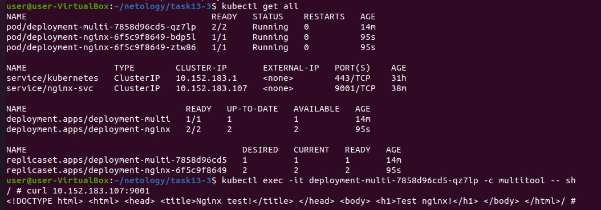

# Домашнее задание к занятию "Конфигурация приложений"

### Задание 1. Создать Deployment приложения и решить возникшую проблему с помощью ConfigMap. Добавить web-страницу

1. Создать Deployment приложения, состоящего из контейнеров busybox и multitool.
2. Решить возникшую проблему с помощью ConfigMap
3. Продемонстрировать, что pod стартовал, и оба конейнера работают.
4. Сделать простую web-страницу и подключить ее к Nginx с помощью ConfigMap. Подключить Service и показать вывод curl или в браузере.  
  
  
5. Предоставить манифесты, а также скриншоты и/или вывод необходимых команд.  
[Deployment-busybox-multitool](file/1-deployment.yaml)  
[ConfigMap-busybox-multitool](file/1-cm-mt.yaml)  
[Deployment-nginx](file/1-deployment-nginx.yaml)  
[Service-nginx](file/1-service-nginx.yaml)  
[Configmao-nginx](file/1-cm-nginx.yaml)  
  
------

### Задание 2. Создать приложение с вашей web-страницей, доступной по HTTPS 

1. Создать Deployment приложения состоящего из nginx.
2. Создать собственную web-страницу и подключить ее как ConfigMap к приложению.
3. Выпустить самоподписной сертификат SSL. Создать Secret для использования данного сертификата.
4. Создать Ingress и необходимый Service, подключить к нему SSL в вид. Продемонстировать доступ к приложению по HTTPS. 
4. Предоставить манифесты, а также скриншоты и/или вывод необходимых команд.

------
