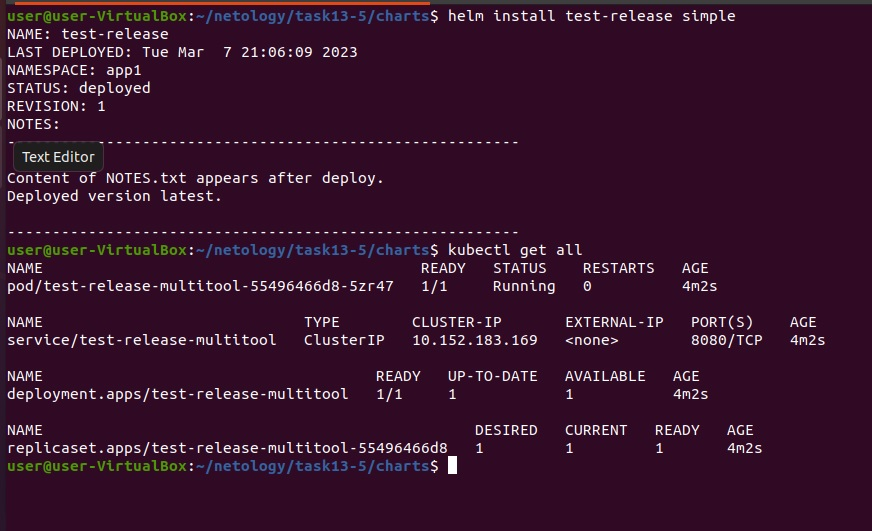
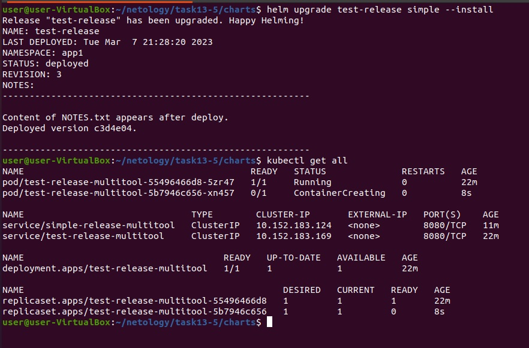
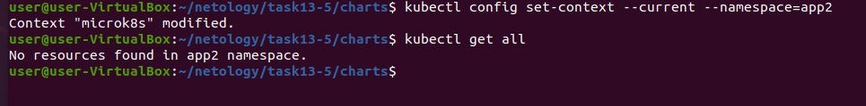
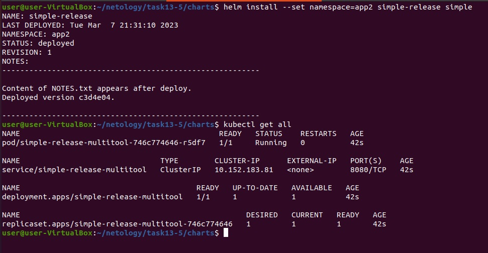
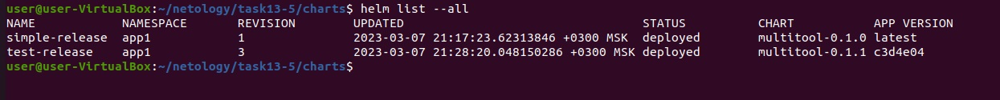

# Домашнее задание к занятию "Helm"

------

### Задание 1. Подготовить helm чарт для приложения

1. Необходимо упаковать приложение в чарт для деплоя в разные окружения.  
2. Каждый компонент приложения деплоится отдельным deployment’ом/statefulset’ом/  
3. В переменных чарта измените образ приложения для изменения версии.  
[helm chart](file/simple.zip)  
[helm template first](file/helmtemplatefirst.yaml)  

------

### Задание 2. Запустить 2 версии в разных неймспейсах  

1. Подготовив чарт, необходимо его проверить. Запуститe несколько копий приложения.  
2. Одну версию в namespace=app1, вторую версию в том же неймспейсе;третью версию в namespace=app2.  
3. Продемонстрируйте результат.  
  
  
  
  
  

------
