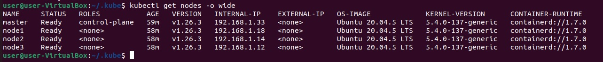
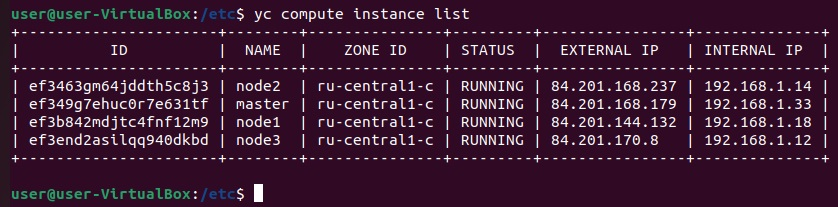

# Домашнее задание к занятию "Установка кластера K8s"

### Задание 1. Установить кластер k8s с 1 master node

1. Подготовка работы кластера из 4 нод: 1 мастер и 3 рабочие ноды.
2. В качестве CRI — containerd. В файле `k8s_cluster.yml` установлено: `container_manager: containerd`
3. Запуск etcd производить на мастере.
4. Способ установки - [kubespray](https://kubespray.io/)

Результат выполнение на локальной машине: `kubectl get nodes`:

[host.yaml](file/host.yaml)
