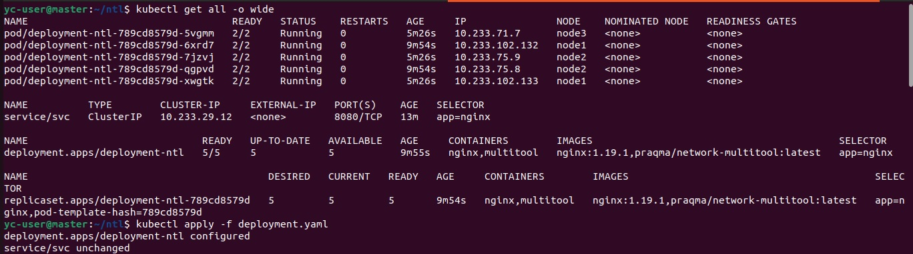
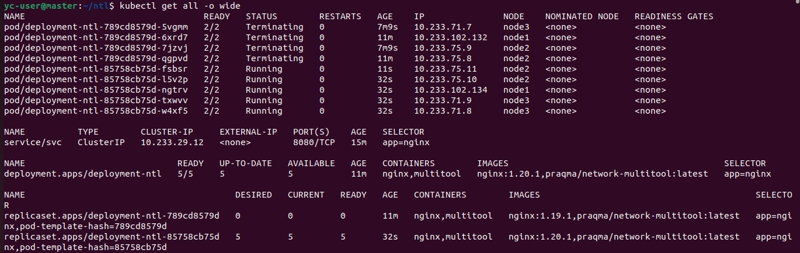
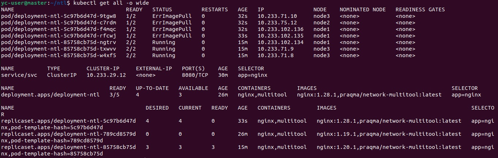
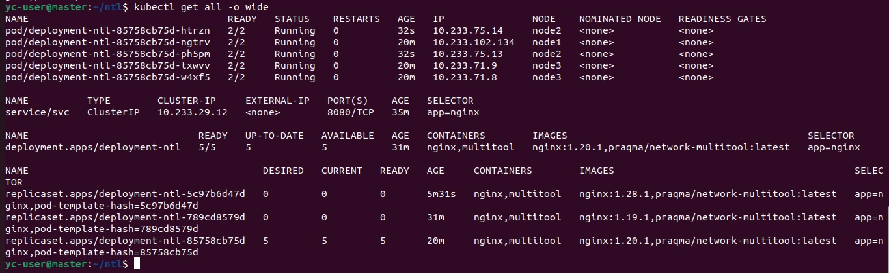

# Домашнее задание к занятию "Обновление приложений"

### Задание 1. Выбрать стратегию обновления приложения и описать ваш выбор.  
Подходит `Rolling Update` – с постепенным обновлением, в деплойменте укажем:  
```
strategy:
type: RollingUpdate
rollingUpdate:
maxSurge: 20%
maxUnavailable: 20%
```
Так как запас ресурсов ограничен, установим значение `maxSurge: 20%` -  который равен запасупо весурсам в свободное время.  
Поды будут постепенно заменяться новыми, в случае если новые поды не запустятся, то будут работать оставшиеся с старой версией, а так как `maxUnavailable: 20%`, то не будет недостатка ресурсов у старых подов.  

### Задание 2. Обновить приложение.

1. Создать deployment приложения с контейнерами nginx и multitool. Версию nginx взять 1.19. Кол-во реплик - 5.  
[deployment](file/deployment-rollingupd.yaml)  
  

2. Обновить версию nginx в приложении до версии 1.20, сократив время обновления до минимума. Приложение должно быть доступно.  


3. Попытаться обновить nginx до версии 1.28, приложение должно оставаться доступным.  


4. Откатиться после неудачного обновления.  
Выполнили:  
```
kubectl rollout undo deployment deployment-ntl
deployment.apps/deployment-ntl rolled back
```



