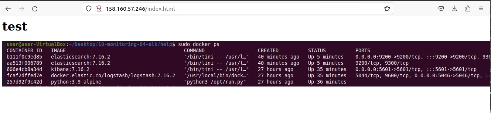
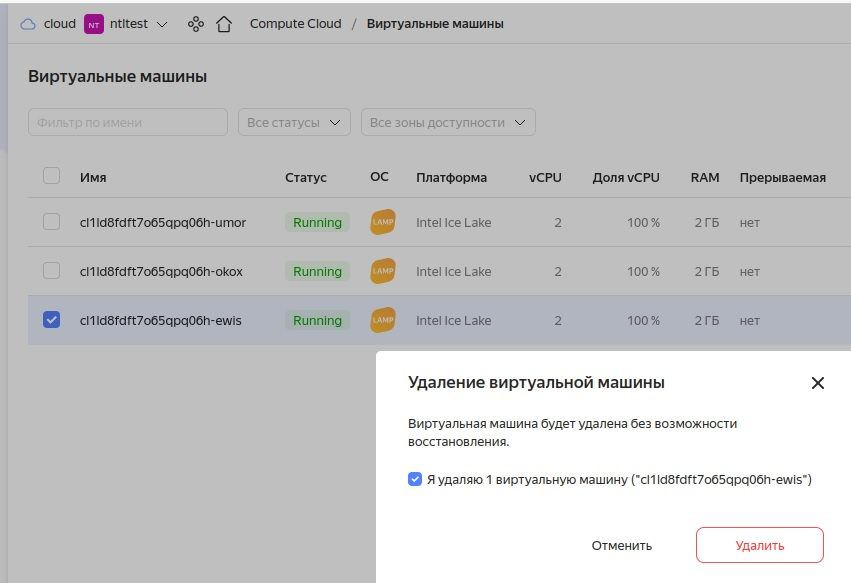
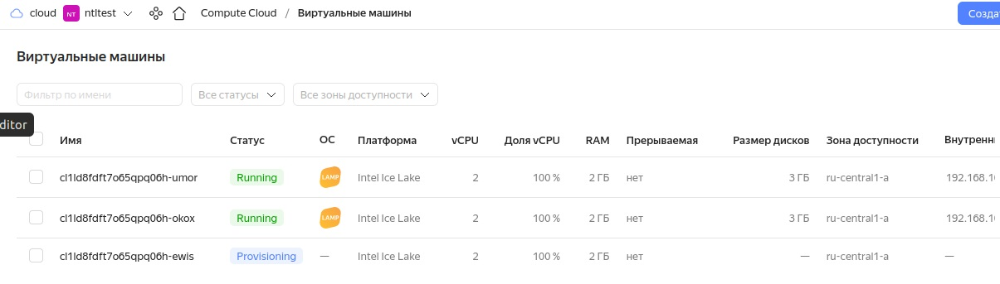

# Домашнее задание к занятию «Вычислительные мощности. Балансировщики нагрузки»   

---
## Задание 1. Yandex Cloud   

**Что нужно сделать**  

1. Создал бакет Object Storage и разместил в нём файл с картинкой:  
 - Создал бакет в Object Storage с произвольным именем (например, _имя_студента_дата_).  
   
 - Положил в бакет файл с картинкой.  
 - Сделал файл доступным из интернета.  
   

2. Создал группу ВМ в public подсети фиксированного размера с шаблоном LAMP и веб-страницей, содержащей ссылку на картинку из бакета:  
 - Создал Instance Group с тремя ВМ и шаблоном LAMP.   
 - Для создания стартовой веб-страницы использовал раздел `user_data` в [meta_data](https://cloud.yandex.ru/docs/compute/concepts/vm-metadata).  
 - Разместил в стартовой веб-странице шаблонной ВМ ссылку на картинку из бакета.  
   

 - Настроил проверку состояния ВМ.  
  

3. Подключил группу к сетевому балансировщику:  
 - Создал сетевой балансировщик.  
 - Проверил работоспособность, удалив одну или несколько ВМ.  
  
  

Манифест:  
[main.tf](file/main15-2.tf)  

Изменил в манифесте:  
```    
    metadata = {
      user-data = <<EOF
#!/bin/bash
sudo wget https://storage.yandexcloud.net/vasya-20-11-2000/elk.jpg -O /var/www/html/elk.jpg
echo "<html><body></body></html>" > /var/www/html/index.html
EOF
    }
```    
