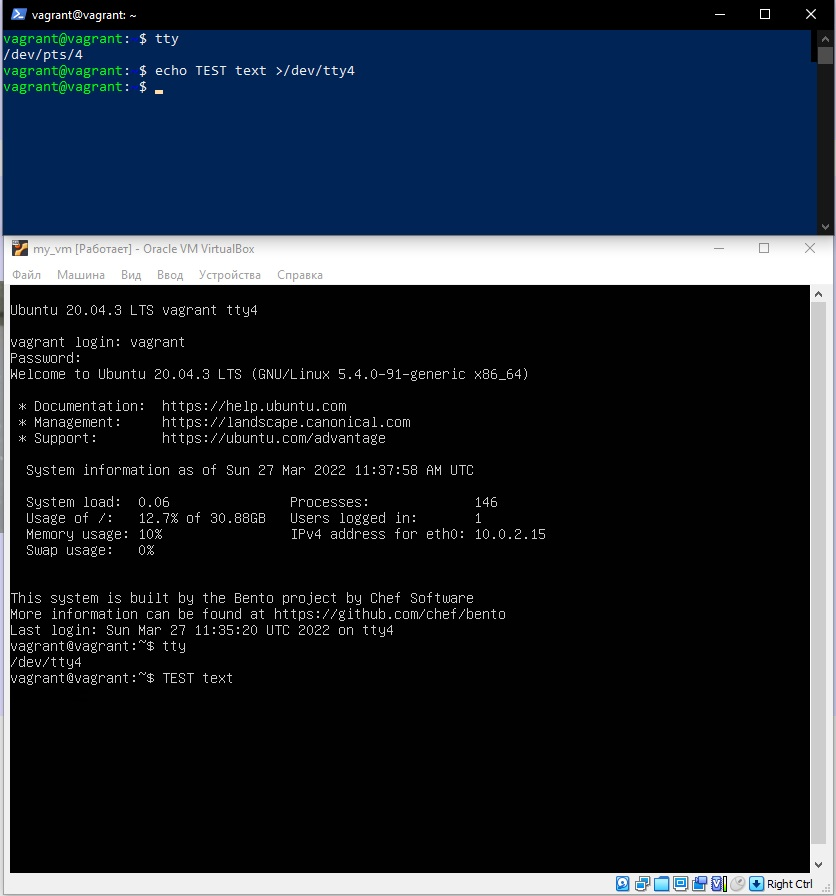

# Домашнее задание к занятию "3.2. Работа в терминале, лекция 2"

1. Команда `cd`, является внутненней. Попробуйте объяснить, почему она именно такого типа; опишите ход своих мыслей, если считаете что она могла бы быть другого типа.
    ```
    vagrant@vagrant:~$ type cd
	 cd is a shell builtin
    ```
	Если бы команда `cd` была внешней, то при каждой смене указателя на директорию, требовалось заново вызвать `bash` из этого *(нового каталога)*, но тогда мы получим новый shell.

1. Альтернативой без pipe для команды `grep <some_string> <some_file> | wc -l`, будет использование `-c` или `--count`.
    ```
	vagrant@vagrant:~/test2$ grep second new.txt | wc -l
	1
	vagrant@vagrant:~/test2$ grep second new.txt -c
	1
    ```

1. Выполнив: `pstree -p` находим процесс с PID `1` является родителем для всех процессов в вашей виртуальной машине Ubuntu 20.04.
    ```
	systemd(1)─┬─VBoxService(876)─┬─{VBoxService}(878)
	           │                  ├─{VBoxService}(879)
	           │                  ├─{VBoxService}(880)
	           │                  ├─{VBoxService}(881)
	           │                  ├─{VBoxService}(882)
	           │                  ├─{VBoxService}(883)
	           │                  ├─{VBoxService}(884)
	           │                  └─{VBoxService}(885)
	           ├─accounts-daemon(659)─┬─{accounts-daemon}(666)
	           │                      └─{accounts-daemon}(724)
	           ├─agetty(704)
	           ├─atd(688)
	           ├─cron(686)
	           ├─dbus-daemon(660)
	           ├─irqbalance(665)───{irqbalance}(672)
	           ├─multipathd(560)─┬─{multipathd}(561)
	           │                 ├─{multipathd}(562)
	           │                 ├─{multipathd}(563)
	           │                 ├─{multipathd}(564)
	           │                 ├─{multipathd}(565)
	           │                 └─{multipathd}(566)
	           ├─networkd-dispat(667)
	           ├─polkitd(732)─┬─{polkitd}(733)
	           │              └─{polkitd}(735)
	           ├─rsyslogd(669)─┬─{rsyslogd}(700)
	           │               ├─{rsyslogd}(701)
	           │               └─{rsyslogd}(702)
	           ├─snapd(671)─┬─{snapd}(897)
	           │            ├─{snapd}(898)
	           │            ├─{snapd}(899)
	           │            ├─{snapd}(900)
	           │            ├─{snapd}(901)
	           │            ├─{snapd}(940)
	           │            ├─{snapd}(941)
	           │            ├─{snapd}(942)
	           │            ├─{snapd}(947)
	           │            ├─{snapd}(987)
	           │            ├─{snapd}(988)
	           │            ├─{snapd}(1004)
	           │            ├─{snapd}(1005)
	           │            └─{snapd}(1432)
	           ├─sshd(715)───sshd(1332)───sshd(1384)───bash(1385)───bash(1395)───pstree(2193)
	           ├─systemd(1346)───(sd-pam)(1350)
	           ├─systemd-journal(375)
	           ├─systemd-logind(680)
	           ├─systemd-network(642)
	           ├─systemd-resolve(644)
	           ├─systemd-udevd(410)
	           └─udisksd(681)─┬─{udisksd}(705)
	                          ├─{udisksd}(725)
	                          ├─{udisksd}(739)
	                          └─{udisksd}(761)
    ```
1. Как будет выглядеть команда, которая перенаправит вывод stderr `ls` на другую сессию терминала?
Выполение на /dev/pts/0:
    ```
    vagrant@vagrant:~$ ls -l /test3 2>/dev/pts/1
	vagrant@vagrant:~$
    ```
	Результат в /dev/pts/1:`vagrant@vagrant:~$ whols: cannot access '/test3': No such file or directory`
	
1. Пример с одновременной передачей для файла команды на stdin и выводом ее stdout в другой файл.
    ```
	vagrant@vagrant:~/test2$ cat new.txt
	first text
	
	second text
	vagrant@vagrant:~/test2$ cat new2.txt
	cat: new2.txt: No such file or directory
	vagrant@vagrant:~/test2$ cat <new.txt >new2.txt
	vagrant@vagrant:~/test2$ cat new2.txt
	first text
	
	second text
	vagrant@vagrant:~/test2$
    ```
    
    `cat < new.txt > new2.txt` - получается перенаправили поток вывода из файла new.txt в поток ввода команды cat , затем поток вывода команды cat в файл new2.txt 
    
1. Получилось вывести  вывести данные из PTY в какой-либо из эмуляторов TTY. 
    ```
	vagrant@vagrant:~$ tty
	/dev/pts/4
	vagrant@vagrant:~$ echo TEST text >/dev/tty4
	vagrant@vagrant:~$
    ```
   Отобразилось в данном виде:
   

1. При выполнении команды `bash 5>&1`, создаётся новый дескриптор `5`, который перенаправит в `1`.
    ```
	vagrant@vagrant:~$ echo netology > /proc/$$/fd/5
	-bash: /proc/1385/fd/5: No such file or directory
	
	vagrant@vagrant:~$ bash 5>&1
	
	vagrant@vagrant:~$ ls -l /proc/$$/fd
	total 0
	lrwx------ 1 vagrant vagrant 64 Mar 25 08:07 0 -> /dev/pts/0
	lrwx------ 1 vagrant vagrant 64 Mar 25 08:07 1 -> /dev/pts/0
	lrwx------ 1 vagrant vagrant 64 Mar 25 08:07 2 -> /dev/pts/0
	lrwx------ 1 vagrant vagrant 64 Mar 25 08:07 255 -> /dev/pts/0
	lrwx------ 1 vagrant vagrant 64 Mar 25 08:07 5 -> /dev/pts/0
	
	vagrant@vagrant:~$ echo netology > /proc/$$/fd/5
	netology
    ```
    При выполнении запроса в дескриптор `5`, будет перенаправлен в `stdout`, как результат на экран будет выведено: `netology`, ранее до создания перенаправления при выполнения данной команды получали ошибку, ввиду его отсутсвия.
    
1. Результат:
    ```
	vagrant@vagrant:~$ ls -l /test3 4>&2 2>&1 1>&4 |grep directory
	ls: cannot access '/test3': No such file or directory
	vagrant@vagrant:~$
    ```
	Где: </br>
	4>&2 - дескриптор `4` перенаправили в stderr </br>
	2>&1 - stderr перенаправили в stdout </br>
	1>&4 - stdout - перенаправили в дескриптор `4` </br>

1. Команда `cat /proc/$$/environ` выведет окружение `environment` или набор пар *ПЕРЕМЕННАЯ=ЗНАЧЕНИЕ*, доступный каждому пользовательскому процессу.
Получить аналогичный по содержанию вывод можно выполнив: `vagrant@vagrant:~/test2$ env` или `vagrant@vagrant:~/test2$ printenv`
    ```
	SHELL=/bin/bash
	PWD=/home/vagrant/test2
	LOGNAME=vagrant
	XDG_SESSION_TYPE=tty
	MOTD_SHOWN=pam
	HOME=/home/vagrant
	LANG=en_US.UTF-8
	LS_COLORS=rs=0:di=01;34:ln=01;36:mh=00:pi=40;33:so=01;35:do=01;35:bd=40;33;01:cd=40;33;01:or=40;31;01:mi=00:su=37;41:sg=30;43:ca=30;41:tw=30;42:ow=34;42:st=37;44:ex=01;32:*.tar=01;31:*.tgz=01;31:*.arc=01;31:*.arj=01;31:*.taz=01;31:*.lha=01;31:*.lz4=01;31:*.lzh=01;31:*.lzma=01;31:*.tlz=01;31:*.txz=01;31:*.tzo=01;31:*.t7z=01;31:*.zip=01;31:*.z=01;31:*.dz=01;31:*.gz=01;31:*.lrz=01;31:*.lz=01;31:*.lzo=01;31:*.xz=01;31:*.zst=01;31:*.tzst=01;31:*.bz2=01;31:*.bz=01;31:*.tbz=01;31:*.tbz2=01;31:*.tz=01;31:*.deb=01;31:*.rpm=01;31:*.jar=01;31:*.war=01;31:*.ear=01;31:*.sar=01;31:*.rar=01;31:*.alz=01;31:*.ace=01;31:*.zoo=01;31:*.cpio=01;31:*.7z=01;31:*.rz=01;31:*.cab=01;31:*.wim=01;31:*.swm=01;31:*.dwm=01;31:*.esd=01;31:*.jpg=01;35:*.jpeg=01;35:*.mjpg=01;35:*.mjpeg=01;35:*.gif=01;35:*.bmp=01;35:*.pbm=01;35:*.pgm=01;35:*.ppm=01;35:*.tga=01;35:*.xbm=01;35:*.xpm=01;35:*.tif=01;35:*.tiff=01;35:*.png=01;35:*.svg=01;35:*.svgz=01;35:*.mng=01;35:*.pcx=01;35:*.mov=01;35:*.mpg=01;35:*.mpeg=01;35:*.m2v=01;35:*.mkv=01;35:*.webm=01;35:*.ogm=01;35:*.mp4=01;35:*.m4v=01;35:*.mp4v=01;35:*.vob=01;35:*.qt=01;35:*.nuv=01;35:*.wmv=01;35:*.asf=01;35:*.rm=01;35:*.rmvb=01;35:*.flc=01;35:*.avi=01;35:*.fli=01;35:*.flv=01;35:*.gl=01;35:*.dl=01;35:*.xcf=01;35:*.xwd=01;35:*.yuv=01;35:*.cgm=01;35:*.emf=01;35:*.ogv=01;35:*.ogx=01;35:*.aac=00;36:*.au=00;36:*.flac=00;36:*.m4a=00;36:*.mid=00;36:*.midi=00;36:*.mka=00;36:*.mp3=00;36:*.mpc=00;36:*.ogg=00;36:*.ra=00;36:*.wav=00;36:*.oga=00;36:*.opus=00;36:*.spx=00;36:*.xspf=00;36:
	SSH_CONNECTION=10.0.2.2 59339 10.0.2.15 22
	LESSCLOSE=/usr/bin/lesspipe %s %s
	XDG_SESSION_CLASS=user
	TERM=xterm-256color
	LESSOPEN=| /usr/bin/lesspipe %s
	USER=vagrant
	SHLVL=2
	XDG_SESSION_ID=3
	XDG_RUNTIME_DIR=/run/user/1000
	SSH_CLIENT=10.0.2.2 59339 22
	XDG_DATA_DIRS=/usr/local/share:/usr/share:/var/lib/snapd/desktop
	PATH=/usr/local/sbin:/usr/local/bin:/usr/sbin:/usr/bin:/sbin:/bin:/usr/games:/usr/local/games:/snap/bin
	DBUS_SESSION_BUS_ADDRESS=unix:path=/run/user/1000/bus
	SSH_TTY=/dev/pts/0
	_=/usr/bin/env
	OLDPWD=/home/vagrant
    ```
1. Используя `man`, опишите что доступно по адресам `/proc/<PID>/cmdline`, `/proc/<PID>/exe`.
	/proc/[pid]/cmdline - страница **226**
	Этот файл, доступный только для чтения, содержит полную командную строку для процесса, если только процесс не является зомби.
	В последнем случае в этом файле ничего нет: то есть чтение этого файла вернет 0 символов.
	/proc/[pid]/exe - страница **279**
	В Linux 2.2 и более поздних версиях этот файл представляет собой символическую ссылку, содержащую фактический путь к выполняемой команде.
    ```	
	226        /proc/[pid]/cmdline
	This read-only file holds the complete command line for the process, unless the process  is  a  zombie.
	In  the  latter case, there is nothing in this file: that is, a read on this file will return 0 characters.  
	The command-line arguments appear in this file as a set  of  strings  separated  by  null bytes ('\0'), with a further null byte after the last string.
	
	279        /proc/[pid]/exe
	Under  Linux 2.2 and later, this file is a symbolic link containing the actual pathname of the executedcommand.  
	This symbolic link can be dereferenced normally; attempting to open it  will  open  the exe‐cutable.   
	You  can  even type /proc/[pid]/exe to run another copy of the same executable that is being run by process [pid].  
	If the pathname has been unlinked, the symbolic link  will  contain  the  string '(deleted)'  appended  to the original pathname.  
	In a multithreaded process, the contents of this symbolic link are not  available  if  the  main  thread  has  already  terminated  (typically  by  calling pthread_exit(3)).
	Permission  to dereference or read (readlink(2)) this symbolic link is governed by a ptrace access  mode PTRACE_MODE_READ_FSCREDS check; see ptrace(2).
	Under Linux 2.0 and earlier, /proc/[pid]/exe is a pointer to the binary which was executed, and appears as a symbolic link.
	
    ```
1. Наиболее старшая версию набора инструкций SSE - **sse4_2**.
    ```
	vagrant@vagrant:~/test2$ grep sse /proc/cpuinfo
	flags           : fpu vme de pse tsc msr pae mce cx8 apic sep mtrr pge mca cmov pat pse36 clflush mmx fxsr sse sse2 ht syscall nx rdtscp lm constant_tsc rep_good nopl xtopology nonstop_tsc cpuid tsc_known_freq pni pclmulqdq ssse3 cx16 pcid sse4_1 sse4_2 x2apic movbe popcnt aes xsave avx rdrand hypervisor lahf_lm abm 3dnowprefetch invpcid_single pti fsgsbase avx2 invpcid rdseed clflushopt md_clear flush_l1d
	flags           : fpu vme de pse tsc msr pae mce cx8 apic sep mtrr pge mca cmov pat pse36 clflush mmx fxsr sse sse2 ht syscall nx rdtscp lm constant_tsc rep_good nopl xtopology nonstop_tsc cpuid tsc_known_freq pni pclmulqdq ssse3 cx16 pcid sse4_1 sse4_2 x2apic movbe popcnt aes xsave avx rdrand hypervisor lahf_lm abm 3dnowprefetch invpcid_single pti fsgsbase avx2 invpcid rdseed clflushopt md_clear flush_l1d
	flags           : fpu vme de pse tsc msr pae mce cx8 apic sep mtrr pge mca cmov pat pse36 clflush mmx fxsr sse sse2 ht syscall nx rdtscp lm constant_tsc rep_good nopl xtopology nonstop_tsc cpuid tsc_known_freq pni pclmulqdq ssse3 cx16 pcid sse4_1 sse4_2 x2apic movbe popcnt aes xsave avx rdrand hypervisor lahf_lm abm 3dnowprefetch invpcid_single pti fsgsbase avx2 invpcid rdseed clflushopt md_clear flush_l1d
	flags           : fpu vme de pse tsc msr pae mce cx8 apic sep mtrr pge mca cmov pat pse36 clflush mmx fxsr sse sse2 ht syscall nx rdtscp lm constant_tsc rep_good nopl xtopology nonstop_tsc cpuid tsc_known_freq pni pclmulqdq ssse3 cx16 pcid sse4_1 sse4_2 x2apic movbe popcnt aes xsave avx rdrand hypervisor lahf_lm abm 3dnowprefetch invpcid_single pti fsgsbase avx2 invpcid rdseed clflushopt md_clear flush_l1d
	vagrant@vagrant:~/test2$
    ```
1. При выполнении команды с добавлением `-t` команда исполняется c принудительным созданием псевдотерминала.
    ```
	vagrant@vagrant:~$ ssh -t localhost 'tty'
	vagrant@localhost's password:
	/dev/pts/5
	Connection to localhost closed.
	vagrant@vagrant:~$
    ```

1. Установил `reptyr`, после изменил настройку `sudo nano /proc/sys/kernel/yama/ptrace_scope` где заменил `1` на `0`.
Выполнил команду `sudo reptyr -T 1401` где PID `1401 pts/1    00:00:00 screen`, после закрыл терминал, во втором терминале данный процесс остался.
    ```
	vagrant@vagrant:~$ ps -a
	PID TTY          TIME CMD
	1401 pts/1    00:00:00 screen
	1442 pts/2    00:00:00 sudo
	1444 pts/2    00:00:01 reptyr
	1551 pts/0    00:00:00 ping
	1574 pts/4    00:00:00 ps
    ```
1. Команда `tee` считывает стандартный ввод и записывает его одновременно в стандартный вывод и в один или несколько подготовленных файлов.
Если брать `sudo echo string > /root/new_file`, команда завершится ошибкой, потому что перенаправление вывода не выполняется `sudo`. Перенаправление выполняется от имени непривилегированного пользователя.
При выполнении `echo string | sudo tee /root/new_file`, команда получает вывод из `stdin`, перенаправленный через `pipe` от `stdout` команды `echo`
и так как команда запущена от `sudo` , соотвественно имеет права на запись в файл

---
