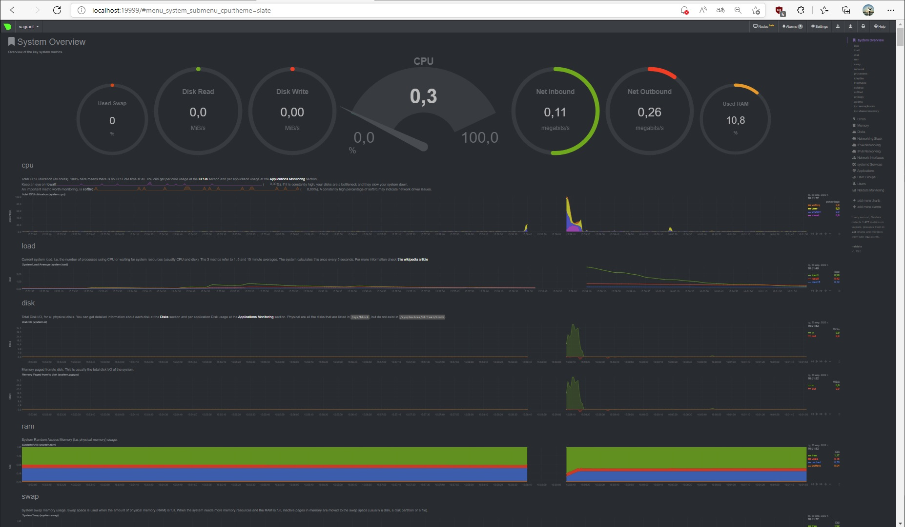

# Домашнее задание к занятию "3.4. Операционные системы, лекция 2"

1. Установка node_exporter:
    ```
   vagrant@vagrant:~$ vagrant@vagrant:~$ wget https://github.com/prometheus/node_exporter/releases/download/v1.3.1/node_exporter-1.3.1.linux-386.tar.gz
   vagrant@vagrant:~$ tar zxvf node_exporter-1.3.1.linux-386.tar.gz
   node_exporter-1.3.1.linux-386/
   node_exporter-1.3.1.linux-386/LICENSE
   node_exporter-1.3.1.linux-386/NOTICE
   node_exporter-1.3.1.linux-386/node_exporter
   vagrant@vagrant:~$ ls -l
   total 11296
   drwxr-xr-x 2 vagrant vagrant    4096 Dec  5 11:15 node_exporter-1.3.1.linux-386
   -rw-rw-r-- 1 vagrant vagrant 8624587 Dec  8 08:52 node_exporter-1.3.1.linux-386.tar.gz
    ```
   Создание /node_exporter.service:
    ```
   vagrant@vagrant:~/node_exporter-1.3.1.linux-386$ sudo cp node_exporter /usr/local/bin/
   vagrant@vagrant:~/node_exporter-1.3.1.linux-386$ sudo useradd --no-create-home --shell /bin/false nodeusr
   vagrant@vagrant:~/node_exporter-1.3.1.linux-386$ sudo chown -R nodeusr:nodeusr /usr/local/bin/node_exporter
   vagrant@vagrant:~/node_exporter-1.3.1.linux-386$ sudo vim /etc/systemd/system/node_exporter.service
   [Unit]
   Description=Node Exporter metrics
   After=multi-user.target
   [Service]
   User=nodeusr
   EnvironmentFile=-/etc/default/node_exporter
   ExecStart=/usr/local/bin/node_exporter $EXTRA_OPTS
   KillMode=process
   [Install]
   WantedBy=multi-user.target
    ```   
    Выставляем права (Все пользователи имеют право чтения; владелец может редактировать):
    ``` 
    vagrant@vagrant:~/node_exporter-1.3.1.linux-386$ sudo chmod 644 /etc/systemd/system/node_exporter.service
    ```        
   Перезапуск deamon, Настройка автозапуска, старт node_exporter
    ```
    vagrant@vagrant:~/node_exporter-1.3.1.linux-386$ systemctl daemon-reload
   ==== AUTHENTICATION COMPLETE ===
   vagrant@vagrant:~/node_exporter-1.3.1.linux-386$ systemctl enable node_exporter
   ==== AUTHENTICATION COMPLETE ===
   vagrant@vagrant:~/node_exporter-1.3.1.linux-386$ systemctl start node_exporter
   ==== AUTHENTICATION COMPLETE ===
    ```
    Проверка запуска node_exporter, до и после перезагрузки, автозагрузка работает:
    ```    
    vagrant@vagrant:~$ systemctl status node_exporter
   ● node_exporter.service - Node Exporter metrics
     Loaded: loaded (/etc/systemd/system/node_exporter.service; enabled; vendor preset: enabled)
     Active: active (running) since Wed 2022-03-30 11:26:22 UTC; 2min 50s ago
   Main PID: 1854 (node_exporter)
      Tasks: 5 (limit: 2278)
     Memory: 2.1M
     CGroup: /system.slice/node_exporter.service
             └─1854 /usr/local/bin/node_exporter
   Mar 30 11:26:22 vagrant node_exporter[1854]: ts=2022-03-30T11:26:22.907Z caller=node_exporter.go:115 level=info collect>
   Mar 30 11:26:22 vagrant node_exporter[1854]: ts=2022-03-30T11:26:22.907Z caller=node_exporter.go:115 level=info collect>
   Mar 30 11:26:22 vagrant node_exporter[1854]: ts=2022-03-30T11:26:22.907Z caller=node_exporter.go:115 level=info collect>
   Mar 30 11:26:22 vagrant node_exporter[1854]: ts=2022-03-30T11:26:22.907Z caller=node_exporter.go:115 level=info collect>
   Mar 30 11:26:22 vagrant node_exporter[1854]: ts=2022-03-30T11:26:22.907Z caller=node_exporter.go:115 level=info collect>
   Mar 30 11:26:22 vagrant node_exporter[1854]: ts=2022-03-30T11:26:22.907Z caller=node_exporter.go:115 level=info collect>
   Mar 30 11:26:22 vagrant node_exporter[1854]: ts=2022-03-30T11:26:22.907Z caller=node_exporter.go:115 level=info collect>
   Mar 30 11:26:22 vagrant node_exporter[1854]: ts=2022-03-30T11:26:22.907Z caller=node_exporter.go:115 level=info collect>
   Mar 30 11:26:22 vagrant node_exporter[1854]: ts=2022-03-30T11:26:22.907Z caller=node_exporter.go:199 level=info msg="Li>
   Mar 30 11:26:22 vagrant node_exporter[1854]: ts=2022-03-30T11:26:22.907Z caller=tls_config.go:195 level=info msg="TLS i>   
   lines 1-19/19 (END)
    ```    
        
1. Опции node_exporter с выводом `/metrics` через  `curl http://localhost:9100/metrics`. Примеры опций для базового мониторинга хоста по CPU, памяти, диску и сети.
    ```    
   | grep node_cpu
   node_cpu_guest_seconds_total
   node_cpu_seconds_total
   
   | grep node_memory
   node_memory_Active_bytes
   node_memory_Inactive_bytes
   node_memory_MemFree_bytes
   node_memory_MemTotal_bytes
   node_memory_SwapCached_bytes  
   node_memory_SwapFree_bytes 
   node_memory_SwapTotal_bytes
   node_memory_MemAvailable_bytes
   
   | grep node_disk
   node_disk_io_time_seconds_total
   node_disk_read_bytes_total
   node_disk_read_time_seconds_total
   node_disk_reads_completed_total
   node_disk_write_time_seconds_total
   node_disk_writes_completed_total
   node_disk_written_bytes_total
   
   | grep node_network
   node_network_address_assign_type
   node_network_device_id
   node_network_flags
   node_network_iface_id
   node_network_iface_link
   node_network_mtu_bytes
   node_network_receive_bytes_total
   node_network_speed_bytes
   node_network_transmit_bytes_total
   node_network_up
    ```    
    
1. Установил виртуальную машину [Netdata](https://github.com/netdata/netdata). После успешной установки:
    * в конфигурационном файле `/etc/netdata/netdata.conf` в секции [web] замениk значение с localhost на `0.0.0.0`,
    * добавил в Vagrantfile проброс порта Netdata на свой локальный компьютер `config.vm.network "forwarded_port", guest: 19999, host: 19999` и сделал `vagrant reload`.
    После успешной перезагрузки в браузере зашёл на `localhost:19999` и ознакомился с метриками:
    

1. Можно проверить выполнив: 
    ```
    vagrant@vagrant:~$ dmesg | grep virtual*
    [    0.004577] CPU MTRRs all blank - virtualized system.
    [    0.145197] Booting paravirtualized kernel on KVM
    [    4.262336] systemd[1]: Detected virtualization oracle.
    ```

1. По-умолчанию sysctl `fs.nr_open`: 
    ```
    vagrant@vagrant:~$ sysctl fs.nr_open
    fs.nr_open = 1048576
    ```
    nr_open - максимальное количество дескрипторов файлов, которые может выделить процесс. Значение по умолчанию равно 1024\*1024 (1048576)

    Другой существующий лимит `ulimit`, значения указаны с шагом 1024 байта, за исключением: 
    `-t` - который задается в секундах. 
    `-p` - с шагом 512 байт.  
    `-u` - немасштабируемый количество процессов.

1. Процесс работает под PID 1 проверил через `nsenter`. 
    Терминал PID1:
    ```
    root@vagrant:~$ unshare -f --pid --mount-proc sleep 1h
    ```
    Терминал PID2:
    ```
    root@vagrant:~# ps aux | grep sleep
    root       42447  0.0  0.0   5480   528 pts/0    S+   14:15   0:00 unshare -f --pid --mount-proc sleep 1h
    root       42448  0.0  0.0   5476   592 pts/0    S+   14:15   0:00 sleep 1h
    root       42520  0.0  0.0   6432   736 pts/1    S+   14:21   0:00 grep --color=auto sleep
    root@vagrant:~#
    root@vagrant:~# nsenter -t 42448 -p -r ps -ef
    UID          PID    PPID  C STIME TTY          TIME CMD
    root           1       0  0 14:15 pts/0    00:00:00 sleep 1h
    root           2       0  0 14:18 pts/1    00:00:00 ps -ef
    root@vagrant:~#
    ```
    
1. Команда `:(){ :|:& };:`, является логической бомбой.
`:()` означает, что вы определяете функцию под названием `:`
`{:|: &}`означает запустить функцию `:` и `:` снова отправить ее вывод в функцию и запустить ее в фоновом режиме.
Это `;` разделитель команд.
`:` запускает функцию в первый раз.
Она оперирует определением функции с именем `:`, которая вызывает сама себя дважды: один раз на переднем плане и один раз в фоне и продолжает своё выполнение снова и снова, пока система не зависнет.

   Cработал механизм `сgroups` - это способ ограничить ресурсы внутри конкретной `cgroup` *(контрольной группы процессов)*.
   Изменить число процессов можно в конфиге: /etc/security/limits.conf
   ```
    agrant@vagrant:~$ dmesg | grep fork
    [ 2630.845285] cgroup: fork rejected by pids controller in /user.slice/user-1000.slice/session-3.scope
    vagrant@vagrant:~$ dmesg | grep cgroup
    [    0.266635] *** VALIDATE cgroup1 ***
    [    0.266959] *** VALIDATE cgroup2 ***
    [ 2630.845285] cgroup: fork rejected by pids controller in /user.slice/user-1000.slice/session-3.scope
   ```

 ---
