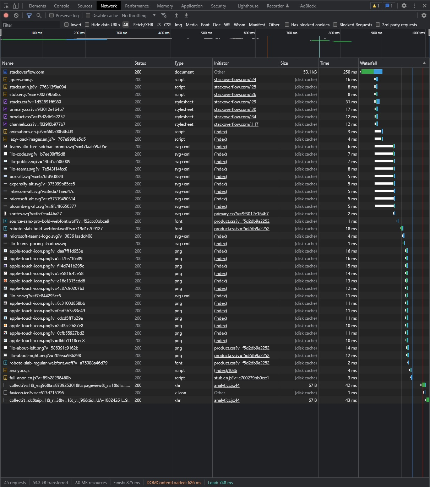
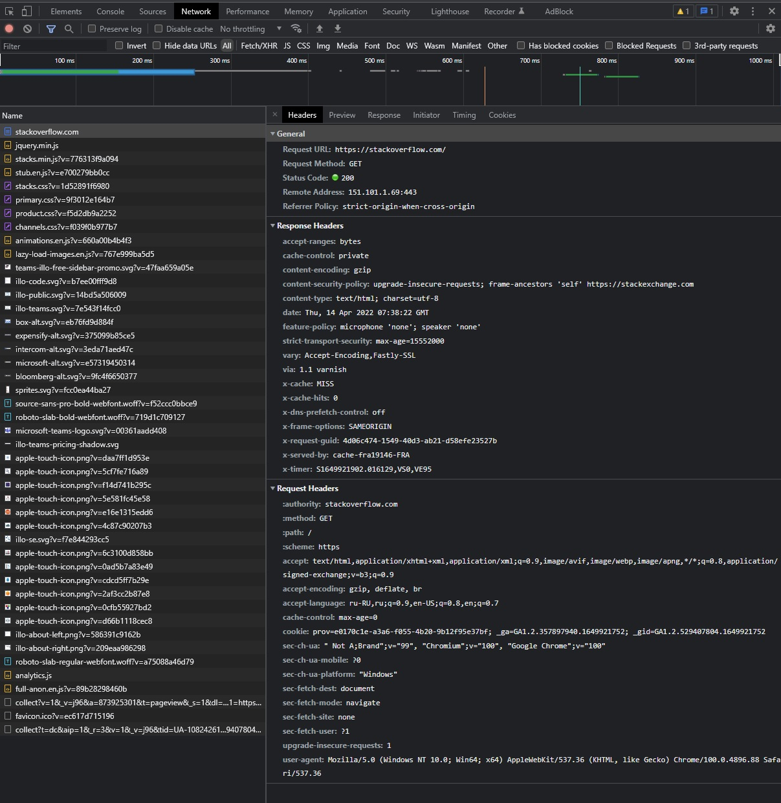
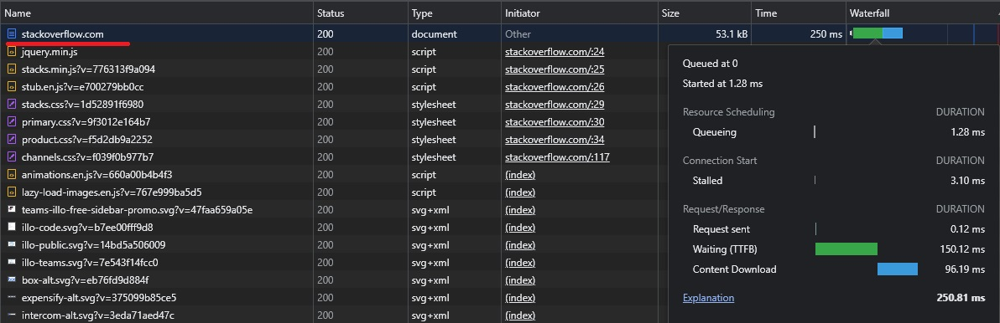
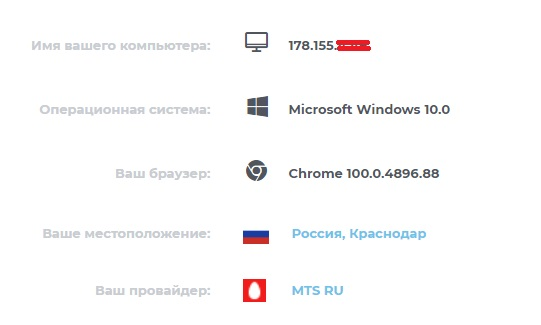

# Домашнее задание к занятию "3.6. Компьютерные сети, лекция 1"

1. Работа c HTTP через телнет.
- Подключился утилитой телнет к сайту stackoverflow.com
`telnet stackoverflow.com 80`
- отправил HTTP запрос
```bash
GET /questions HTTP/1.0
HOST: stackoverflow.com
[press enter]
[press enter]
```
- Полученый результат:
  ```
  vagrant@vagrant:~$ telnet stackoverflow.com 80
  Trying 151.101.1.69...
  Connected to stackoverflow.com.
  Escape character is '^]'.
  GET /questions HTTP/1.0
  HOST: stackoverflow.com
  
  HTTP/1.1 301 Moved Permanently
  cache-control: no-cache, no-store, must-revalidate
  location: https://stackoverflow.com/questions
  x-request-guid: 798d17cb-a2d0-44bf-a65e-b44a2aa2c38a
  feature-policy: microphone 'none'; speaker 'none'
  content-security-policy: upgrade-insecure-requests; frame-ancestors 'self' https://stackexchange.com
  Accept-Ranges: bytes
  Date: Thu, 14 Apr 2022 07:26:22 GMT
  Via: 1.1 varnish
  Connection: close
  X-Served-By: cache-fra19146-FRA
  X-Cache: MISS
  X-Cache-Hits: 0
  X-Timer: S1649921182.225041,VS0,VE93
  Vary: Fastly-SSL
  X-DNS-Prefetch-Control: off
  Set-Cookie: prov=d30ae5ea-6da4-0bf1-8865-2255c837f806; domain=.stackoverflow.com; expires=Fri, 01-Jan-2055 00:00:00 GMT; path=/; HttpOnly
  
  Connection closed by foreign host.
  ```
HTTP/1.1 - версия протокола. </br>
301 Moved Permanently - код состояния HTTP, стандартный код ответа сервера, который сообщает, что запрашиваемый ресурс перемещен и получил новый URL. </br>
cache-control - это HTTP-заголовок, который определяет количество времени и способ htaccess кэширования файла. </br>
location: https://stackoverflow.com/questions - Поле заголовка HTTP Location возвращается в ответах от HTTP. </br>
x-request-guid - уникальный идентификатор запроса, генерируемый для каждого запроса, поступающего на сервер. </br>
feature-policy - Значение заголовка переопределяет политику браузера по умолчанию для данной страницы. К примеру, для блокировки микрофона и колонок по всему сайту: microphone 'none'; speaker 'none'. </br>
content-security-policy - механизм обеспечения безопасности, с помощью которого можно защищаться от атак с внедрением контента. </br>
Accept-Ranges - маркер, который использует сервер, чтобы уведомить клиента о поддержке "запросов по кускам". </br>
Date - дата и время формирования документ. </br>
Via: 1.1 varnish - заголовок серверного ПО. </br>
Connection - заголовок определяет, остаётся ли сетевое соединение активным после завершения текущей транзакции (запроса). </br>
X-Served-By - содержит идентификатор сервера кэша, действующего в качестве узла доставки. </br>
X-Cache / X-Cache-Hits - заголовок X-Cache добавляет Fastly (и другие CDN), вместе с другими специфичными хедерами, такими как X-Cache-Hits и X-Served-By.  </br>
X-Timer: - заголовок предоставляет информацию о времени прохождения запроса. </br>
Vary - заголовок ответа Vary определяет, как сопоставить будущие заголовки запроса, чтобы решить, можно ли использовать кешированный ответ, а не запрашивать новый с исходного сервера. Он используется сервером для указания того, какие заголовки он использовал при выборе представления ресурса в алгоритме согласования контента. </br>
X-DNS-Prefetch-Control - контролирует заголовок ответа HTTP DNS упреждающая выборка, функция , с помощью которого браузеры активно выполнять разрешение доменных имен на обеих ссылок , которые пользователь может выбрать , чтобы следовать. </br>
Set-Cookie -  заголовок используется для отправки cookies с сервера на агент пользователя. </br>
Connection closed by foreign host - Соединение закрыто внешним хостом. </br>
  
2. Повтор задания 1 в браузере, используя консоль разработчика F12.
- открыл вкладку `Network`
- отправил запрос http://stackoverflow.com </br>
  

- первый ответ HTTP сервера, открыл вкладку `Headers`:
  

- проверил время загрузки страницы, приложил скриншот с самым длительным запросом:
  

3. IP адрес: </br>
  

4. Провайдер:
```
vagrant@vagrant:~$ whois 178.155.4.49

inetnum:        178.155.0.0 - 178.155.63.255
netname:        MTS-BROADBAND
descr:          MTS PJSC
country:        RU
admin-c:        MT12425-RIPE
admin-c:        MTS134-RIPE
tech-c:         MT12425-RIPE
tech-c:         MTS134-RIPE
status:         ASSIGNED PA
mnt-by:         KUBANGSM-MNT
created:        2012-03-27T07:58:25Z
last-modified:  2015-12-10T13:25:09Z
source:         RIPE # Filtered
```
AS:
```
route:          178.155.4.0/24
origin:         AS29497
mnt-by:         KUBANGSM-MNT
mnt-by:         MTU-NOC
created:        2017-06-28T00:17:57Z
last-modified:  2017-06-28T00:17:57Z
source:         RIPE
```

5. Данные по `traceroute`: 
```
vagrant@vagrant:~$ sudo traceroute -IAn 8.8.8.8
traceroute to 8.8.8.8 (8.8.8.8), 30 hops max, 60 byte packets
 1  10.0.2.2 [*]  0.207 ms  0.184 ms  0.121 ms
 2  192.168.31.1 [*]  1.304 ms  1.295 ms  1.286 ms
 3  10.255.61.251 [*]  2.313 ms  5.219 ms  5.210 ms
 4  10.255.61.18 [*]  2.196 ms  2.188 ms  2.170 ms
 5  10.255.61.14 [*]  2.160 ms  2.227 ms  2.214 ms
 6  10.250.245.254 [*]  5.129 ms  2.891 ms  2.794 ms
 7  10.249.12.29 [*]  16.079 ms  4.178 ms  4.126 ms
 8  195.34.36.115 [AS8359]  6.167 ms  6.575 ms  7.832 ms
 9  195.34.36.114 [AS8359]  4.818 ms  5.055 ms  5.706 ms
10  * * *
11  * * *
12  212.188.28.101 [AS8359]  22.178 ms  22.156 ms  21.956 ms
13  212.188.29.82 [AS8359]  22.219 ms  22.408 ms  22.474 ms
14  108.170.250.99 [AS15169]  23.561 ms  23.800 ms  23.930 ms
15  142.251.49.24 [AS15169]  38.215 ms  36.504 ms  37.119 ms
16  172.253.65.82 [AS15169]  58.407 ms  58.530 ms  58.629 ms
17  142.250.238.179 [AS15169]  40.420 ms  40.873 ms  40.995 ms
18  * * *
19  * * *
20  * * *
21  * * *
22  * * *
23  * * *
24  8.8.8.8 [AS15169]  36.331 ms  36.047 ms  36.158 ms
```
AS: `AS8359`, `AS15169`.

6. Повторил задание 5 в утилите `mtr`. 
```
 My traceroute  [v0.93]
vagrant (10.0.2.15)                                                                            2022-04-14T12:32:33+0000
Keys:  Help   Display mode   Restart statistics   Order of fields   quit
                                                                               Packets               Pings
 Host                                                                        Loss%   Snt   Last   Avg  Best  Wrst StDev
 1. AS???    10.0.2.2                                                         0.0%   405    0.2   0.2   0.1   2.8   0.3
 2. AS???    192.168.31.1                                                     0.0%   405    1.1   1.2   0.7  12.0   1.0
 3. AS???    10.255.61.251                                                    0.0%   405    2.5   2.7   1.9  16.2   1.2
 4. AS???    10.255.61.18                                                     0.0%   405    1.7   2.7   1.4  40.1   4.3
 5. AS???    10.255.61.14                                                     0.0%   405    1.8   2.1   1.4  14.4   1.4
 6. AS???    10.250.245.254                                                   0.0%   405    3.0   4.2   2.5  34.0   3.7
 7. AS???    10.249.12.29                                                     0.0%   405    3.3   4.1   2.3  33.0   3.5
 8. AS8359   195.34.36.115                                                    0.0%   405    4.3   3.4   2.1  38.8   3.3
 9. AS8359   195.34.36.114                                                    0.0%   404    2.4   3.0   2.0  29.9   2.4
10. AS8359   195.34.53.198                                                   78.7%   404   22.3  23.4  21.4  33.7   2.1
11. AS8359   212.188.28.133                                                  91.8%   404   22.3  21.8  21.2  24.0   0.5
12. AS8359   212.188.28.101                                                   4.2%   404   22.5  21.9  21.2  30.7   1.2
13. AS8359   212.188.29.82                                                    0.0%   404   22.2  21.7  20.9  31.0   1.1
14. AS15169  108.170.250.99                                                   0.0%   404   22.9  23.3  22.5  32.2   1.1
15. AS15169  142.250.238.138                                                  0.0%   404   35.9  37.8  34.9 156.8  12.0
16. AS15169  142.250.233.0                                                    0.0%   404   36.8  40.2  36.0 110.0  10.5
17. AS15169  108.170.233.161                                                  0.0%   404   44.4  34.2  33.6  50.9   1.4
18. (waiting for reply)
19. (waiting for reply)
20. (waiting for reply)
21. (waiting for reply)
22. (waiting for reply)
23. (waiting for reply)
24. (waiting for reply)
25. (waiting for reply)
26. (waiting for reply)
27. AS15169  8.8.8.8                                                          0.0%   404   34.8  34.6  33.8  45.4   1.2
```
Наибольшая задержка на участке: </br>
`15. AS15169  142.250.238.138                                                  0.0%   404   35.9  37.8  34.9 156.8  12.0`</br>

7. DNS сервера отвечающие за доменное имя dns.google:
```
vagrant@vagrant:~$ dig dns.google NS +noall +answer
dns.google.             7006    IN      NS      ns4.zdns.google.
dns.google.             7006    IN      NS      ns2.zdns.google.
dns.google.             7006    IN      NS      ns1.zdns.google.
dns.google.             7006    IN      NS      ns3.zdns.google.
```
A записи:
```
vagrant@vagrant:~$ dig dns.google A +noall +answer
dns.google.             12      IN      A       8.8.8.8
dns.google.             12      IN      A       8.8.4.4
```

8. PTR записи для IP адресов из задания 7.  
```
vagrant@vagrant:~$ dig -x 8.8.8.8

; <<>> DiG 9.16.1-Ubuntu <<>> -x 8.8.8.8
;; global options: +cmd
;; Got answer:
;; ->>HEADER<<- opcode: QUERY, status: NOERROR, id: 21559
;; flags: qr rd ra; QUERY: 1, ANSWER: 1, AUTHORITY: 0, ADDITIONAL: 1

;; OPT PSEUDOSECTION:
; EDNS: version: 0, flags:; udp: 4096
;; QUESTION SECTION:
;8.8.8.8.in-addr.arpa.          IN      PTR

;; ANSWER SECTION:
8.8.8.8.in-addr.arpa.   30      IN      PTR     dns.google.

;; Query time: 0 msec
;; SERVER: 192.168.31.1#53(192.168.31.1)
;; WHEN: Fri Apr 15 10:15:17 MSK 2022
;; MSG SIZE  rcvd: 73
```
---
