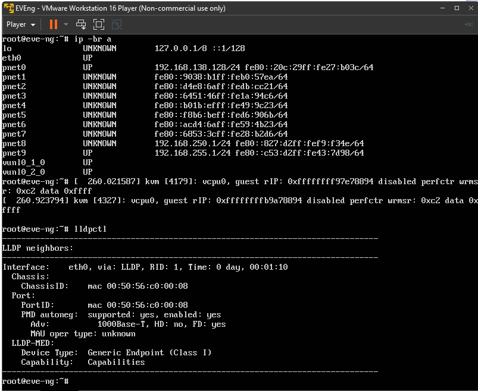
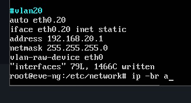
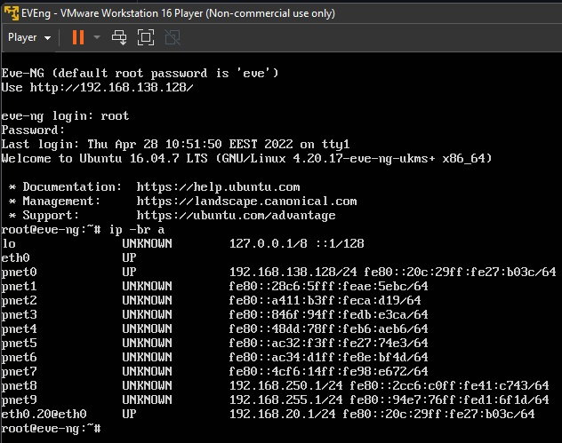

# Домашнее задание к занятию "3.7. Компьютерные сети, лекция 2"

1. Для Windows команда `ipconfig`:
```bash
PS C:\Users\user> ipconfig /all

Настройка протокола IP для Windows

   Имя компьютера  . . . . . . . . . : xxx
   Основной DNS-суффикс  . . . . . . :
   Тип узла. . . . . . . . . . . . . : Гибридный
   IP-маршрутизация включена . . . . : Нет
   WINS-прокси включен . . . . . . . : Нет

Адаптер Ethernet VirtualBox Host-Only Network:

   DNS-суффикс подключения . . . . . :
   Описание. . . . . . . . . . . . . : VirtualBox Host-Only Ethernet Adapter
   Физический адрес. . . . . . . . . : 0A-00-27-00-00-11
   DHCP включен. . . . . . . . . . . : Нет
   Автонастройка включена. . . . . . : Да
   Локальный IPv6-адрес канала . . . : fe80::d441:6ffb:1889:b27b%17(Основной)
   IPv4-адрес. . . . . . . . . . . . : 192.168.56.1(Основной)
   Маска подсети . . . . . . . . . . : 255.255.255.0
   Основной шлюз. . . . . . . . . :
   IAID DHCPv6 . . . . . . . . . . . : 403308583
   DUID клиента DHCPv6 . . . . . . . : 00-01-00-01-22-A4-7C-9D-70-85-C2-49-3C-0D
   DNS-серверы. . . . . . . . . . . : fec0:0:0:ffff::1%1
                                       fec0:0:0:ffff::2%1
                                       fec0:0:0:ffff::3%1
   NetBios через TCP/IP. . . . . . . . : Включен

Адаптер Ethernet Ethernet:

   DNS-суффикс подключения . . . . . :
   Описание. . . . . . . . . . . . . : Intel(R) Ethernet Connection (2) I219-V
   Физический адрес. . . . . . . . . : 70-85-C2-49-3C-0D
   DHCP включен. . . . . . . . . . . : Да
   Автонастройка включена. . . . . . : Да
   Локальный IPv6-адрес канала . . . : fe80::a05a:7e4c:cf89:7e2d%4(Основной)
   IPv4-адрес. . . . . . . . . . . . : 192.168.31.14(Основной)
   Маска подсети . . . . . . . . . . : 255.255.255.0
   Аренда получена. . . . . . . . . . : 19 апреля 2022 г. 10:46:11
   Срок аренды истекает. . . . . . . . . . : 19 апреля 2022 г. 22:46:12
   Основной шлюз. . . . . . . . . : 192.168.31.1
   DHCP-сервер. . . . . . . . . . . : 192.168.31.1
   IAID DHCPv6 . . . . . . . . . . . : 410027458
   DUID клиента DHCPv6 . . . . . . . : 00-01-00-01-22-A4-7C-9D-70-85-C2-49-3C-0D
   DNS-серверы. . . . . . . . . . . : 192.168.31.1
   NetBios через TCP/IP. . . . . . . . : Включен

Туннельный адаптер Teredo Tunneling Pseudo-Interface:

   DNS-суффикс подключения . . . . . :
   Описание. . . . . . . . . . . . . : Microsoft Teredo Tunneling Adapter
   Физический адрес. . . . . . . . . : 00-00-00-00-00-00-00-E0
   DHCP включен. . . . . . . . . . . : Нет
   Автонастройка включена. . . . . . : Да
   IPv6-адрес. . . . . . . . . . . . : 2001:0:284a:364:3c9d:4cf:4d64:fbce(Основной)
   Локальный IPv6-адрес канала . . . : fe80::3c9d:4cf:4d64:fbce%10(Основной)
   Основной шлюз. . . . . . . . . : ::
   IAID DHCPv6 . . . . . . . . . . . : 150994944
   DUID клиента DHCPv6 . . . . . . . : 00-01-00-01-22-A4-7C-9D-70-85-C2-49-3C-0D
   NetBios через TCP/IP. . . . . . . . : Отключен
```
Для Linux ранее была команда `ifconfig`, сейчас больше используется `ip`:
```bash
vagrant@vagrant:~$ ip -c -br a
eth0             192.168.31.14/24 fe80::a05a:7e4c:cf89:7e2d/64
eth1             192.168.56.1/24 fe80::d441:6ffb:1889:b27b/64
lo               127.0.0.1/8 ::1/128
eth2             169.254.178.153/16 fe80::d521:27f9:eed6:b299/64
eth3             10.37.0.6/16 169.254.160.23/16 fe80::1123:c782:75a8:a017/64
eth4             2001:0:284a:364:3c9d:4cf:4d64:fbce/64 fe80::3c9d:4cf:4d64:fbce/64
```

2. **LLDP** – протокол для обмена информацией между соседними устройствами, позволяет определить к какому порту коммутатора подключен сервер.
Используется команда `lldpctl` из пакета `lldpd`.

3. Используется технология `VLAN` – виртуальное разделение коммутатора. В linux устанавливается пакет `vlan`.
```
vagrant@vagrant:~$ ip -br link
lo               UNKNOWN        00:00:00:00:00:00 <LOOPBACK,UP,LOWER_UP>
eth0             UP             08:00:27:b1:28:5d <BROADCAST,MULTICAST,UP,LOWER_UP>
```

Установка пакета: `vagrant@vagrant:~$ sudo apt-get install vlan`.
Отредактировал файл: `sudo nano /etc/netplan/01-netcfg.yaml`, добавив:
```bash
vlans:
  vlan10:
      id: 10
      dhcp4: no
      link: eth0
      addresses: [10.0.2.220/24]
      routes:
        - to: 10.0.2.220/24
          via: 10.0.2.1
          on-link: true
```

Перезапустил netpaln: `sudo netplan apply`, после проверил:
```
vagrant@vagrant:~$ ip -br link
lo               UNKNOWN        00:00:00:00:00:00 <LOOPBACK,UP,LOWER_UP>
eth0             UP             08:00:27:b1:28:5d <BROADCAST,MULTICAST,UP,LOWER_UP>
vlan10@eth0      UP             08:00:27:b1:28:5d <BROADCAST,MULTICAST,UP,LOWER_UP>
```

4. Типы агрегации интерфейсов в Linux:  

`mode=0 (balance-rr)` </br>
При этом методе объединения трафик распределяется по принципу «карусели»: пакеты по очереди направляются на сетевые карты объединённого интерфейса. Например, если у нас есть физические интерфейсы eth0, eth1, and eth2, объединенные в bond0, первый пакет будет отправляться через eth0, второй — через eth1, третий — через eth2, а четвертый снова через eth0 и т.д.

`mode=1 (active-backup)` </br>
Когда используется этот метод, активен только один физический интерфейс, а остальные работают как резервные на случай отказа основного.

`mode=2 (balance-xor)` </br>
В данном случае объединенный интерфейс определяет, через какую физическую сетевую карту отправить пакеты, в зависимости от MAC-адресов источника и получателя.

`mode=3 (broadcast)`  </br>
Широковещательный режим, все пакеты отправляются через каждый интерфейс. Имеет ограниченное применение, но обеспечивает значительную отказоустойчивость.

`mode=4 (802.3ad)` </br>
Особый режим объединения. Для него требуется специально настраивать коммутатор, к которому подключен объединенный интерфейс. Реализует стандарты объединения каналов IEEE и обеспечивает как увеличение пропускной способности, так и отказоустойчивость.

`mode=5 (balance-tlb)` </br>
Распределение нагрузки при передаче. Входящий трафик обрабатывается в обычном режиме, а при передаче интерфейс определяется на основе данных о загруженности.

`mode=6 (balance-alb)` </br>
Адаптивное распределение нагрузки. Аналогично предыдущему режиму, но с возможностью балансировать также входящую нагрузку.

Отредактировал файл: `sudo nano /etc/netplan/01-netcfg.yaml`, добавив:
```bash
bonds: 
  bond0:
    dhcp4: true
    interfaces: [eth0, eth1]
    parameters:
      mode: 802.3ad
      mii-monitor-interval: 1
```
Перезапустил netpaln: `sudo netplan apply`, после проверил:
```
vagrant@vagrant:~$ ip -br link
lo               UNKNOWN        00:00:00:00:00:00 <LOOPBACK,UP,LOWER_UP>
eth0             UP             d6:e7:73:49:3b:d6 <BROADCAST,MULTICAST,SLAVE,UP,LOWER_UP>
eth1             UP             d6:e7:73:49:3b:d6 <BROADCAST,MULTICAST,SLAVE,UP,LOWER_UP>
vlan10@eth0      UP             d6:e7:73:49:3b:d6 <BROADCAST,MULTICAST,UP,LOWER_UP>
bond0            UP             d6:e7:73:49:3b:d6 <BROADCAST,MULTICAST,MASTER,UP,LOWER_UP>
```

5. `Hosts/Net: 6` - количество IP адресов в сети с маской /29 
```bash
vagrant@vagrant:$ sudo ipcalc 10.10.10.0/29
Address:   10.10.10.0           00001010.00001010.00001010.00000 000
Netmask:   255.255.255.248 = 29 11111111.11111111.11111111.11111 000
Wildcard:  0.0.0.7              00000000.00000000.00000000.00000 111
=>
Network:   10.10.10.0/29        00001010.00001010.00001010.00000 000
HostMin:   10.10.10.1           00001010.00001010.00001010.00000 001
HostMax:   10.10.10.6           00001010.00001010.00001010.00000 110
Broadcast: 10.10.10.7           00001010.00001010.00001010.00000 111
Hosts/Net: 6                     Class A, Private Internet
```

`Subnets:   32` - количество /29 подсетей которых можно получить из сети с маской /24. 
```bash
vagrant@vagrant:$ ipcalc 10.10.10.0 255.255.255.0 255.255.255.248
Subnets:   32
```

Несколько примеров 29 подсетей внутри сети 10.10.10.0/24.
```
Network:   10.10.10.224/29      00001010.00001010.00001010.11100 000
HostMin:   10.10.10.225         00001010.00001010.00001010.11100 001
HostMax:   10.10.10.230         00001010.00001010.00001010.11100 110
Broadcast: 10.10.10.231         00001010.00001010.00001010.11100 111
Hosts/Net: 6                     Class A, Private Internet

Network:   10.10.10.248/29      00001010.00001010.00001010.11111 000
HostMin:   10.10.10.249         00001010.00001010.00001010.11111 001
HostMax:   10.10.10.254         00001010.00001010.00001010.11111 110
Broadcast: 10.10.10.255         00001010.00001010.00001010.11111 111
Hosts/Net: 6                     Class A, Private Internet
```

6. Есть ещё диапазон: `100.64.0.0 — 100.127.255.255`
```bash
vagrant@vagrant:$ ipcalc 100.64.0.0/26
Address:   100.64.0.0           01100100.01000000.00000000.00 000000
Netmask:   255.255.255.192 = 26 11111111.11111111.11111111.11 000000
Wildcard:  0.0.0.63             00000000.00000000.00000000.00 111111
=>
Network:   100.64.0.0/26        01100100.01000000.00000000.00 000000
HostMin:   100.64.0.1           01100100.01000000.00000000.00 000001
HostMax:   100.64.0.62          01100100.01000000.00000000.00 111110
Broadcast: 100.64.0.63          01100100.01000000.00000000.00 111111
Hosts/Net: 62
```

7. Как проверить ARP таблицу в Linux, Windows? 
Команда для Windows: 
- `arp [/a [<inetaddr>] [/n <ifaceaddr>]] [/g [<inetaddr>] [-n <ifaceaddr>]] [/d <inetaddr> [<ifaceaddr>]] [/s <inetaddr> <etheraddr> [<ifaceaddr>]]`
Команды для Linux:
- `arp` устанавливается с пакетом net-tools: `vagrant@vagrant:/etc/netplan$ sudo apt install net-tools`
 ```
        -a показать (все) хосты в альтернативном (BSD) стиле
        -e display (all) hosts in default (Linux) style
        -s, --set установить новую запись ARP
        -d, --delete удалить определенную запись
        -v, --verbose более детальный вывод
        -n, --numeric не преобразовывать адреса в имена
        -i, --device указание сетевого интерфейса (например, eth0)
        -D, --use-device прочитать <hwaddr> из заданного устройства
        -A, -p, --protocol указание семейства протоколов
        -f, --file считать новые записи из файла или из /etc/ethers
 ```
- `ip neigh` альтернативный способ просмотра записей таблицы.

Команда очистки ARP полностью:  </br>
- Linux: `sudo ip neigh flush all`   </br>
- Windows: `arp /d` </br>

Команда для удаления одного нужного IP из ARP таблицы: </br>
- Linux: `sudo arp -d 192.168.1.10` </br>
- Windows: `arp /d 192.168.1.10` </br>

 ---
## Задание для самостоятельной отработки (необязательно к выполнению)

8*. Установил эмулятор EVE-ng. </br>
Используя инструкцию - https://github.com/svmyasnikov/eve-ng </br>
Выполните задания на lldp, vlan, bonding в эмуляторе EVE-ng.  </br>
LLDP:  </br>
  </br>

VLAN:  </br>
  </br>
 </br>
 
 ---
