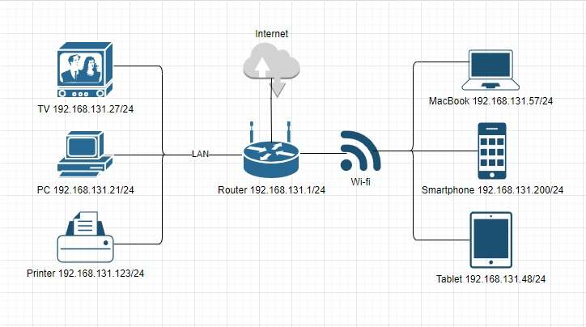

# Домашнее задание к занятию "3.8. Компьютерные сети, лекция 3"

1. Подключился к публичному маршрутизатору нашёл маршрут к вашему публичному IP:
Выполнив: `telnet route-views.routeviews.org` / `Username: rviews`
show ip route: 
```bash
Username: rviews
route-views>show ip route 178.155.4.XXX
Routing entry for 178.155.4.0/24
  Known via "bgp 6447", distance 20, metric 0
  Tag 2497, type external
  Last update from 202.232.0.2 5w1d ago
  Routing Descriptor Blocks:
  * 202.232.0.2, from 202.232.0.2, 5w1d ago
      Route metric is 0, traffic share count is 1
      AS Hops 3
      Route tag 2497
      MPLS label: none
```
show bgp:
```bash
Username: rviews
route-views>show bgp 178.155.4.XXX
BGP routing table entry for 178.155.4.0/24, version 374902655
Paths: (23 available, best #20, table default)
  Not advertised to any peer
  Refresh Epoch 1
  6939 8359 29497
    64.71.137.241 from 64.71.137.241 (216.218.252.164)
      Origin IGP, localpref 100, valid, external
      path 7FE13EA90E38 RPKI State not found
      rx pathid: 0, tx pathid: 0
  Refresh Epoch 1
  3333 8359 29497
    193.0.0.56 from 193.0.0.56 (193.0.0.56)
      Origin IGP, localpref 100, valid, external
      Community: 8359:5500 8359:55361 29497:29497
      path 7FE09F248A58 RPKI State not found
      rx pathid: 0, tx pathid: 0
  Refresh Epoch 1
  8283 8359 29497
    94.142.247.3 from 94.142.247.3 (94.142.247.3)
      Origin IGP, metric 0, localpref 100, valid, external
      Community: 8283:1 8283:101 8359:5500 8359:55361 29497:29497
      unknown transitive attribute: flag 0xE0 type 0x20 length 0x18
        value 0000 205B 0000 0000 0000 0001 0000 205B
              0000 0005 0000 0001
      path 7FE0A0A0D1B0 RPKI State not found
      rx pathid: 0, tx pathid: 0
  Refresh Epoch 1
  53767 174 174 3356 8359 29497
    162.251.163.2 from 162.251.163.2 (162.251.162.3)
      Origin IGP, localpref 100, valid, external
      Community: 174:21000 174:22013 53767:5000
      path 7FE0F8F269F0 RPKI State not found
      rx pathid: 0, tx pathid: 0
  Refresh Epoch 1
  3267 1299 8359 29497
    194.85.40.15 from 194.85.40.15 (185.141.126.1)
      Origin IGP, metric 0, localpref 100, valid, external
      path 7FE0A6263B00 RPKI State not found
      rx pathid: 0, tx pathid: 0
  Refresh Epoch 1
  3561 3910 3356 8359 29497
    206.24.210.80 from 206.24.210.80 (206.24.210.80)
      Origin IGP, localpref 100, valid, external
      path 7FE0E4A9B698 RPKI State not found
      rx pathid: 0, tx pathid: 0
  Refresh Epoch 1
  7018 3356 8359 29497
    12.0.1.63 from 12.0.1.63 (12.0.1.63)
      Origin IGP, localpref 100, valid, external
      Community: 7018:5000 7018:37232
      path 7FE0FC4E2C28 RPKI State not found
      rx pathid: 0, tx pathid: 0
  Refresh Epoch 1
  3356 8359 29497
    4.68.4.46 from 4.68.4.46 (4.69.184.201)
      Origin IGP, metric 0, localpref 100, valid, external
      Community: 3356:2 3356:100 3356:123 3356:507 3356:903 3356:2111 8359:5500 8359:55361 29497:29497
      path 7FE0CF60D5D0 RPKI State not found
      rx pathid: 0, tx pathid: 0
  Refresh Epoch 1
  3549 3356 8359 29497
    208.51.134.254 from 208.51.134.254 (67.16.168.191)
      Origin IGP, metric 0, localpref 100, valid, external
      Community: 3356:2 3356:100 3356:123 3356:507 3356:903 3356:2111 3549:2581 3549:30840 8359:5500 8359:55361 29497:29497
      path 7FE0E00E52C8 RPKI State not found
      rx pathid: 0, tx pathid: 0
  Refresh Epoch 1
  701 3356 8359 29497
    137.39.3.55 from 137.39.3.55 (137.39.3.55)
      Origin IGP, localpref 100, valid, external
      path 7FE1195F9EA0 RPKI State not found
      rx pathid: 0, tx pathid: 0
  Refresh Epoch 1
  20130 6939 8359 29497
    140.192.8.16 from 140.192.8.16 (140.192.8.16)
      Origin IGP, localpref 100, valid, external
      path 7FE0DB5705F0 RPKI State not found
      rx pathid: 0, tx pathid: 0
  Refresh Epoch 1
  20912 3257 3356 8359 29497
    212.66.96.126 from 212.66.96.126 (212.66.96.126)
      Origin IGP, localpref 100, valid, external
      Community: 3257:8070 3257:30515 3257:50001 3257:53900 3257:53902 20912:65004
      path 7FE155463B80 RPKI State not found
      rx pathid: 0, tx pathid: 0
  Refresh Epoch 1
  4901 6079 8359 29497
    162.250.137.254 from 162.250.137.254 (162.250.137.254)
      Origin IGP, localpref 100, valid, external
      Community: 65000:10100 65000:10300 65000:10400
      path 7FE174688AE8 RPKI State not found
      rx pathid: 0, tx pathid: 0
  Refresh Epoch 1
  101 3356 8359 29497
    209.124.176.223 from 209.124.176.223 (209.124.176.223)
      Origin IGP, localpref 100, valid, external
      Community: 101:20100 101:20110 101:22100 3356:2 3356:100 3356:123 3356:507 3356:903 3356:2111 8359:5500 8359:55361 29497:29497
      Extended Community: RT:101:22100
      path 7FE0CFB06078 RPKI State not found
      rx pathid: 0, tx pathid: 0
  Refresh Epoch 1
  57866 3356 8359 29497
    37.139.139.17 from 37.139.139.17 (37.139.139.17)
      Origin IGP, metric 0, localpref 100, valid, external
      Community: 3356:2 3356:100 3356:123 3356:507 3356:903 3356:2111 8359:5500 8359:55361 29497:29497
      path 7FE11DE051D8 RPKI State not found
      rx pathid: 0, tx pathid: 0
  Refresh Epoch 1
  1351 8359 8359 29497
    132.198.255.253 from 132.198.255.253 (132.198.255.253)
      Origin IGP, localpref 100, valid, external
      path 7FE03FB22900 RPKI State not found
      rx pathid: 0, tx pathid: 0
  Refresh Epoch 1
  852 3356 8359 29497
    154.11.12.212 from 154.11.12.212 (96.1.209.43)
      Origin IGP, metric 0, localpref 100, valid, external
      path 7FE1013D6FB0 RPKI State not found
      rx pathid: 0, tx pathid: 0
  Refresh Epoch 1
  3303 8359 29497
    217.192.89.50 from 217.192.89.50 (138.187.128.158)
      Origin IGP, localpref 100, valid, external
      Community: 3303:1004 3303:1006 3303:1030 3303:3054 8359:5500 8359:55361 29497:29497
      path 7FE09368EBB0 RPKI State not found
      rx pathid: 0, tx pathid: 0
  Refresh Epoch 1
  1221 4637 3356 8359 29497
    203.62.252.83 from 203.62.252.83 (203.62.252.83)
      Origin IGP, localpref 100, valid, external
      path 7FE130E4D378 RPKI State not found
      rx pathid: 0, tx pathid: 0
  Refresh Epoch 2
  2497 8359 29497
    202.232.0.2 from 202.232.0.2 (58.138.96.254)
      Origin IGP, localpref 100, valid, external, best
      path 7FE0F4C9EE38 RPKI State not found
      rx pathid: 0, tx pathid: 0x0
  Refresh Epoch 1
  7660 2516 1299 8359 29497
    203.181.248.168 from 203.181.248.168 (203.181.248.168)
      Origin IGP, localpref 100, valid, external
      Community: 2516:1030 7660:9003
      path 7FE00CA0AA58 RPKI State not found
      rx pathid: 0, tx pathid: 0
  Refresh Epoch 1
  3257 3356 8359 29497
    89.149.178.10 from 89.149.178.10 (213.200.83.26)
      Origin IGP, metric 10, localpref 100, valid, external
      Community: 3257:8794 3257:30043 3257:50001 3257:54900 3257:54901
      path 7FE07DE9E8B0 RPKI State not found
      rx pathid: 0, tx pathid: 0
  Refresh Epoch 1
  49788 12552 8359 29497
    91.218.184.60 from 91.218.184.60 (91.218.184.60)
      Origin IGP, localpref 100, valid, external
      Community: 12552:12000 12552:12100 12552:12101 12552:22000
      Extended Community: 0x43:100:1
      path 7FE0F2215F40 RPKI State not found
      rx pathid: 0, tx pathid: 0
```

2. Создали dummy0 интерфейс в Ubuntu: `vagrant@vagrant:~$ sudo ip link add dummy0 type dummy`
```bash
vagrant@vagrant:~$ ip -c -br link
lo               UNKNOWN        00:00:00:00:00:00 <LOOPBACK,UP,LOWER_UP>
eth0             UP             d6:e7:73:49:3b:d6 <BROADCAST,MULTICAST,SLAVE,UP,LOWER_UP>
bond0            UP             d6:e7:73:49:3b:d6 <BROADCAST,MULTICAST,MASTER,UP,LOWER_UP>
vlan10@eth0      UP             d6:e7:73:49:3b:d6 <BROADCAST,MULTICAST,UP,LOWER_UP>
dummy0           DOWN           82:a0:c9:b9:95:ef <BROADCAST,NOARP>
vagrant@vagrant:~$
```

Добавили статические маршруты:
```bash
sudo ip route add 192.168.1.0/24 via 10.0.2.15
sudo ip route add 192.168.2.0/24 dev eth0 
sudo ip route add 192.168.3.0/24 dev eth0 metric 100 
```

Проверили статические маршруты ip route show:
```bash
vagrant@vagrant:~$ ip route show
default via 10.0.2.2 dev bond0 proto dhcp src 10.0.2.15 metric 100
10.0.2.0/24 dev vlan10 proto kernel scope link src 10.0.2.220
10.0.2.0/24 dev bond0 proto kernel scope link src 10.0.2.15
10.0.2.2 dev bond0 proto dhcp scope link src 10.0.2.15 metric 100
192.168.1.0/24 via 10.0.2.15 dev bond0
192.168.2.0/24 dev eth0 scope link
192.168.3.0/24 dev eth0 scope link metric 100
```

3. Проверку открытых TCP порты в Ubuntu выполним через `ss`. </br>
Опции утилиты `ss`: </br>
`-V` - Version показать версию утилиты. </br>
`-n` - Numeric не определять имена служб. </br>
`-r` - Resolve определять сетевые имена адресов с помощью DNS. </br>
`-a` - All отобразить все сокеты (открытые соединения). </br>
`-l` - Listening показать только прослушиваемые сокеты. </br>
`-o` - Options показать информацию таймера. </br>
`-e` - Extended выводить расширенную информацию о сокете. </br>
`-p` - Processes, показать процессы, использующие сокет. </br>
`-i` - Internal, посмотреть внутреннюю информацию TCP. </br>
`-s` - Summary, статистика использования сокета. </br>
`-D` - экспортировать текущее состояние TCP сокетов в файл. </br>
`-F` - работать с информацией, взятой из файла. </br>

Кроме того, можно вывести сокеты только нужного протокола: </br>
`-4`, `--ipv4` - только сокеты протокола IP версии 4. </br>
`-6`, `--ipv6` - только сокеты протокола IP версии 6. </br>
`-0`, `--packet` - только PACKET сокеты. </br>
`-t`, `--tcp` - TCP сокеты. </br>
`-u`, `--udp` - UDP сокеты. </br>
`-d`, `--dhcp` - DHCP сокеты. </br>
`-r`, `--raw` - RAW сокеты. </br>
`-x`, `--unix` - UNIX сокеты. </br>
```bash
vagrant@vagrant:~$ ss -ta
State        Recv-Q       Send-Q              Local Address:Port                 Peer Address:Port        Process
LISTEN       0            4096                127.0.0.53%lo:domain                    0.0.0.0:*
LISTEN       0            128                       0.0.0.0:ssh                       0.0.0.0:*
ESTAB        0            0                       10.0.2.15:ssh                      10.0.2.2:53091
LISTEN       0            128                          [::]:ssh                          [::]:*
```
```bash
vagrant@vagrant:~$ ss -tl
State         Recv-Q        Send-Q               Local Address:Port                 Peer Address:Port       Process
LISTEN        0             4096                 127.0.0.53%lo:domain                    0.0.0.0:*
LISTEN        0             128                        0.0.0.0:ssh                       0.0.0.0:*
LISTEN        0             128                           [::]:ssh                          [::]:*
```
```bash
vagrant@vagrant:~$ ss -lntpe
State      Recv-Q     Send-Q           Local Address:Port           Peer Address:Port     Process
LISTEN     0          4096             127.0.0.53%lo:53                  0.0.0.0:*         uid:101 ino:20872 sk:2 <->
LISTEN     0          128                    0.0.0.0:22                  0.0.0.0:*         ino:24383 sk:3 <->
LISTEN     0          128                       [::]:22                     [::]:*         ino:24394 sk:4 v6only:1 <->
```
Используемые порты:
SSH Remote Login Protocol - Port `22` Protocol TCP and UDP(\*Assigned)
DNS Access - Port `53` Protocol TCP and UDP 

4. Проверил используемые UDP сокеты в Ubuntu:
```bash
vagrant@vagrant:~$ ss -lu
State        Recv-Q       Send-Q                 Local Address:Port                 Peer Address:Port       Process
UNCONN       0            0                      127.0.0.53%lo:domain                    0.0.0.0:*
UNCONN       0            0                    10.0.2.15%bond0:bootpc                    0.0.0.0:*
```
```bash
vagrant@vagrant:~$ ss -lnupe
State      Recv-Q     Send-Q           Local Address:Port          Peer Address:Port     Process
UNCONN     0          0                127.0.0.53%lo:53                 0.0.0.0:*         uid:101 ino:20871 sk:91 <->
UNCONN     0          0              10.0.2.15%bond0:68                 0.0.0.0:*         uid:100 ino:20435 sk:92 <->
```
Используемые порты:
DNS Access - Port `53` Protocol TCP and UDP 
DHCP Access - Port `68` Protocol  UDP

5. Используя diagrams.net, создал L3 диаграмму домашней сети: 
  

 ---
## Задание для самостоятельной отработки (необязательно к выполнению)

6*. Установите Nginx, настройте в режиме балансировщика TCP или UDP.


7*. Установите bird2, настройте динамический протокол маршрутизации RIP.


8*. Установите Netbox, создайте несколько IP префиксов, используя curl проверьте работу API.


 ---
