# Домашнее задание к занятию "3.9. Элементы безопасности информационных систем"

1. Установил Bitwarden плагин для браузера. Зарегестрировался и сохранил несколько паролей.
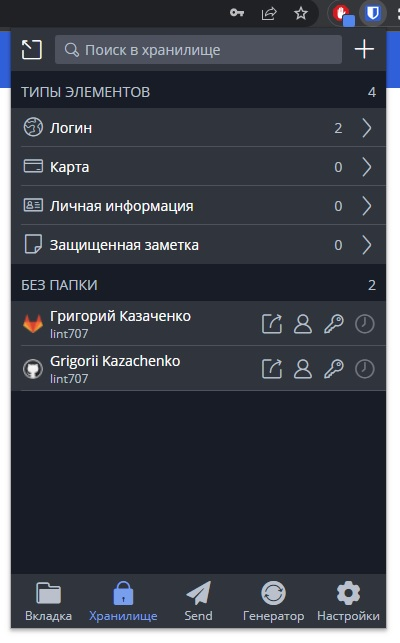

2. Установил Google authenticator на мобильный телефон. Настроил вход в Bitwarden акаунт через Google authenticator OTP.
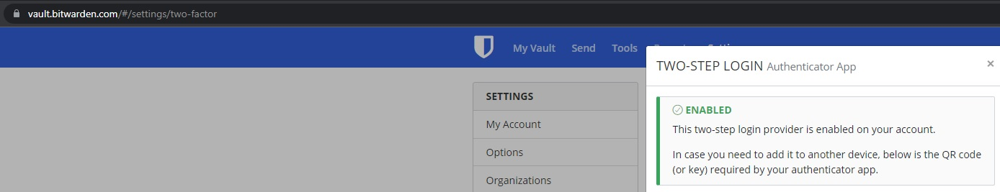

3. Установите apache2, сгенерируйте самоподписанный сертификат, настройте тестовый сайт для работы по HTTPS.
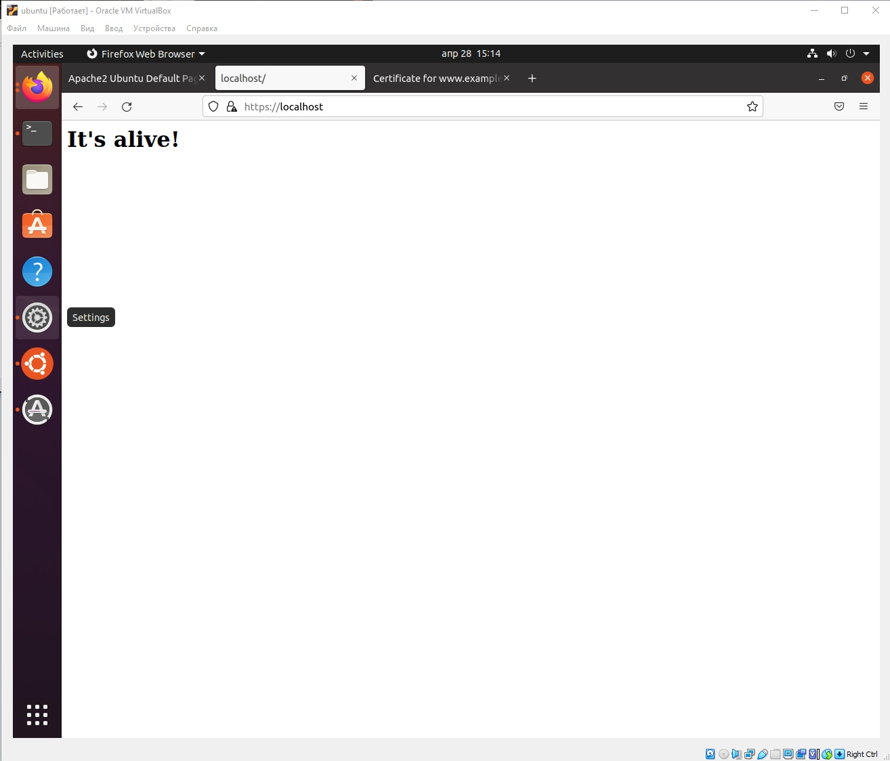
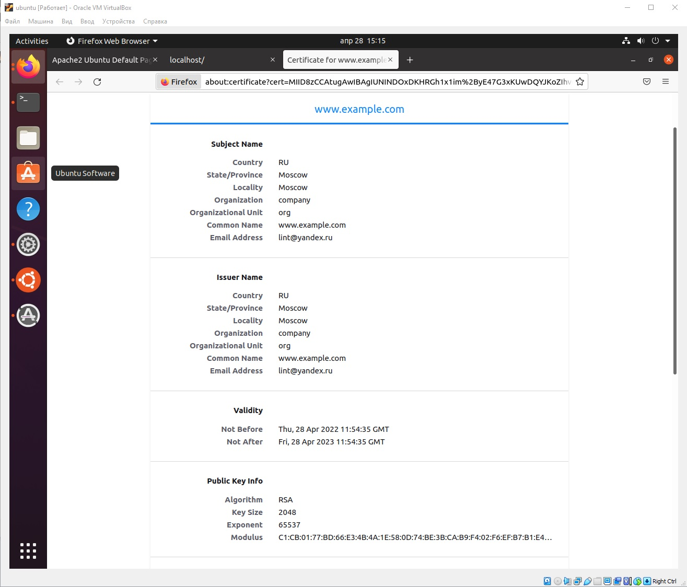

4. Проверил на TLS уязвимости произвольный сайт в интернете:
```
vagrant@vagrant:~/testssl.sh$ ./testssl.sh -U --sneaky https://www.google.com/

###########################################################
    testssl.sh       3.1dev from https://testssl.sh/dev/
    (ab33f6c 2022-04-25 10:18:49 -- )

      This program is free software. Distribution and
             modification under GPLv2 permitted.
      USAGE w/o ANY WARRANTY. USE IT AT YOUR OWN RISK!

       Please file bugs @ https://testssl.sh/bugs/

###########################################################

 Using "OpenSSL 1.0.2-chacha (1.0.2k-dev)" [~183 ciphers]
 on vagrant:./bin/openssl.Linux.x86_64
 (built: "Jan 18 17:12:17 2019", platform: "linux-x86_64")


Testing all IPv4 addresses (port 443): 64.233.164.106 64.233.164.105 64.233.164.103 64.233.164.104 64.233.164.147 64.233.164.99
---------------------------------------------------------------------------------
 Start 2022-04-27 07:29:45        -->> 64.233.164.106:443 (www.google.com) <<--

 Further IP addresses:   64.233.164.99 64.233.164.147 64.233.164.104 64.233.164.103 64.233.164.105 2a00:1450:4010:c0e::6a
                         2a00:1450:4010:c0e::93 2a00:1450:4010:c0e::67 2a00:1450:4010:c0e::68
 rDNS (64.233.164.106):  lf-in-f106.1e100.net.
 Service detected:       HTTP


 Testing vulnerabilities

 Heartbleed (CVE-2014-0160)                not vulnerable (OK), no heartbeat extension
 CCS (CVE-2014-0224)                       not vulnerable (OK)
 Ticketbleed (CVE-2016-9244), experiment.  not vulnerable (OK)
 ROBOT                                     not vulnerable (OK)
 Secure Renegotiation (RFC 5746)           supported (OK)
 Secure Client-Initiated Renegotiation     not vulnerable (OK)
 CRIME, TLS (CVE-2012-4929)                not vulnerable (OK)
 BREACH (CVE-2013-3587)                    potentially NOT ok, "br gzip" HTTP compression detected. - only supplied "/" tested
                                           Can be ignored for static pages or if no secrets in the page
 POODLE, SSL (CVE-2014-3566)               not vulnerable (OK)
 TLS_FALLBACK_SCSV (RFC 7507)              Downgrade attack prevention supported (OK)
 SWEET32 (CVE-2016-2183, CVE-2016-6329)    VULNERABLE, uses 64 bit block ciphers
 FREAK (CVE-2015-0204)                     not vulnerable (OK)
 DROWN (CVE-2016-0800, CVE-2016-0703)      not vulnerable on this host and port (OK)
                                           make sure you don't use this certificate elsewhere with SSLv2 enabled services
                                           https://censys.io/ipv4?q=A6E4CC389843F4694161666B1EB8E73821592E180657A8824D8D8DCC8D05ED37 could help you to find out
 LOGJAM (CVE-2015-4000), experimental      not vulnerable (OK): no DH EXPORT ciphers, no DH key detected with <= TLS 1.2
 BEAST (CVE-2011-3389)                     TLS1: ECDHE-ECDSA-AES128-SHA ECDHE-ECDSA-AES256-SHA ECDHE-RSA-AES128-SHA
                                                 ECDHE-RSA-AES256-SHA AES128-SHA AES256-SHA DES-CBC3-SHA
                                           VULNERABLE -- but also supports higher protocols  TLSv1.1 TLSv1.2 (likely mitigated)
 LUCKY13 (CVE-2013-0169), experimental     potentially VULNERABLE, uses cipher block chaining (CBC) ciphers with TLS. Check patches
 Winshock (CVE-2014-6321), experimental    not vulnerable (OK)
 RC4 (CVE-2013-2566, CVE-2015-2808)        no RC4 ciphers detected (OK)


 Done 2022-04-27 07:30:27 [  44s] -->> 64.233.164.106:443 (www.google.com) <<--

---------------------------------------------------------------------------------
 Start 2022-04-27 07:30:27        -->> 64.233.164.105:443 (www.google.com) <<--

 Further IP addresses:   64.233.164.99 64.233.164.147 64.233.164.104 64.233.164.103 64.233.164.106 2a00:1450:4010:c0e::6a
                         2a00:1450:4010:c0e::93 2a00:1450:4010:c0e::67 2a00:1450:4010:c0e::68
                        
^C
```

5. Установил на Ubuntu ssh сервер и сгенерировал новый приватный ключ: </br>
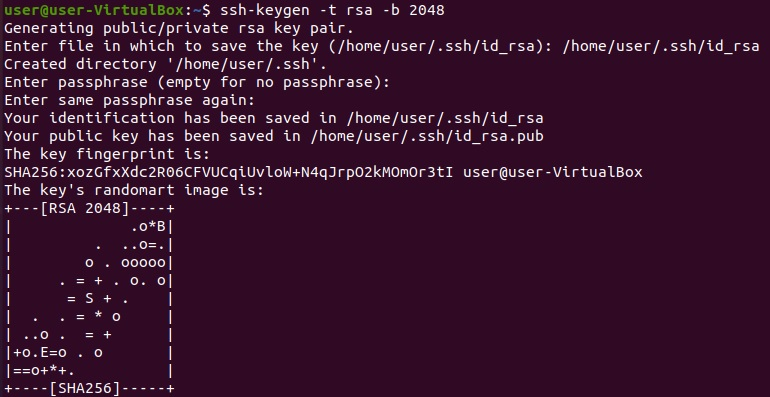  </br>

Скопировал свой публичный ключ на другой сервер и подключился к серверу по SSH-ключу: </br>
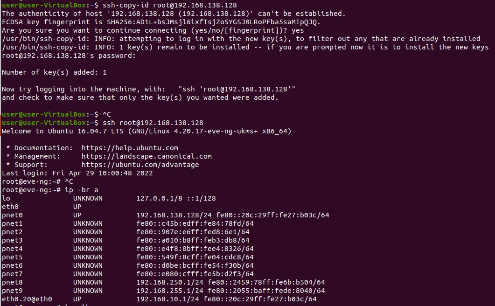 </br>

6. Переименовал файлы ключей из задания 5 и настроил вход на удаленный сервер по имени сервера:
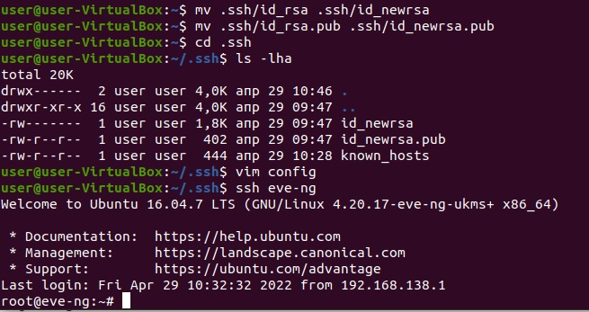 </br>

Файл конфигурации SSH клиента:
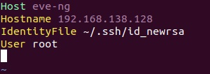 </br>

7. Соберите дамп трафика утилитой tcpdump в формате pcap, 100 пакетов. Откройте файл pcap в Wireshark.
```bash
vagrant@vagrant:~$ sudo tcpdump -c 100 -w dump.pcap
tcpdump: listening on eth0, link-type EN10MB (Ethernet), capture size 262144 bytes
36 packets captured
39 packets received by filte
0 packets dropped by kernel
```
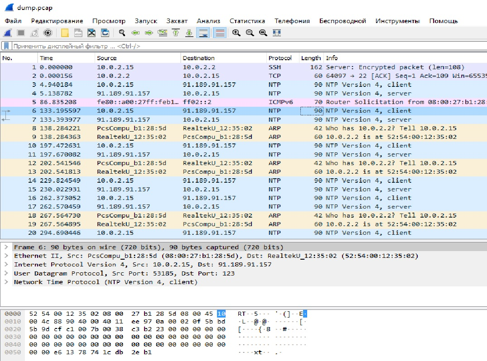
 ---
## Задание для самостоятельной отработки (необязательно к выполнению)

8*. Просканировал хост scanme.nmap.org. Запущены сервисы: `ssh`, `http`, `Elite`.
```
vagrant@vagrant:~$ sudo nmap scanme.nmap.org
Starting Nmap 7.80 ( https://nmap.org ) at 2022-04-29 07:59 UTC
Nmap scan report for scanme.nmap.org (45.33.32.156)
Host is up (0.0016s latency).
Other addresses for scanme.nmap.org (not scanned): 2600:3c01::f03c:91ff:fe18:bb2f
Not shown: 748 filtered ports, 249 closed ports
PORT      STATE SERVICE
22/tcp    open  ssh
80/tcp    open  http
31337/tcp open  Elite

Nmap done: 1 IP address (1 host up) scanned in 131.18 seconds
```

```
vagrant@vagrant:~$ sudo nmap -A scanme.nmap.org
Starting Nmap 7.80 ( https://nmap.org ) at 2022-04-28 09:23 UTC
Nmap scan report for scanme.nmap.org (45.33.32.156)
Host is up (0.0011s latency).
Other addresses for scanme.nmap.org (not scanned): 2600:3c01::f03c:91ff:fe18:bb2f
Not shown: 755 filtered ports, 243 closed ports
PORT   STATE SERVICE    VERSION
22/tcp open  tcpwrapped
|_ssh-hostkey: ERROR: Script execution failed (use -d to debug)
80/tcp open  tcpwrapped
|_http-server-header: Apache/2.4.7 (Ubuntu)
Device type: switch|phone|VoIP adapter
Running (JUST GUESSING): Cisco IOS 10.X (94%), Cisco embedded (87%), Nokia Symbian OS (87%)
OS CPE: cpe:/h:cisco:catalyst_3000 cpe:/o:cisco:ios:10.3 cpe:/h:cisco:catalyst_1900 cpe:/o:nokia:symbian_os cpe:/h:cisco:ata_188_voip_gateway
Aggressive OS guesses: Cisco 3000 switch (IOS 10.3) (94%), Cisco Catalyst 1900 switch (87%), Nokia 3600i mobile phone (87%), Cisco SF300 or SG300 switch (86%), Cisco ATA 188 VoIP adapter (85%)
No exact OS matches for host (test conditions non-ideal).
Network Distance: 2 hops

TRACEROUTE (using port 80/tcp)
HOP RTT     ADDRESS
1   0.75 ms _gateway (10.0.2.2)
2   0.77 ms scanme.nmap.org (45.33.32.156)

OS and Service detection performed. Please report any incorrect results at https://nmap.org/submit/ .
Nmap done: 1 IP address (1 host up) scanned in 162.74 seconds
```

9*. Установил и настроил фаервол `ufw` на web-сервер из задания 3:  </br>
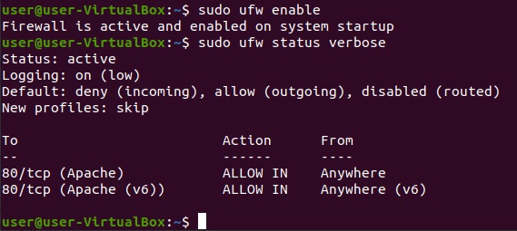 </br>

Открыл доступ снаружи только к портам 22,80,443: </br>
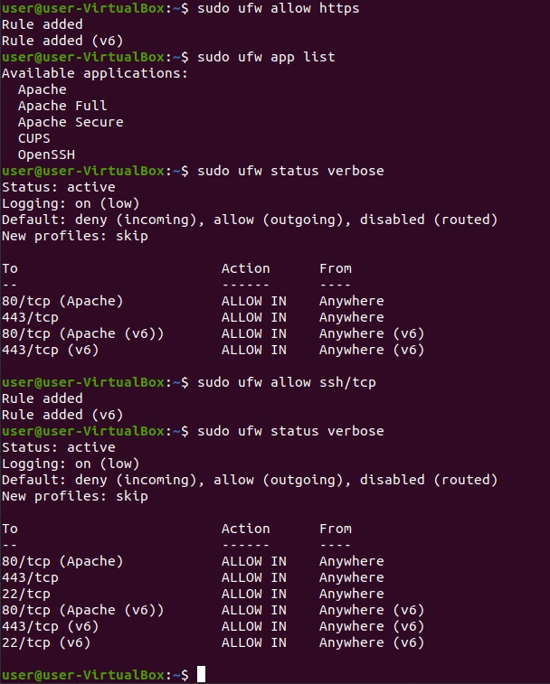 </br>

 ---
