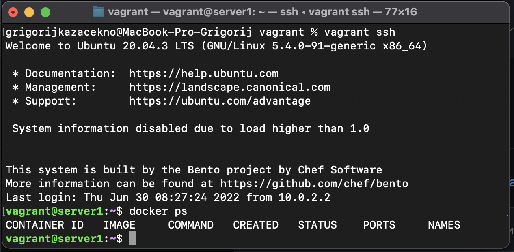

# Домашнее задание к занятию "5.2. Применение принципов IaaC в работе с виртуальными машинами"

---

## Задача 1
- Опишите своими словами основные преимущества применения на практике IaaC паттернов. </br>
> Быстрое масштабирование – увеличение или уменьшение количества используемых инфраструктурных услуг. </br>
> Более быстрая эффективная разработка. </br>
> Гибкость – доступ к инфраструктуре в любом месте, где есть интернет. </br>
> Уменьшение времени затрачиваемого на рутинные операции. </br>
> Устранение дрейфа конфигураций, что помогает в ускорении выхода продукта на рынок. </br>
> Непрерывная интеграция приводит к сокращению стоимости исправления дефекта, за счёт его раннего выявления. </br>
> Непрерывная доставка позволяет при выявлении ошибки, легко откатиться на стабильную версию. </br>

- Какой из принципов IaaC является основополагающим?
> Основопологающим принципом IaaC можно назвать идемпоте́нтность —  действие, многократное повторение которого эквивалентно однократному.

## Задача 2
- Чем Ansible выгодно отличается от других систем управление конфигурациями? </br>
> Работа на инфраструктуре SSH. </br>
> Большое количество плагинов. </br>
> На управляемые узлы не нужно устанавливать никакого дополнительного ПО. </br>
> Низкий порог входа. </br>
> Использует Python. </br>
> Декларативный язык описания конфигурации. </br>

- Какой, на ваш взгляд, метод работы систем конфигурации более надёжный push или pull?
> Push - так как отправку конфигурации инициирует управляющий сервер, а не клиентская машина которую сложнее мониторить на предмет ошибок и проблем.

## Задача 3
Установить на личный компьютер:

- VirtualBox
```
vboxmanage --version

6.1.32_Ubuntur149290
```
- Vagrant
```
vagrant --version

Vagrant 2.2.6
```
- Ansible
```
ansible --version

ansible 2.9.6
config file = /etc/ansible/ansible.cfg
configured module search path = ['/home/alexandr/.ansible/plugins/modules', '/usr/share/ansible/plugins/modules']
ansible python module location = /usr/lib/python3/dist-packages/ansible
executable location = /usr/bin/ansible
python version = 3.8.10 (default, Now 26 2021, 20:14:08) [GCC 9.3.0]
```

## Задача 4 (*)

Воспроизвести практическую часть лекции самостоятельно.

- Создать виртуальную машину.
- Зайти внутрь ВМ, убедиться, что Docker установлен с помощью команды
```
docker ps
```

Результат: 


