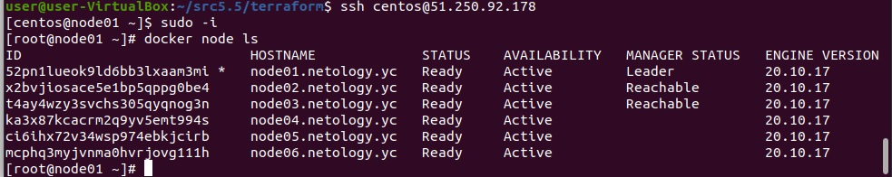
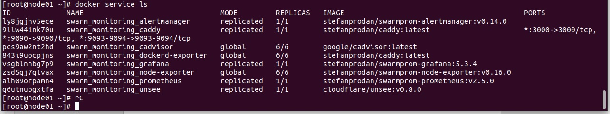

# Домашнее задание к занятию "5.5. Оркестрация кластером Docker контейнеров на примере Docker Swarm"

## Задача 1

Ответы на следующие вопросы:

- В чём отличие режимов работы сервисов в Docker Swarm кластере: replication и global?
> В режиме global выполняется одна реплика службы на узел роя. Количество глобальных реплик равно количеству узлов swarm. В режиме replica вы можете запускать любое количество экземпляров службы.

- Какой алгоритм выбора лидера используется в Docker Swarm кластере?
> В Docker Swarm кластере используется алгоритм поддержания распределенного консенсуса — Raft. Лидер нода выбирается из управляючих нод путем Raft согласованного  алгоритма. Сам Raft-алгоритм имеет ограничение на количество управляющих нод. Распределенные решения должны быть одобрены большинством управляющих узлов, называемых кворумом.  Это означает, что рекомендуется нечетное количество управляющих узлов.

- Что такое Overlay Network?
> Overlay-network создает внутреннюю частную сеть, которую могут использовать контейнеры в разных хостах swarm-кластера. Контейнеры на разных физических хостах могут обмениваться данными по overlay-network (если все они прикреплены к одной сети), что  упрощает взаимодействие узлов кластера между собой.

## Задача 2

Создать ваш первый Docker Swarm кластер в Яндекс.Облаке

Результат, с выводом команды:
```
docker node ls
```
<p align="center">
  
</p>

## Задача 3

Создать ваш первый, готовый к боевой эксплуатации кластер мониторинга, состоящий из стека микросервисов.

Результат, с выводом команды:
```
docker service ls
```
<p align="center">
  
</p>

## Задача 4 (*)

Выполнить на лидере Docker Swarm кластера команду (указанную ниже) и дать письменное описание её функционала, что она делает и зачем она нужна:
```
# см.документацию: https://docs.docker.com/engine/swarm/swarm_manager_locking/
docker swarm update --autolock=true
```


---
