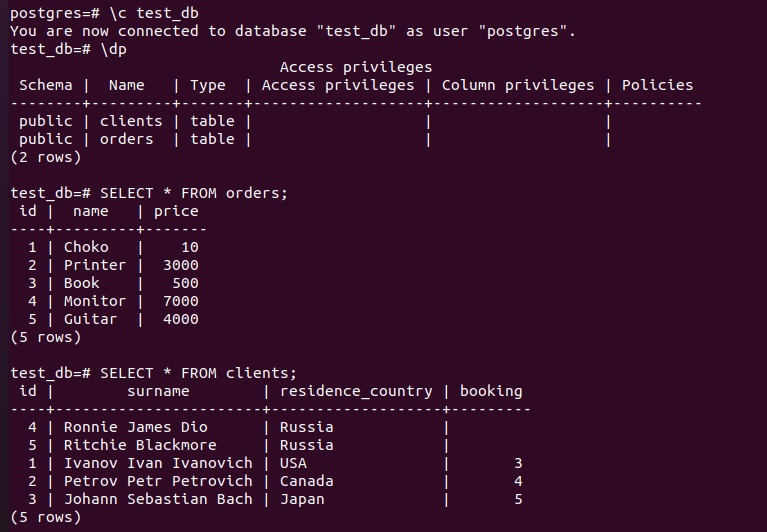

# Домашнее задание к занятию "6.2. SQL"

## Введение

Перед выполнением задания вы можете ознакомиться с 
[дополнительными материалами](https://github.com/netology-code/virt-homeworks/tree/master/additional/README.md).

## Задача 1

Используя docker поднимите инстанс PostgreSQL (версию 12) c 2 volume, 
в который будут складываться данные БД и бэкапы.

Docker-compose.yml:  
  
  


## Задача 2

В БД из задачи 1:  
- создал пользователя test-admin-user, назание БД test_db, указано в dockre-compose.yml:  
```
CREATE ROLE "test-admin-user";
```
 
- в БД test_db создал таблицу orders и clients *(спeцификация таблиц ниже)*:  
```
\c test_db
CREATE TABLE orders (id integer PRIMARY KEY, name text, price integer);
CREATE TABLE clients (id integer PRIMARY KEY, surname text, residence_country text, booking integer, FOREIGN KEY (booking) REFERENCES orders (id));
CREATE INDEX countryid ON clients(residence_country); 
```
- предоставил привилегии на все операции пользователю test-admin-user на таблицы БД test_db:
```
GRANT ALL ON DATABASE test_db to "test-admin-user";
```
- создал пользователя test-simple-user:  
```
CREATE USER "test-simple-user";
```
- предоставил пользователю test-simple-user права на SELECT/INSERT/UPDATE/DELETE данных таблиц БД test_db:
```
GRANT SELECT,INSERT,UPDATE,DELETE ON TABLE public.clients TO "test-simple-user";
GRANT SELECT,INSERT,UPDATE,DELETE ON TABLE public.orders TO "test-simple-user";
```
> Таблица orders:
> - id (serial primary key)
> - наименование (string)
> - цена (integer)

> Таблица clients:
> - id (serial primary key)
> - фамилия (string)
> - страна проживания (string, index)
> - заказ (foreign key orders)

### Ответы:
- итоговый список БД после выполнения пунктов выше:  
  

- описание таблиц (describe):  
  

- SQL-запрос для выдачи списка пользователей с правами над таблицами test_db  
- список пользователей с правами над таблицами test_db:  
  

## Задача 3

Используя SQL синтаксис - наполнил таблицы следующими тестовыми данными:

Таблица orders

|Наименование|цена|
|------------|----|
|Шоколад| 10 |
|Принтер| 3000 |
|Книга| 500 |
|Монитор| 7000|
|Гитара| 4000|

Таблица clients

|ФИО|Страна проживания|
|------------|----|
|Иванов Иван Иванович| USA |
|Петров Петр Петрович| Canada |
|Иоганн Себастьян Бах| Japan |
|Ронни Джеймс Дио| Russia|
|Ritchie Blackmore| Russia|

```
INSERT INTO orders VALUES (1, 'Choko', 10), (2, 'Printer', 3000), (3, 'Book', 500), (4, 'Monitor', 7000), (5, 'Guitar', 4000);
INSERT INTO clients VALUES (1, 'Ivanov Ivan Ivanovich', 'USA'), (2, 'Petrov Petr Petrovich', 'Canada'), (3, ' Johann Sebastian Bach', 'Japan'), (4, 'Ronnie James Dio', 'Russia'), (5, 'Ritchie Blackmore', 'Russia');
```

Используя SQL синтаксис:  
- вычислите количество записей для каждой таблицы  
- приведите в ответе:  
    - запросы  
    - результаты их выполнения.  

### Ответ: 
  
  
## Задача 4

Часть пользователей из таблицы clients решили оформить заказы из таблицы orders.

Используя foreign keys свяжите записи из таблиц, согласно таблице:

> |ФИО|Заказ|
> |------------|----|
> |Иванов Иван Иванович| Книга |
> |Петров Петр Петрович| Монитор |
> |Иоганн Себастьян Бах| Гитара |

Приведите SQL-запросы для выполнения данных операций.
Приведите SQL-запрос для выдачи всех пользователей, которые совершили заказ, а также вывод данного запроса.
Подсказка - используйте директиву `UPDATE`.  

### Ответ:  
  


## Задача 5
Получите полную информацию по выполнению запроса выдачи всех пользователей из задачи 4 
*(используя директиву EXPLAIN)*.

Приведите получившийся результат и объясните что значат полученные значения.  

### Ответ:
  

`Seq Scan` - последовательное чтение данных таблицы, блок за блоком.  
`cost=0.00..18.10`  - оценка затратность операции. Первое значение 0.00 — затраты на получение первой строки. Второе — 18.10 — затраты на получение всех строк.  
`rows=806` - приблизительное количество возвращаемых строк при выполнении операции Seq Scan.  
`width=72` - средний размер одной строки в байтах.  

## Задача 6

Создал бэкап БД test_db и поместил его в volume, предназначенный для бэкапов (см. Задачу 1).  
`pg_dump -U postgres test_db > /var/lib/postgres/backup/test_db.backup`  
  

Остановил контейнер с PostgreSQL *(но не удаляйте volumes)*.  
Выполнил `docker stop postgres`.

Поднял новый пустой контейнер с PostgreSQL, для этого изменил файл docker-compose.yml.  
  
И запустил только postgres2 - выполнив команду `docker-compose up -d postgres2`  

Восстановил БД test_db в новом контейнере.  
  
  
  

---
