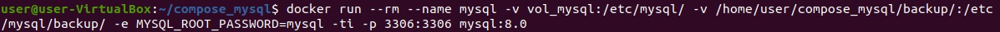
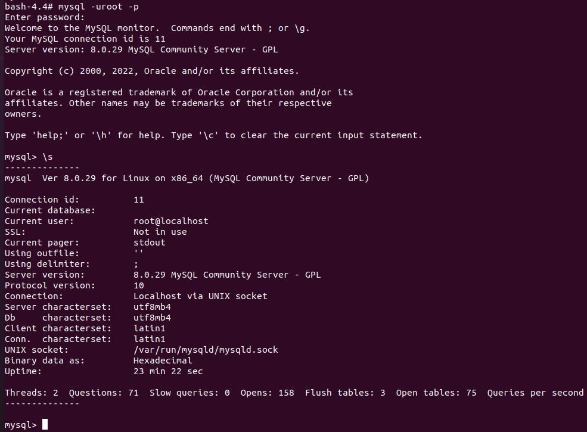
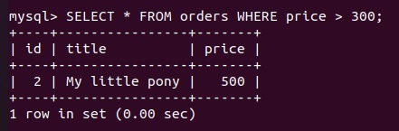
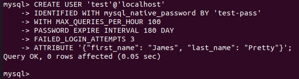
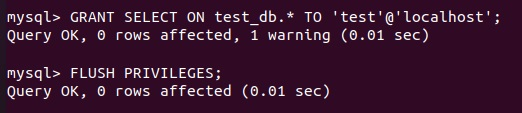
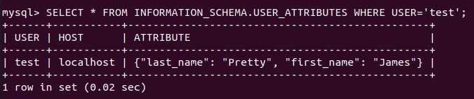
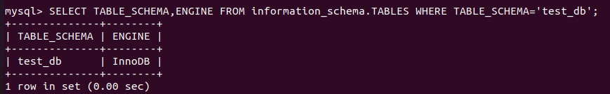
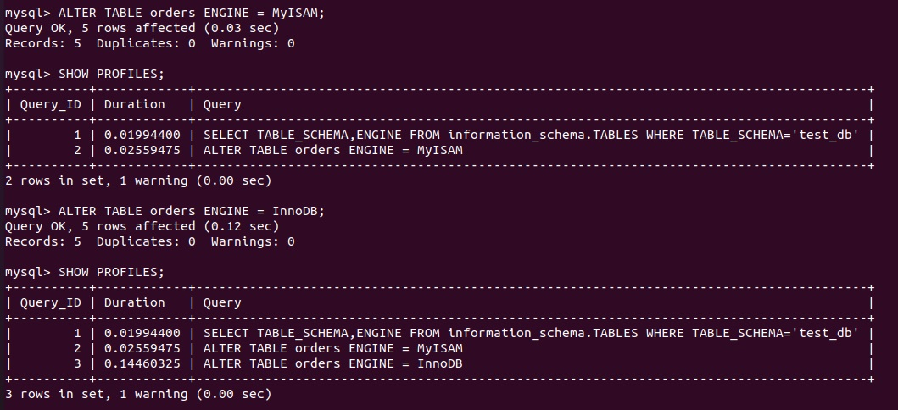

# Домашнее задание к занятию "6.3. MySQL"

## Введение

Перед выполнением задания вы можете ознакомиться с 
[дополнительными материалами](https://github.com/netology-code/virt-homeworks/tree/master/additional/README.md).

## Задача 1
Используя `docker run` поднял инстанс `MySQL` (версию 8). Данные БД сохраните в volume:  
  

Изучите [бэкап БД](https://github.com/netology-code/virt-homeworks/tree/master/06-db-03-mysql/test_data) и восстановитесь из него:  
```
???
```

Перешёл в управляющую консоль `mysql` внутри контейнера:  
```
mysql -uroot -p
```

Используя команду `\h` получил список управляющих команд.  
Нашёл команду для выдачи статуса БД и указал версию сервера БД:  
 

Подключился к восстановленной БД и получите список таблиц из этой БД:  
```
USE test_db;
```

Количество записей с `price` > 300:  
  

> В следующих заданиях мы будем продолжать работу с данным контейнером.

## Задача 2
Создал пользователя `test` в БД c паролем `test-pass`, используя:  
> - плагин авторизации mysql_native_password  
> - срок истечения пароля - 180 дней  
> - количество попыток авторизации - 3   
> - максимальное количество запросов в час - 100  
> - аттрибуты пользователя:  
>     - Фамилия "Pretty"  
>     - Имя "James"  
  

Предоставил привелегии пользователю `test` на операции SELECT базы `test_db`.  
  

Используя таблицу INFORMATION_SCHEMA.USER_ATTRIBUTES получил данные по пользователю `test`:   
  

## Задача 3
Установил профилирование `SET profiling = 1`.  
Изучите вывод профилирования команд `SHOW PROFILES;`.  
Исследовал, какой `engine` используется в таблице БД `test_db`:  
  

Изменил `engine` и приложил запрос:  
- на `MyISAM`  
- на `InnoDB`  
  

## Задача 4 

Изучил файл `my.cnf` в директории /etc/mysql.

Изменил его согласно ТЗ (движок InnoDB):  
 - Скорость IO важнее сохранности данных:  
`innodb_flush_log_at_trx_commit = 0`  

 - Нужна компрессия таблиц для экономии места на диске:  
`innodb_file_per_table = 1`  

 - Размер буфера с незакомиченными транзакциями 1 Мб:  
`innodb_log_buffer_size = 1M`  

 - Буфер кеширования 30% от ОЗУ (Всего 4 ГБ, доступно 2.5, 30% = 750 Мб):  
`innodb_buffer_pool_size = 750M`  

 - Размер файла логов операций 100 Мб:  
`innodb_log_file_size = 100M`  

Приведите в ответе измененный файл `my.cnf`.
```
[mysqld]
skip-host-cache
skip-name-resolve
datadir=/var/lib/mysql
socket=/var/run/mysqld/mysqld.sock
secure-file-priv=/var/lib/mysql-files
user=mysql

pid-file=/var/run/mysqld/mysqld.pid
[client]
socket=/var/run/mysqld/mysqld.sock

!includedir /etc/mysql/conf.d/
innodb_flush_log_at_trx_commit = 0  
innodb_file_per_table = 1  
innodb_log_buffer_size = 1M  
innodb_buffer_pool_size = 750M  
innodb_log_file_size = 100M  

```
---
