# Домашнее задание к занятию "6.4. PostgreSQL"

## Задача 1  

Используя docker поднял инстанс PostgreSQL (версию 13). Данные БД сохранил в volume.  

Подключился к БД PostgreSQL используя `psql`.  
Воспользовался командой `\?` для вывода подсказки по имеющимся в `psql` управляющим командам:  
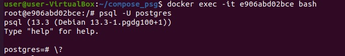  

Примеры управляющих команды для:  
- вывода списка БД: `postgres=# \l`  
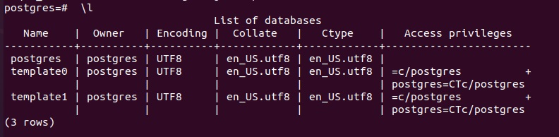  

- подключения к БД: `postgres=# \c postgres`  
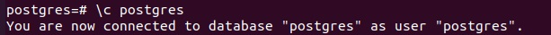  

- вывода списка таблиц: `postgres=# \dtS` или `\dt`  
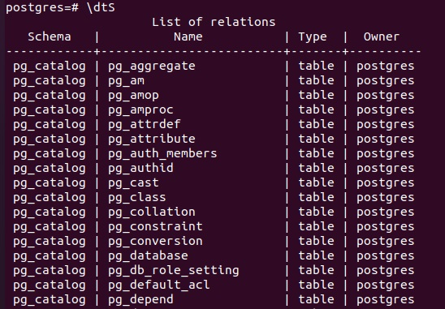  

- вывода описания содержимого таблиц: `postgres=# \dS pg_event_trigger` или `\d имя таблицы`
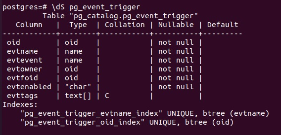  

- выхода из psql: `postgres=# \q`  
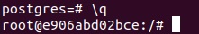  

## Задача 2  
Используя `psql` создал БД `test_database`:  
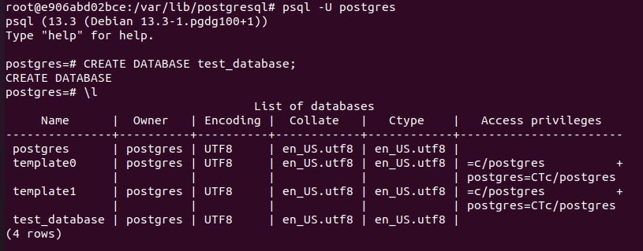  

Изучил [бэкап БД](https://github.com/netology-code/virt-homeworks/tree/master/06-db-04-postgresql/test_data).  

Восстановил бэкап БД в `test_database`:  
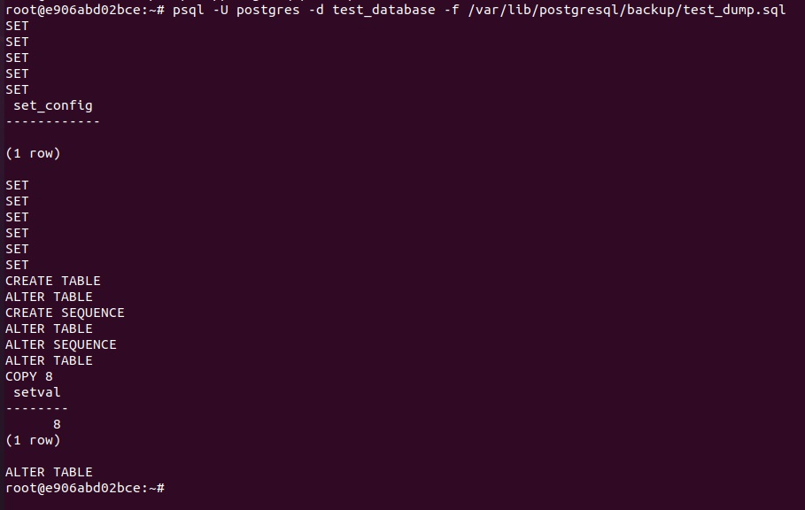  

Перешёл в управляющую консоль `psql` внутри контейнера.  
Подключился к восстановленной БД и провёл операцию ANALYZE для сбора статистики по таблице.  
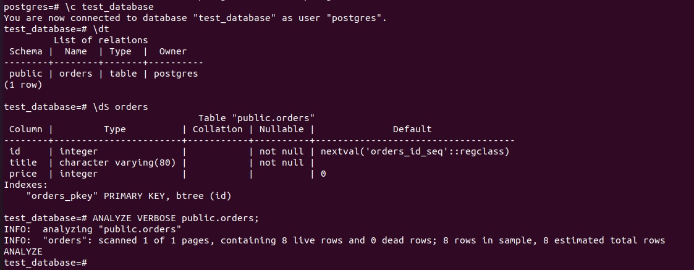  

Используя таблицу [pg_stats](https://postgrespro.ru/docs/postgresql/12/view-pg-stats), нашёл столбец таблицы `orders`   
с наибольшим средним значением размера элементов в байтах.  
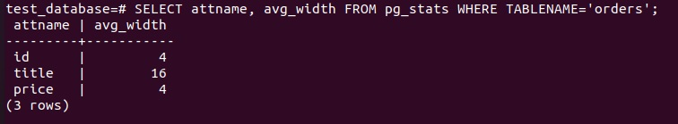  

## Задача 3
Архитектор и администратор БД выяснили, что ваша таблица orders разрослась до невиданных размеров и
поиск по ней занимает долгое время. Вам, как успешному выпускнику курсов DevOps в нетологии предложили
провести разбиение таблицы на 2 (шардировать на orders_1 - price>499 и orders_2 - price<=499).
SQL-транзакции для проведения данной операции:  
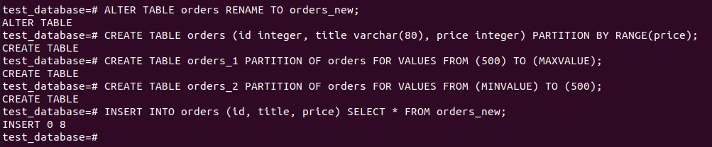  
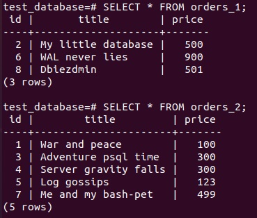  

Можно ли было изначально исключить "ручное" разбиение при проектировании таблицы orders?
 - Ручного разбиения можно было исбежать, если при изначальном проектировании сделать таблицу как секционарованную.

## Задача 4
Используя утилиту `pg_dump` создал бекап БД `test_database`:  
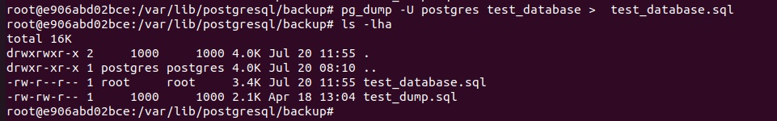  

Как бы вы доработали бэкап-файл, чтобы добавить уникальность значения столбца `title` для таблиц `test_database`?
 - Доработать файл бекапа можно следующим образом, добавив UNIQUE(title):
```
CREATE TABLE public.orders (
    id integer NOT NULL,
    title character varying(80) NOT NULL,
    price integer DEFAULT 0,
    UNIQUE(title)
);
```

---
