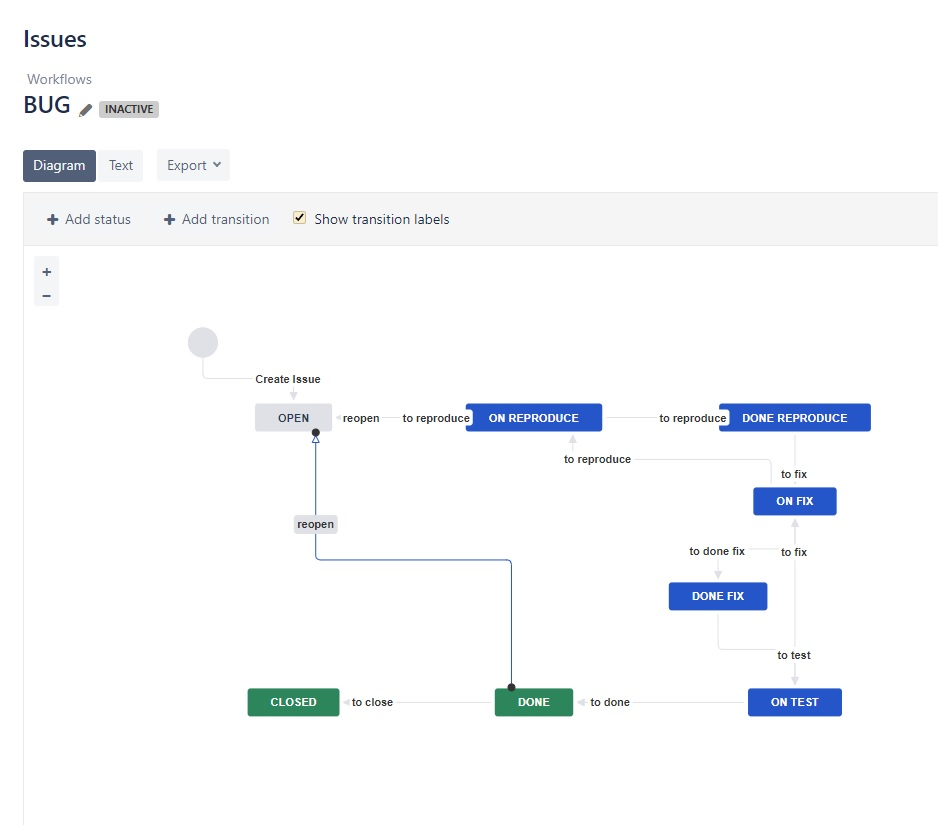
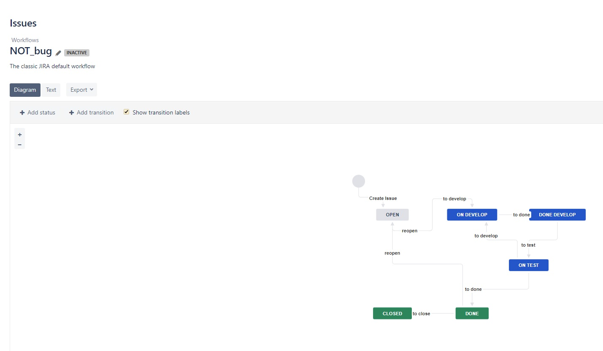

# Домашнее задание к занятию "09.01 Жизненный цикл ПО"

## Подготовка к выполнению
1. Получил бесплатную [JIRA](https://www.atlassian.com/ru/software/jira/free)
> Выполнено.

2. Настроил её для своей "команды разработки"
> Выполнено.

3. Создал доски kanban и scrum
> Выполнено.

## Основная часть
В рамках основной части создал собственные workflow для двух типов задач: bug и остальные типы задач.  
Задачи типа bug проходят следующий жизненный цикл:  
1. Open -> On reproduce  
2. On reproduce -> Open, Done reproduce  
3. Done reproduce -> On fix  
4. On fix -> On reproduce, Done fix  
5. Done fix -> On test  
6. On test -> On fix, Done  
7. Done -> Closed, Open  
  

Остальные задачи проходят по упрощённому workflow:  
1. Open -> On develop  
2. On develop -> Open, Done develop  
3. Done develop -> On test 
4. On test -> On develop, Done  
5. Done -> Closed, Open  
  

Создал задачу с типом bug, попытался провести его по всему workflow до Done. Создал задачу с типом epic, к ней привязал несколько задач с типом task, провёл их по всему workflow до Done. При проведении обеих задач по статусам использовать kanban. Вернул задачи в статус Open.
> Выполнено.

Перешёл в scrum, запланировал новый спринт, состоящий из задач эпика и одного бага, стартовал спринт, провёл задачи до состояния Closed. Закрыл спринт.
> Выполнено.
 
Всё отработало в рамках ожидания - выгрузил схемы workflow для импорта в XML. Файлы с workflow приложил к решению задания.  
[BUG.xml](https://github.com/lint707/devops-netology-1/blob/main/Homework/file/BUG.xml)  
[NOT_bug.xml](https://github.com/lint707/devops-netology-1/blob/main/Homework/file/NOT_bug.xml)  

---
