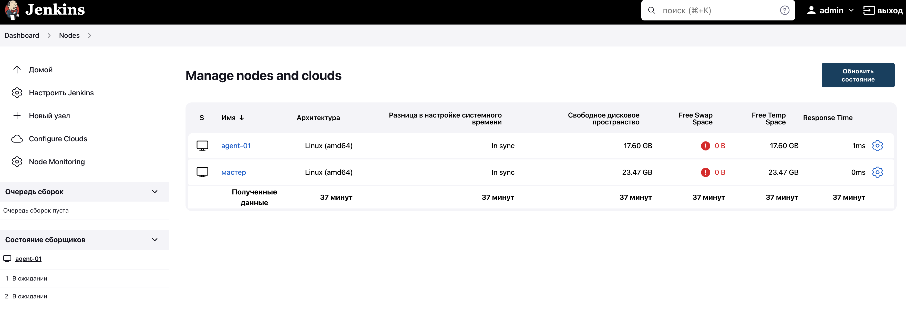
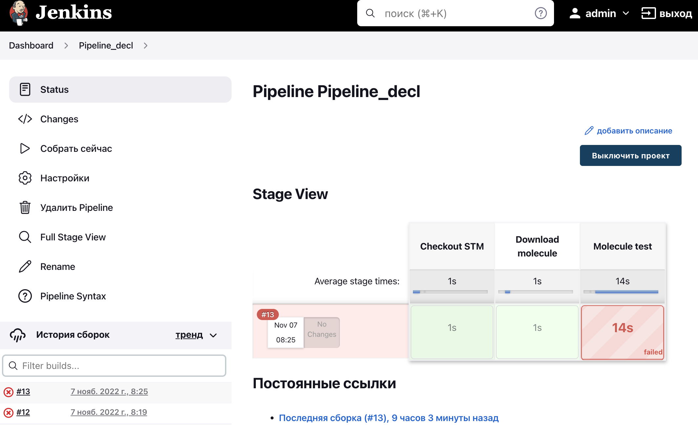
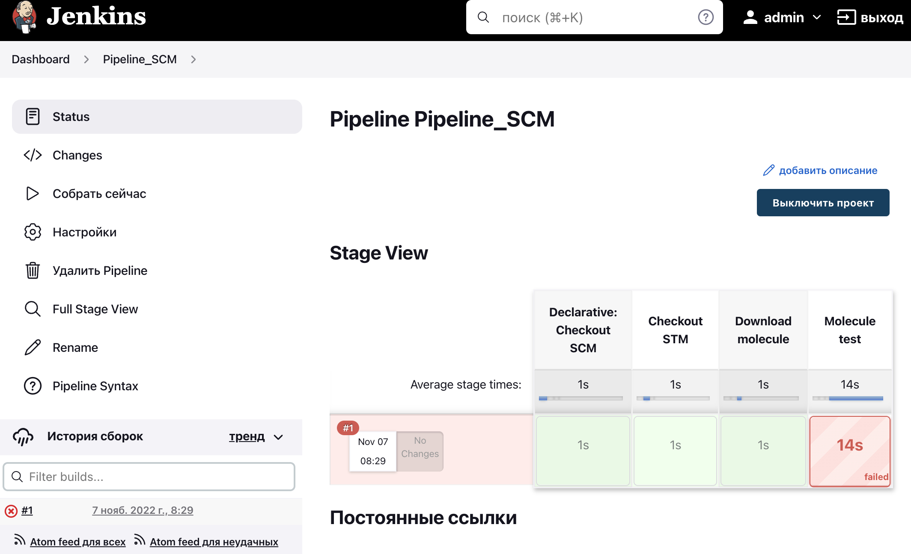
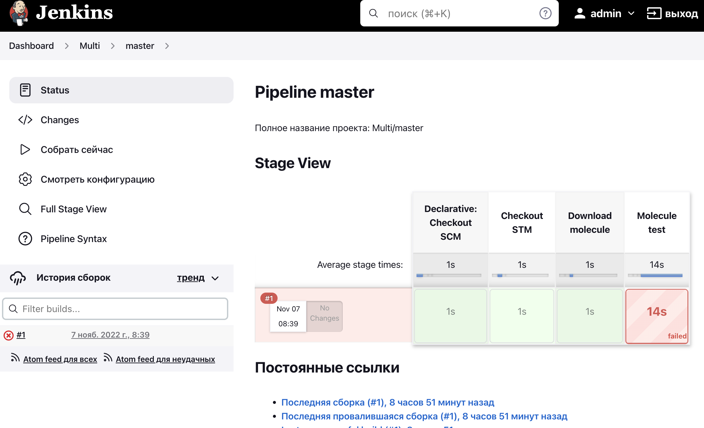
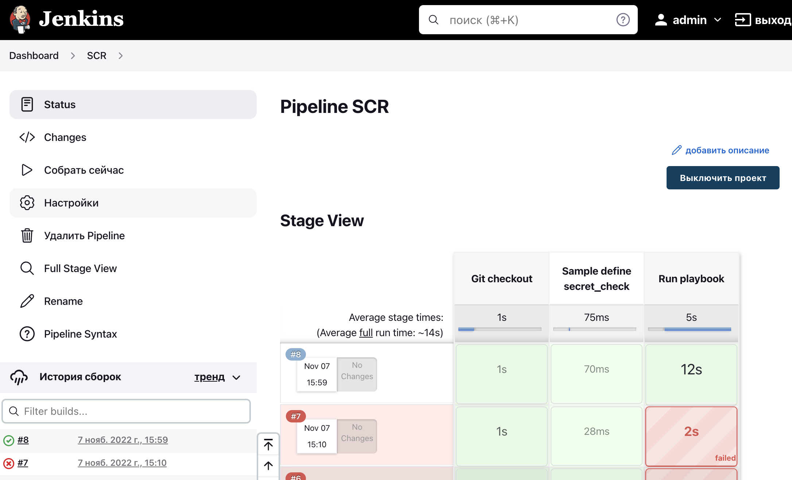

# Домашнее задание к занятию "09.04 Jenkins"

## Подготовка к выполнению

1. Создать 2 VM: для jenkins-master и jenkins-agent.
> Done  

2. Установить jenkins при помощи playbook'a.
> Done  
  
3. Запустить и проверить работоспособность.
> Done  

4. Сделать первоначальную настройку.
> Done  


## Основная часть

1. Сделать Freestyle Job, который будет запускать `molecule test` из любого вашего репозитория с ролью.
```
+ molecule test -s centos_7
/usr/local/lib/python3.6/site-packages/ansible/parsing/vault/__init__.py:44: CryptographyDeprecationWarning: Python 3.6 is no longer supported by the Python core team. Therefore, support for it is deprecated in cryptography and will be removed in a future release.
  from cryptography.exceptions import InvalidSignature
/home/jenkins/.local/lib/python3.6/site-packages/requests/__init__.py:104: RequestsDependencyWarning: urllib3 (1.26.12) or chardet (5.0.0)/charset_normalizer (2.0.12) doesn't match a supported version!
  RequestsDependencyWarning)
INFO     centos_7 scenario test matrix: dependency, lint, cleanup, destroy, syntax, create, prepare, converge, idempotence, side_effect, verify, cleanup, destroy
INFO     Performing prerun...
INFO     Set ANSIBLE_LIBRARY=/home/jenkins/.cache/ansible-compat/cbfd19/modules:/home/jenkins/.ansible/plugins/modules:/usr/share/ansible/plugins/modules
INFO     Set ANSIBLE_COLLECTIONS_PATH=/home/jenkins/.cache/ansible-compat/cbfd19/collections:/home/jenkins/.ansible/collections:/usr/share/ansible/collections
INFO     Set ANSIBLE_ROLES_PATH=/home/jenkins/.cache/ansible-compat/cbfd19/roles:/home/jenkins/.ansible/roles:/usr/share/ansible/roles:/etc/ansible/roles
INFO     Using /home/jenkins/.ansible/roles/alexeysetevoi.clickhouse symlink to current repository in order to enable Ansible to find the role using its expected full name.
INFO     Inventory /opt/jenkins_agent/workspace/Freestyle/roles/clickhouse-role/molecule/centos_7/../resources/inventory/hosts.yml linked to /home/jenkins/.cache/molecule/clickhouse-role/centos_7/inventory/hosts
INFO     Inventory /opt/jenkins_agent/workspace/Freestyle/roles/clickhouse-role/molecule/centos_7/../resources/inventory/group_vars/ linked to /home/jenkins/.cache/molecule/clickhouse-role/centos_7/inventory/group_vars
INFO     Inventory /opt/jenkins_agent/workspace/Freestyle/roles/clickhouse-role/molecule/centos_7/../resources/inventory/host_vars/ linked to /home/jenkins/.cache/molecule/clickhouse-role/centos_7/inventory/host_vars
INFO     Running centos_7 > dependency
WARNING  Skipping, missing the requirements file.
WARNING  Skipping, missing the requirements file.
INFO     Inventory /opt/jenkins_agent/workspace/Freestyle/roles/clickhouse-role/molecule/centos_7/../resources/inventory/hosts.yml linked to /home/jenkins/.cache/molecule/clickhouse-role/centos_7/inventory/hosts
INFO     Inventory /opt/jenkins_agent/workspace/Freestyle/roles/clickhouse-role/molecule/centos_7/../resources/inventory/group_vars/ linked to /home/jenkins/.cache/molecule/clickhouse-role/centos_7/inventory/group_vars
INFO     Inventory /opt/jenkins_agent/workspace/Freestyle/roles/clickhouse-role/molecule/centos_7/../resources/inventory/host_vars/ linked to /home/jenkins/.cache/molecule/clickhouse-role/centos_7/inventory/host_vars
INFO     Running centos_7 > lint
/bin/bash: yamllint: command not found
/bin/bash: line 1: ansible-lint: command not found
/bin/bash: line 2: flake8: command not found
WARNING  Retrying execution failure 127 of: y a m l l i n t   . 
 a n s i b l e - l i n t 
 f l a k e 8 

CRITICAL Lint failed with error code 127
WARNING  An error occurred during the test sequence action: 'lint'. Cleaning up.
INFO     Inventory /opt/jenkins_agent/workspace/Freestyle/roles/clickhouse-role/molecule/centos_7/../resources/inventory/hosts.yml linked to /home/jenkins/.cache/molecule/clickhouse-role/centos_7/inventory/hosts
INFO     Inventory /opt/jenkins_agent/workspace/Freestyle/roles/clickhouse-role/molecule/centos_7/../resources/inventory/group_vars/ linked to /home/jenkins/.cache/molecule/clickhouse-role/centos_7/inventory/group_vars
INFO     Inventory /opt/jenkins_agent/workspace/Freestyle/roles/clickhouse-role/molecule/centos_7/../resources/inventory/host_vars/ linked to /home/jenkins/.cache/molecule/clickhouse-role/centos_7/inventory/host_vars
INFO     Running centos_7 > cleanup
WARNING  Skipping, cleanup playbook not configured.
INFO     Inventory /opt/jenkins_agent/workspace/Freestyle/roles/clickhouse-role/molecule/centos_7/../resources/inventory/hosts.yml linked to /home/jenkins/.cache/molecule/clickhouse-role/centos_7/inventory/hosts
INFO     Inventory /opt/jenkins_agent/workspace/Freestyle/roles/clickhouse-role/molecule/centos_7/../resources/inventory/group_vars/ linked to /home/jenkins/.cache/molecule/clickhouse-role/centos_7/inventory/group_vars
INFO     Inventory /opt/jenkins_agent/workspace/Freestyle/roles/clickhouse-role/molecule/centos_7/../resources/inventory/host_vars/ linked to /home/jenkins/.cache/molecule/clickhouse-role/centos_7/inventory/host_vars
INFO     Running centos_7 > destroy
INFO     Sanity checks: 'docker'

PLAY [Destroy] *****************************************************************

TASK [Destroy molecule instance(s)] ********************************************
/usr/local/lib/python3.6/site-packages/ansible/parsing/vault/__init__.py:44: CryptographyDeprecationWarning: Python 3.6 is no longer supported by the Python core team. Therefore, support for it is deprecated in cryptography and will be removed in a future release.
  from cryptography.exceptions import InvalidSignature
changed: [localhost] => (item=centos_7)

TASK [Wait for instance(s) deletion to complete] *******************************
FAILED - RETRYING: Wait for instance(s) deletion to complete (300 retries left).
ok: [localhost] => (item=centos_7)

TASK [Delete docker networks(s)] ***********************************************

PLAY RECAP *********************************************************************
localhost                  : ok=2    changed=1    unreachable=0    failed=0    skipped=1    rescued=0    ignored=0

INFO     Pruning extra files from scenario ephemeral directory
Build step 'Execute shell' marked build as failure
Finished: FAILURE
```

2. Сделать Declarative Pipeline Job, который будет запускать `molecule test` из любого вашего репозитория с ролью.


```
+ molecule test -s centos_7
/usr/local/lib/python3.6/site-packages/ansible/parsing/vault/__init__.py:44: CryptographyDeprecationWarning: Python 3.6 is no longer supported by the Python core team. Therefore, support for it is deprecated in cryptography and will be removed in a future release.
  from cryptography.exceptions import InvalidSignature
/home/jenkins/.local/lib/python3.6/site-packages/requests/__init__.py:104: RequestsDependencyWarning: urllib3 (1.26.12) or chardet (5.0.0)/charset_normalizer (2.0.12) doesn't match a supported version!
  RequestsDependencyWarning)
INFO     centos_7 scenario test matrix: dependency, lint, cleanup, destroy, syntax, create, prepare, converge, idempotence, side_effect, verify, cleanup, destroy
INFO     Performing prerun...
INFO     Set ANSIBLE_LIBRARY=/home/jenkins/.cache/ansible-compat/6e507e/modules:/home/jenkins/.ansible/plugins/modules:/usr/share/ansible/plugins/modules
INFO     Set ANSIBLE_COLLECTIONS_PATH=/home/jenkins/.cache/ansible-compat/6e507e/collections:/home/jenkins/.ansible/collections:/usr/share/ansible/collections
INFO     Set ANSIBLE_ROLES_PATH=/home/jenkins/.cache/ansible-compat/6e507e/roles:/home/jenkins/.ansible/roles:/usr/share/ansible/roles:/etc/ansible/roles
INFO     Using /home/jenkins/.ansible/roles/alexeysetevoi.clickhouse symlink to current repository in order to enable Ansible to find the role using its expected full name.
INFO     Inventory /opt/jenkins_agent/workspace/Pipeline_decl/roles/clickhouse-role/molecule/centos_7/../resources/inventory/hosts.yml linked to /home/jenkins/.cache/molecule/clickhouse-role/centos_7/inventory/hosts
INFO     Inventory /opt/jenkins_agent/workspace/Pipeline_decl/roles/clickhouse-role/molecule/centos_7/../resources/inventory/group_vars/ linked to /home/jenkins/.cache/molecule/clickhouse-role/centos_7/inventory/group_vars
INFO     Inventory /opt/jenkins_agent/workspace/Pipeline_decl/roles/clickhouse-role/molecule/centos_7/../resources/inventory/host_vars/ linked to /home/jenkins/.cache/molecule/clickhouse-role/centos_7/inventory/host_vars
INFO     Running centos_7 > dependency
INFO     Running ansible-galaxy collection install -v --force community.docker:>=1.9.1
WARNING  Skipping, missing the requirements file.
WARNING  Skipping, missing the requirements file.
INFO     Inventory /opt/jenkins_agent/workspace/Pipeline_decl/roles/clickhouse-role/molecule/centos_7/../resources/inventory/hosts.yml linked to /home/jenkins/.cache/molecule/clickhouse-role/centos_7/inventory/hosts
INFO     Inventory /opt/jenkins_agent/workspace/Pipeline_decl/roles/clickhouse-role/molecule/centos_7/../resources/inventory/group_vars/ linked to /home/jenkins/.cache/molecule/clickhouse-role/centos_7/inventory/group_vars
INFO     Inventory /opt/jenkins_agent/workspace/Pipeline_decl/roles/clickhouse-role/molecule/centos_7/../resources/inventory/host_vars/ linked to /home/jenkins/.cache/molecule/clickhouse-role/centos_7/inventory/host_vars
INFO     Running centos_7 > lint
/bin/bash: yamllint: command not found
/bin/bash: line 1: ansible-lint: command not found
/bin/bash: line 2: flake8: command not found
WARNING  Retrying execution failure 127 of: y a m l l i n t   . 
 a n s i b l e - l i n t 
 f l a k e 8 

CRITICAL Lint failed with error code 127
WARNING  An error occurred during the test sequence action: 'lint'. Cleaning up.
INFO     Inventory /opt/jenkins_agent/workspace/Pipeline_decl/roles/clickhouse-role/molecule/centos_7/../resources/inventory/hosts.yml linked to /home/jenkins/.cache/molecule/clickhouse-role/centos_7/inventory/hosts
INFO     Inventory /opt/jenkins_agent/workspace/Pipeline_decl/roles/clickhouse-role/molecule/centos_7/../resources/inventory/group_vars/ linked to /home/jenkins/.cache/molecule/clickhouse-role/centos_7/inventory/group_vars
INFO     Inventory /opt/jenkins_agent/workspace/Pipeline_decl/roles/clickhouse-role/molecule/centos_7/../resources/inventory/host_vars/ linked to /home/jenkins/.cache/molecule/clickhouse-role/centos_7/inventory/host_vars
INFO     Running centos_7 > cleanup
WARNING  Skipping, cleanup playbook not configured.
INFO     Inventory /opt/jenkins_agent/workspace/Pipeline_decl/roles/clickhouse-role/molecule/centos_7/../resources/inventory/hosts.yml linked to /home/jenkins/.cache/molecule/clickhouse-role/centos_7/inventory/hosts
INFO     Inventory /opt/jenkins_agent/workspace/Pipeline_decl/roles/clickhouse-role/molecule/centos_7/../resources/inventory/group_vars/ linked to /home/jenkins/.cache/molecule/clickhouse-role/centos_7/inventory/group_vars
INFO     Inventory /opt/jenkins_agent/workspace/Pipeline_decl/roles/clickhouse-role/molecule/centos_7/../resources/inventory/host_vars/ linked to /home/jenkins/.cache/molecule/clickhouse-role/centos_7/inventory/host_vars
INFO     Running centos_7 > destroy
INFO     Sanity checks: 'docker'

PLAY [Destroy] *****************************************************************

TASK [Destroy molecule instance(s)] ********************************************
/usr/local/lib/python3.6/site-packages/ansible/parsing/vault/__init__.py:44: CryptographyDeprecationWarning: Python 3.6 is no longer supported by the Python core team. Therefore, support for it is deprecated in cryptography and will be removed in a future release.
  from cryptography.exceptions import InvalidSignature
changed: [localhost] => (item=centos_7)

TASK [Wait for instance(s) deletion to complete] *******************************
FAILED - RETRYING: Wait for instance(s) deletion to complete (300 retries left).
ok: [localhost] => (item=centos_7)

TASK [Delete docker networks(s)] ***********************************************

PLAY RECAP *********************************************************************
localhost                  : ok=2    changed=1    unreachable=0    failed=0    skipped=1    rescued=0    ignored=0

INFO     Pruning extra files from scenario ephemeral directory
[Pipeline] }
[Pipeline] // stage
[Pipeline] }
[Pipeline] // node
[Pipeline] End of Pipeline
ERROR: script returned exit code 1
Finished: FAILURE
```

3. Перенести Declarative Pipeline в репозиторий в файл `Jenkinsfile`.

```
+ molecule test -s centos_7
/usr/local/lib/python3.6/site-packages/ansible/parsing/vault/__init__.py:44: CryptographyDeprecationWarning: Python 3.6 is no longer supported by the Python core team. Therefore, support for it is deprecated in cryptography and will be removed in a future release.
  from cryptography.exceptions import InvalidSignature
/home/jenkins/.local/lib/python3.6/site-packages/requests/__init__.py:104: RequestsDependencyWarning: urllib3 (1.26.12) or chardet (5.0.0)/charset_normalizer (2.0.12) doesn't match a supported version!
  RequestsDependencyWarning)
INFO     centos_7 scenario test matrix: dependency, lint, cleanup, destroy, syntax, create, prepare, converge, idempotence, side_effect, verify, cleanup, destroy
INFO     Performing prerun...
INFO     Set ANSIBLE_LIBRARY=/home/jenkins/.cache/ansible-compat/5205cf/modules:/home/jenkins/.ansible/plugins/modules:/usr/share/ansible/plugins/modules
INFO     Set ANSIBLE_COLLECTIONS_PATH=/home/jenkins/.cache/ansible-compat/5205cf/collections:/home/jenkins/.ansible/collections:/usr/share/ansible/collections
INFO     Set ANSIBLE_ROLES_PATH=/home/jenkins/.cache/ansible-compat/5205cf/roles:/home/jenkins/.ansible/roles:/usr/share/ansible/roles:/etc/ansible/roles
INFO     Using /home/jenkins/.ansible/roles/alexeysetevoi.clickhouse symlink to current repository in order to enable Ansible to find the role using its expected full name.
INFO     Inventory /opt/jenkins_agent/workspace/Pipeline_SCM/roles/clickhouse-role/molecule/centos_7/../resources/inventory/hosts.yml linked to /home/jenkins/.cache/molecule/clickhouse-role/centos_7/inventory/hosts
INFO     Inventory /opt/jenkins_agent/workspace/Pipeline_SCM/roles/clickhouse-role/molecule/centos_7/../resources/inventory/group_vars/ linked to /home/jenkins/.cache/molecule/clickhouse-role/centos_7/inventory/group_vars
INFO     Inventory /opt/jenkins_agent/workspace/Pipeline_SCM/roles/clickhouse-role/molecule/centos_7/../resources/inventory/host_vars/ linked to /home/jenkins/.cache/molecule/clickhouse-role/centos_7/inventory/host_vars
INFO     Running centos_7 > dependency
INFO     Running ansible-galaxy collection install -v --force community.docker:>=1.9.1
WARNING  Skipping, missing the requirements file.
WARNING  Skipping, missing the requirements file.
INFO     Inventory /opt/jenkins_agent/workspace/Pipeline_SCM/roles/clickhouse-role/molecule/centos_7/../resources/inventory/hosts.yml linked to /home/jenkins/.cache/molecule/clickhouse-role/centos_7/inventory/hosts
INFO     Inventory /opt/jenkins_agent/workspace/Pipeline_SCM/roles/clickhouse-role/molecule/centos_7/../resources/inventory/group_vars/ linked to /home/jenkins/.cache/molecule/clickhouse-role/centos_7/inventory/group_vars
INFO     Inventory /opt/jenkins_agent/workspace/Pipeline_SCM/roles/clickhouse-role/molecule/centos_7/../resources/inventory/host_vars/ linked to /home/jenkins/.cache/molecule/clickhouse-role/centos_7/inventory/host_vars
INFO     Running centos_7 > lint
/bin/bash: yamllint: command not found
/bin/bash: line 1: ansible-lint: command not found
/bin/bash: line 2: flake8: command not found
WARNING  Retrying execution failure 127 of: y a m l l i n t   . 
 a n s i b l e - l i n t 
 f l a k e 8 

CRITICAL Lint failed with error code 127
WARNING  An error occurred during the test sequence action: 'lint'. Cleaning up.
INFO     Inventory /opt/jenkins_agent/workspace/Pipeline_SCM/roles/clickhouse-role/molecule/centos_7/../resources/inventory/hosts.yml linked to /home/jenkins/.cache/molecule/clickhouse-role/centos_7/inventory/hosts
INFO     Inventory /opt/jenkins_agent/workspace/Pipeline_SCM/roles/clickhouse-role/molecule/centos_7/../resources/inventory/group_vars/ linked to /home/jenkins/.cache/molecule/clickhouse-role/centos_7/inventory/group_vars
INFO     Inventory /opt/jenkins_agent/workspace/Pipeline_SCM/roles/clickhouse-role/molecule/centos_7/../resources/inventory/host_vars/ linked to /home/jenkins/.cache/molecule/clickhouse-role/centos_7/inventory/host_vars
INFO     Running centos_7 > cleanup
WARNING  Skipping, cleanup playbook not configured.
INFO     Inventory /opt/jenkins_agent/workspace/Pipeline_SCM/roles/clickhouse-role/molecule/centos_7/../resources/inventory/hosts.yml linked to /home/jenkins/.cache/molecule/clickhouse-role/centos_7/inventory/hosts
INFO     Inventory /opt/jenkins_agent/workspace/Pipeline_SCM/roles/clickhouse-role/molecule/centos_7/../resources/inventory/group_vars/ linked to /home/jenkins/.cache/molecule/clickhouse-role/centos_7/inventory/group_vars
INFO     Inventory /opt/jenkins_agent/workspace/Pipeline_SCM/roles/clickhouse-role/molecule/centos_7/../resources/inventory/host_vars/ linked to /home/jenkins/.cache/molecule/clickhouse-role/centos_7/inventory/host_vars
INFO     Running centos_7 > destroy
INFO     Sanity checks: 'docker'

PLAY [Destroy] *****************************************************************

TASK [Destroy molecule instance(s)] ********************************************
/usr/local/lib/python3.6/site-packages/ansible/parsing/vault/__init__.py:44: CryptographyDeprecationWarning: Python 3.6 is no longer supported by the Python core team. Therefore, support for it is deprecated in cryptography and will be removed in a future release.
  from cryptography.exceptions import InvalidSignature
changed: [localhost] => (item=centos_7)

TASK [Wait for instance(s) deletion to complete] *******************************
FAILED - RETRYING: Wait for instance(s) deletion to complete (300 retries left).
ok: [localhost] => (item=centos_7)

TASK [Delete docker networks(s)] ***********************************************

PLAY RECAP *********************************************************************
localhost                  : ok=2    changed=1    unreachable=0    failed=0    skipped=1    rescued=0    ignored=0

INFO     Pruning extra files from scenario ephemeral directory
[Pipeline] }
[Pipeline] // stage
[Pipeline] }
[Pipeline] // withEnv
[Pipeline] }
[Pipeline] // node
[Pipeline] End of Pipeline
ERROR: script returned exit code 1
Finished: FAILURE
```

4. Создать Multibranch Pipeline на запуск `Jenkinsfile` из репозитория.

```
+ molecule test -s centos_7
/usr/local/lib/python3.6/site-packages/ansible/parsing/vault/__init__.py:44: CryptographyDeprecationWarning: Python 3.6 is no longer supported by the Python core team. Therefore, support for it is deprecated in cryptography and will be removed in a future release.
  from cryptography.exceptions import InvalidSignature
/home/jenkins/.local/lib/python3.6/site-packages/requests/__init__.py:104: RequestsDependencyWarning: urllib3 (1.26.12) or chardet (5.0.0)/charset_normalizer (2.0.12) doesn't match a supported version!
  RequestsDependencyWarning)
INFO     centos_7 scenario test matrix: dependency, lint, cleanup, destroy, syntax, create, prepare, converge, idempotence, side_effect, verify, cleanup, destroy
INFO     Performing prerun...
INFO     Set ANSIBLE_LIBRARY=/home/jenkins/.cache/ansible-compat/b10dc9/modules:/home/jenkins/.ansible/plugins/modules:/usr/share/ansible/plugins/modules
INFO     Set ANSIBLE_COLLECTIONS_PATH=/home/jenkins/.cache/ansible-compat/b10dc9/collections:/home/jenkins/.ansible/collections:/usr/share/ansible/collections
INFO     Set ANSIBLE_ROLES_PATH=/home/jenkins/.cache/ansible-compat/b10dc9/roles:/home/jenkins/.ansible/roles:/usr/share/ansible/roles:/etc/ansible/roles
INFO     Using /home/jenkins/.ansible/roles/alexeysetevoi.clickhouse symlink to current repository in order to enable Ansible to find the role using its expected full name.
INFO     Inventory /opt/jenkins_agent/workspace/Multi_master/roles/clickhouse-role/molecule/centos_7/../resources/inventory/hosts.yml linked to /home/jenkins/.cache/molecule/clickhouse-role/centos_7/inventory/hosts
INFO     Inventory /opt/jenkins_agent/workspace/Multi_master/roles/clickhouse-role/molecule/centos_7/../resources/inventory/group_vars/ linked to /home/jenkins/.cache/molecule/clickhouse-role/centos_7/inventory/group_vars
INFO     Inventory /opt/jenkins_agent/workspace/Multi_master/roles/clickhouse-role/molecule/centos_7/../resources/inventory/host_vars/ linked to /home/jenkins/.cache/molecule/clickhouse-role/centos_7/inventory/host_vars
INFO     Running centos_7 > dependency
INFO     Running ansible-galaxy collection install -v --force community.docker:>=1.9.1
WARNING  Skipping, missing the requirements file.
WARNING  Skipping, missing the requirements file.
INFO     Inventory /opt/jenkins_agent/workspace/Multi_master/roles/clickhouse-role/molecule/centos_7/../resources/inventory/hosts.yml linked to /home/jenkins/.cache/molecule/clickhouse-role/centos_7/inventory/hosts
INFO     Inventory /opt/jenkins_agent/workspace/Multi_master/roles/clickhouse-role/molecule/centos_7/../resources/inventory/group_vars/ linked to /home/jenkins/.cache/molecule/clickhouse-role/centos_7/inventory/group_vars
INFO     Inventory /opt/jenkins_agent/workspace/Multi_master/roles/clickhouse-role/molecule/centos_7/../resources/inventory/host_vars/ linked to /home/jenkins/.cache/molecule/clickhouse-role/centos_7/inventory/host_vars
INFO     Running centos_7 > lint
/bin/bash: yamllint: command not found
/bin/bash: line 1: ansible-lint: command not found
/bin/bash: line 2: flake8: command not found
WARNING  Retrying execution failure 127 of: y a m l l i n t   . 
 a n s i b l e - l i n t 
 f l a k e 8 

CRITICAL Lint failed with error code 127
WARNING  An error occurred during the test sequence action: 'lint'. Cleaning up.
INFO     Inventory /opt/jenkins_agent/workspace/Multi_master/roles/clickhouse-role/molecule/centos_7/../resources/inventory/hosts.yml linked to /home/jenkins/.cache/molecule/clickhouse-role/centos_7/inventory/hosts
INFO     Inventory /opt/jenkins_agent/workspace/Multi_master/roles/clickhouse-role/molecule/centos_7/../resources/inventory/group_vars/ linked to /home/jenkins/.cache/molecule/clickhouse-role/centos_7/inventory/group_vars
INFO     Inventory /opt/jenkins_agent/workspace/Multi_master/roles/clickhouse-role/molecule/centos_7/../resources/inventory/host_vars/ linked to /home/jenkins/.cache/molecule/clickhouse-role/centos_7/inventory/host_vars
INFO     Running centos_7 > cleanup
WARNING  Skipping, cleanup playbook not configured.
INFO     Inventory /opt/jenkins_agent/workspace/Multi_master/roles/clickhouse-role/molecule/centos_7/../resources/inventory/hosts.yml linked to /home/jenkins/.cache/molecule/clickhouse-role/centos_7/inventory/hosts
INFO     Inventory /opt/jenkins_agent/workspace/Multi_master/roles/clickhouse-role/molecule/centos_7/../resources/inventory/group_vars/ linked to /home/jenkins/.cache/molecule/clickhouse-role/centos_7/inventory/group_vars
INFO     Inventory /opt/jenkins_agent/workspace/Multi_master/roles/clickhouse-role/molecule/centos_7/../resources/inventory/host_vars/ linked to /home/jenkins/.cache/molecule/clickhouse-role/centos_7/inventory/host_vars
INFO     Running centos_7 > destroy
INFO     Sanity checks: 'docker'

PLAY [Destroy] *****************************************************************

TASK [Destroy molecule instance(s)] ********************************************
/usr/local/lib/python3.6/site-packages/ansible/parsing/vault/__init__.py:44: CryptographyDeprecationWarning: Python 3.6 is no longer supported by the Python core team. Therefore, support for it is deprecated in cryptography and will be removed in a future release.
  from cryptography.exceptions import InvalidSignature
changed: [localhost] => (item=centos_7)

TASK [Wait for instance(s) deletion to complete] *******************************
FAILED - RETRYING: Wait for instance(s) deletion to complete (300 retries left).
ok: [localhost] => (item=centos_7)

TASK [Delete docker networks(s)] ***********************************************

PLAY RECAP *********************************************************************
localhost                  : ok=2    changed=1    unreachable=0    failed=0    skipped=1    rescued=0    ignored=0

INFO     Pruning extra files from scenario ephemeral directory
[Pipeline] }
[Pipeline] // stage
[Pipeline] }
[Pipeline] // withEnv
[Pipeline] }
[Pipeline] // node
[Pipeline] End of Pipeline
ERROR: script returned exit code 1
Finished: FAILURE
```

5. Создать Scripted Pipeline, наполнить его скриптом из [pipeline](./pipeline).
> Done  

6. Внести необходимые изменения, чтобы Pipeline запускал `ansible-playbook` без флагов `--check --diff`, если не установлен параметр при запуске джобы (prod_run = True), по умолчанию параметр имеет значение False и запускает прогон с флагами `--check --diff`.
```
node("linux"){
    stage("Git checkout"){
        git branch: 'master', credentialsId: 'e840b753-6713-44d0-a1f3-6964d19b46b9', url: 'git@github.com:aragastmatb/example-playbook.git'
    }
    stage("Sample define secret_check"){
        secret_check=true
    }
    stage("Run playbook"){
        if (secret_check){
            sh 'ansible-playbook site.yml -i inventory/prod.yml'
        }
        else{
            echo 'need more action'
        }
        
    }
}
```


```
Started by user admin
[Pipeline] Start of Pipeline
[Pipeline] node
Running on agent-01 in /opt/jenkins_agent/workspace/SCR
[Pipeline] {
[Pipeline] stage
[Pipeline] { (Git checkout)
[Pipeline] git
The recommended git tool is: NONE
using credential e840b753-6713-44d0-a1f3-6964d19b46b9
Fetching changes from the remote Git repository
 > git rev-parse --resolve-git-dir /opt/jenkins_agent/workspace/SCR/.git # timeout=10
 > git config remote.origin.url git@github.com:aragastmatb/example-playbook.git # timeout=10
Fetching upstream changes from git@github.com:aragastmatb/example-playbook.git
 > git --version # timeout=10
 > git --version # 'git version 1.8.3.1'
using GIT_SSH to set credentials 
[INFO] Currently running in a labeled security context
[INFO] Currently SELinux is 'enforcing' on the host
 > /usr/bin/chcon --type=ssh_home_t /opt/jenkins_agent/workspace/SCR@tmp/jenkins-gitclient-ssh4536026209918068176.key
Verifying host key using known hosts file
 > git fetch --tags --progress git@github.com:aragastmatb/example-playbook.git +refs/heads/*:refs/remotes/origin/* # timeout=10
Checking out Revision 20bd8d945340bb742acdd9e8c1a8fb5b73cc1700 (refs/remotes/origin/master)
Commit message: "Merge branch 'master' of https://github.com/aragastmatb/example-playbook"
 > git rev-parse refs/remotes/origin/master^{commit} # timeout=10
 > git config core.sparsecheckout # timeout=10
 > git checkout -f 20bd8d945340bb742acdd9e8c1a8fb5b73cc1700 # timeout=10
 > git branch -a -v --no-abbrev # timeout=10
 > git branch -D master # timeout=10
 > git checkout -b master 20bd8d945340bb742acdd9e8c1a8fb5b73cc1700 # timeout=10
 > git rev-list --no-walk 20bd8d945340bb742acdd9e8c1a8fb5b73cc1700 # timeout=10
[Pipeline] }
[Pipeline] // stage
[Pipeline] stage
[Pipeline] { (Sample define secret_check)
[Pipeline] }
[Pipeline] // stage
[Pipeline] stage
[Pipeline] { (Run playbook)
[Pipeline] sh
+ ansible-playbook site.yml -i inventory/prod.yml

PLAY [Install Java] ************************************************************

TASK [Gathering Facts] *********************************************************
/usr/local/lib/python3.6/site-packages/ansible/parsing/vault/__init__.py:44: CryptographyDeprecationWarning: Python 3.6 is no longer supported by the Python core team. Therefore, support for it is deprecated in cryptography and will be removed in a future release.
  from cryptography.exceptions import InvalidSignature
ok: [localhost]

TASK [java : Upload .tar.gz file containing binaries from local storage] *******
skipping: [localhost]

TASK [java : Upload .tar.gz file conaining binaries from remote storage] *******
ok: [localhost]

TASK [java : Ensure installation dir exists] ***********************************
changed: [localhost]

TASK [java : Extract java in the installation directory] ***********************
changed: [localhost]

TASK [java : Export environment variables] *************************************
changed: [localhost]

PLAY RECAP *********************************************************************
localhost                  : ok=5    changed=3    unreachable=0    failed=0    skipped=1    rescued=0    ignored=0   

[Pipeline] }
[Pipeline] // stage
[Pipeline] }
[Pipeline] // node
[Pipeline] End of Pipeline
Finished: SUCCESS
```

7. Проверить работоспособность, исправить ошибки, исправленный Pipeline вложить в репозиторий в файл `ScriptedJenkinsfile`.  
[ScriptedJenkinsfile](file/ScriptedJenkinsfile)  

8. Отправить ссылку на репозиторий с ролью и Declarative Pipeline и Scripted Pipeline.  
[Declarative Pipeline](https://github.com/lint707/playbook_ntl.git)  
[Scripted Pipeline](https://github.com/aragastmatb/example-playbook.git)  
---

### Как оформить ДЗ?
