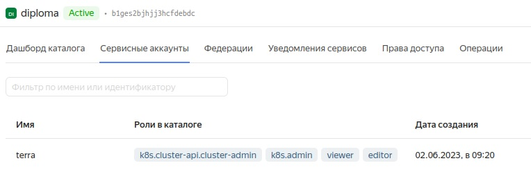
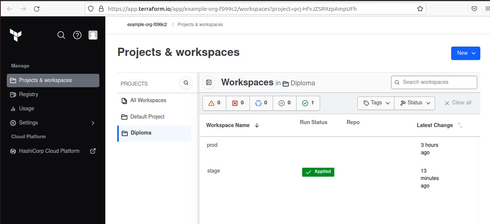
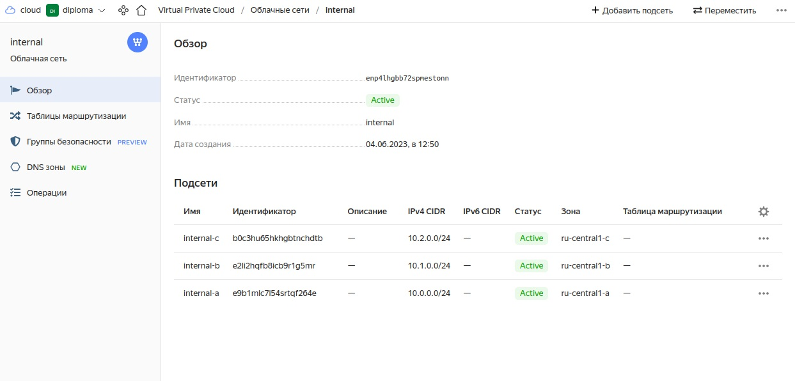
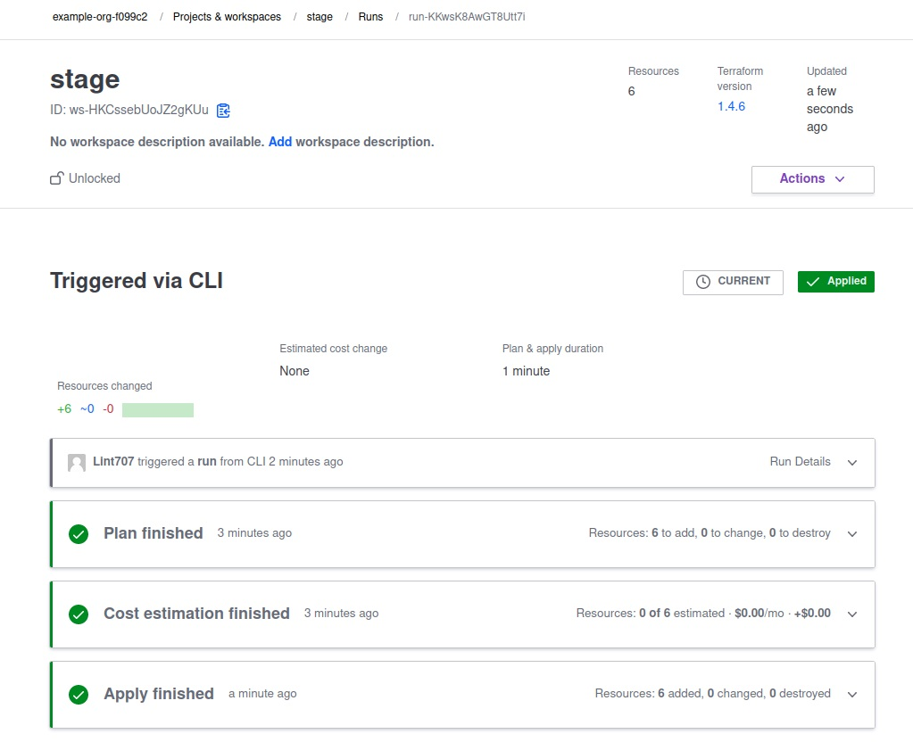
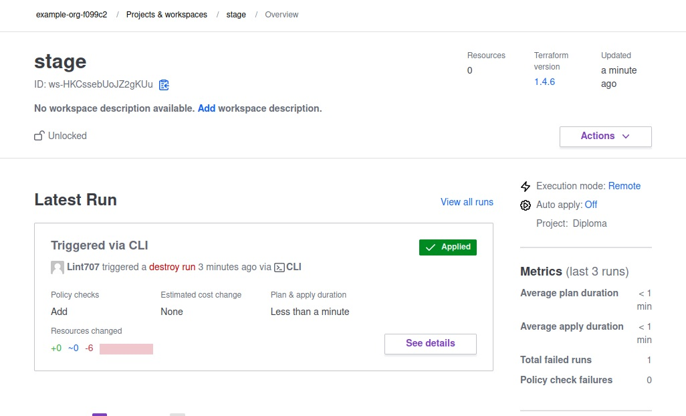

 Дипломный практикум в Yandex.Cloud

---
## Этапы выполнения:

### Создание облачной инфраструктуры

Подготовка облачной инфраструктуру в ЯО при помощи [Terraform](https://www.terraform.io/).

Предварительная подготовка к установке и запуску Kubernetes кластера.

1. Создал сервисный аккаунт `terra`, который будет в дальнейшем использоваться `Terraform` для работы с инфраструктурой с необходимыми и достаточными правами:  
  

2. Подготовил [backend](https://www.terraform.io/docs/language/settings/backends/index.html) спользуя [Terraform Cloud](https://app.terraform.io/).
3. Настроил [workspaces](https://www.terraform.io/docs/language/state/workspaces.html):  
  
  
4. Создал VPC с подсетями в разных зонах доступности:  
  
  
5. Убедился, что теперь могу выполнить команды `terraform destroy` и `terraform apply` без дополнительных ручных действий:
[terraform apply](file/apply.txt)
[terraform destroy](file/destroy.txt)

6. Убедился, что применение изменений успешно проходит, используя web-интерфейс Terraform cloud.
  
  
  

Ожидаемые результаты:
1. Terraform сконфигурирован и создание инфраструктуры посредством Terraform возможно без дополнительных ручных действий.  
2. Полученная конфигурация инфраструктуры является предварительной, поэтому в ходе дальнейшего выполнения задания возможны изменения.  

[main.tf](mf/main.tf)  
[network.tf](mf/network.tf)  
[provider.tf](mf/provider.tf)  
[versions.tf](mf/versions.tf)  
[backend.tf](mf/backend.tf)  
