 Дипломный практикум в Yandex.Cloud

---

<details>
    <summary><b>Цели:</b></summary>
1. Подготовить облачную инфраструктуру на базе облачного провайдера Яндекс.Облако.
2. Запустить и сконфигурировать Kubernetes кластер.
3. Установить и настроить систему мониторинга.
4. Настроить и автоматизировать сборку тестового приложения с использованием Docker-контейнеров.
5. Настроить CI для автоматической сборки и тестирования.
6. Настроить CD для автоматического развёртывания приложения.
</details>

---

## Этапы выполнения:


### Создание облачной инфраструктуры

Подготовка облачной инфраструктуру в ЯО при помощи [Terraform](https://www.terraform.io/).

Предварительная подготовка к установке и запуску Kubernetes кластера.

1. Создал сервисный аккаунт `terra`, который будет в дальнейшем использоваться `Terraform` для работы с инфраструктурой с необходимыми и достаточными правами:  
  

2. Подготовил [backend](https://www.terraform.io/docs/language/settings/backends/index.html) спользуя [Terraform Cloud](https://app.terraform.io/).
3. Настроил [workspaces](https://www.terraform.io/docs/language/state/workspaces.html):  
  
  
4. Создал VPC с подсетями в разных зонах доступности:  
  
  
5. Убедился, что теперь могу выполнить команды `terraform destroy` и `terraform apply` без дополнительных ручных действий:
[terraform apply](file/apply.txt)
[terraform destroy](file/destroy.txt)

6. Убедился, что применение изменений успешно проходит, используя web-интерфейс Terraform cloud.
  
  
  

Ожидаемые результаты:
1. Terraform сконфигурирован и создание инфраструктуры посредством Terraform возможно без дополнительных ручных действий.  
2. Полученная конфигурация инфраструктуры является предварительной, поэтому в ходе дальнейшего выполнения задания возможны изменения.  

---
### Создание Kubernetes кластера  

2. Альтернативный вариант: воспользовался сервисом [Yandex Managed Service for Kubernetes](https://cloud.yandex.ru/services/managed-kubernetes)  
  а. С помощью terraform resource для [kubernetes](https://registry.terraform.io/providers/yandex-cloud/yandex/latest/docs/resources/kubernetes_cluster) создать региональный мастер kubernetes с размещением нод в разных 3 подсетях      
    
Результат:  
1. Работоспособный Kubernetes кластер:   
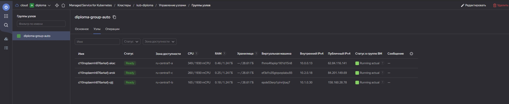  

2. В файле `~/.kube/config` находятся данные для доступа к кластеру:   
```
user@user-VirtualBox:~/.kube$ cat config 
apiVersion: v1
clusters:
- cluster:
    certificate-authority-data: *******==
    server: https://51.250.67.27
  name: yc-managed-k8s-cat4nie0akus8hfv58h7
contexts:
- context:
    cluster: yc-managed-k8s-cat4nie0akus8hfv58h7
    user: yc-managed-k8s-cat4nie0akus8hfv58h7
  name: yc-kub-diploma
current-context: yc-kub-diploma
kind: Config
preferences: {}
users:
- name: yc-managed-k8s-cat431sqh0j8d26eik42
  user:
    exec:
      apiVersion: client.authentication.k8s.io/v1beta1
      args:
      - k8s
      - create-token
      - --profile=terradiploma
      command: /home/user/yandex-cloud/bin/yc
      env: null
      interactiveMode: IfAvailable
      provideClusterInfo: false
- name: yc-managed-k8s-cat4nie0akus8hfv58h7
  user:
    exec:
      apiVersion: client.authentication.k8s.io/v1beta1
      args:
      - k8s
      - create-token
      - --profile=terradiploma
      command: /home/user/yandex-cloud/bin/yc
      env: null
      provideClusterInfo: false
```

3. Команда `kubectl get pods --all-namespaces` отрабатывает без ошибок:  
```
kubectl get pods --all-namespaces 
NAMESPACE     NAME                                   READY   STATUS    RESTARTS   AGE
kube-system   coredns-66f79ddf7b-66ndm               1/1     Running   0          8m43s
kube-system   coredns-66f79ddf7b-z7j7r               1/1     Running   0          12m
kube-system   ip-masq-agent-b7jhg                    1/1     Running   0          9m15s
kube-system   ip-masq-agent-l8cgc                    1/1     Running   0          9m2s
kube-system   ip-masq-agent-w7s7l                    1/1     Running   0          9m15s
kube-system   kube-dns-autoscaler-65956d889d-9rxv8   1/1     Running   0          12m
kube-system   kube-proxy-62gc9                       1/1     Running   0          9m15s
kube-system   kube-proxy-6tsrm                       1/1     Running   0          9m2s
kube-system   kube-proxy-hlqfl                       1/1     Running   0          9m15s
kube-system   metrics-server-79f848fbc6-qk7jf        2/2     Running   0          8m23s
kube-system   npd-v0.8.0-k88g7                       1/1     Running   0          9m2s
kube-system   npd-v0.8.0-n2mrr                       1/1     Running   0          9m15s
kube-system   npd-v0.8.0-tn4x7                       1/1     Running   0          9m15s
kube-system   yc-disk-csi-node-v2-6ghnv              6/6     Running   0          9m15s
kube-system   yc-disk-csi-node-v2-cn4w2              6/6     Running   0          9m15s
kube-system   yc-disk-csi-node-v2-jkk69              6/6     Running   0          9m2s
```
---

[main.tf](mf/main.tf)  
[network.tf](mf/network.tf)  
[provider.tf](mf/provider.tf)  
[versions.tf](mf/versions.tf)  
[backend.tf](mf/backend.tf)  
[service-accounts.tf](mf/service-accounts.tf)  

---
### Создание тестового приложения

Подготовил тестовое приложение, эмулирующее основное приложение разрабатываемое вашей компанией.
1. Рекомендуемый вариант:  
   а. Создал отдельный git репозиторий с простым nginx конфигом, который будет отдавать статические данные.  
   б. Подготовил Dockerfile для создания образа приложения.  

##### Результат:
1. [Git репозиторий с тестовым приложением и Dockerfile](https://github.com/lint707/nginx_diploma)
2. Регистр с собранным docker image в DockerHub: [nginx_diploma](https://hub.docker.com/repository/docker/lint707/nginx_diploma/general)

---
### Установка и настройка CI/CD  

Настроил ci/cd систему для автоматической сборки docker image и деплоя приложения при изменении кода.  
Цель:  
1. Автоматическая сборка docker образа при коммите в репозиторий с тестовым приложением.  
`2. Автоматический деплой нового docker образа.`  

Использовал [jenkins](https://www.jenkins.io/).  

Ожидаемый результат:  

1. Интерфейс ci/cd сервиса доступен по http.  
Создал новый проэкт:  
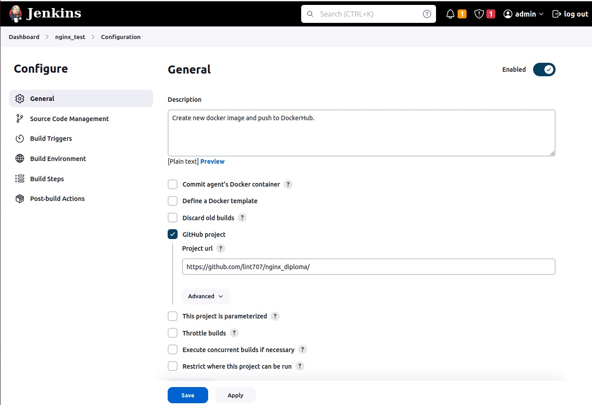   
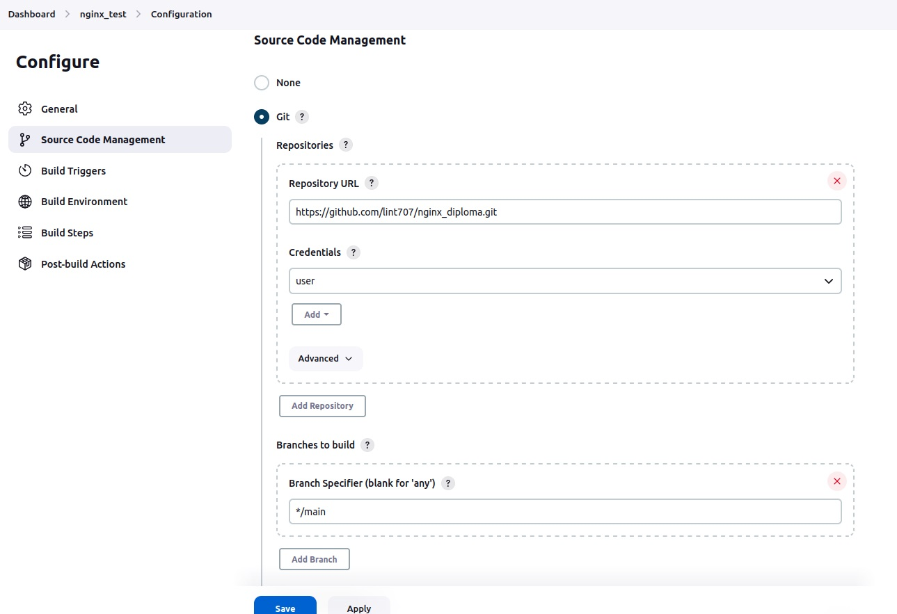  
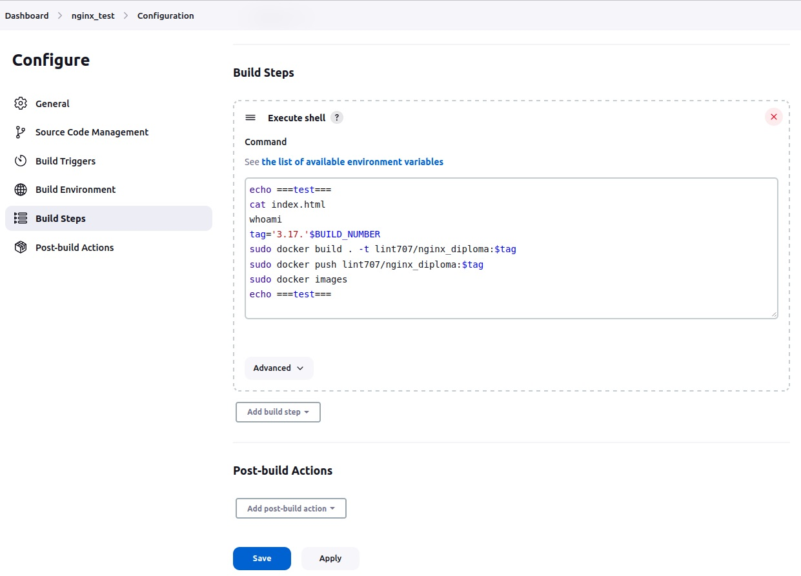  

2. При любом коммите в репозиторие с тестовым приложением происходит сборка и отправка в регистр Docker образа.  
Настройл webhook в github:  
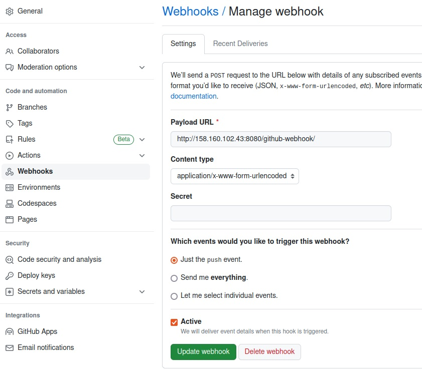  

Для проверки выполнил изменеия в репозитории, в index.html:  
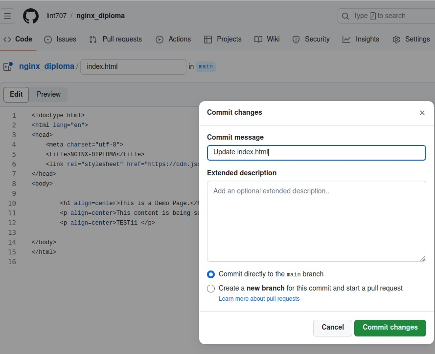   

Создался и успешно отработал Build#28:  
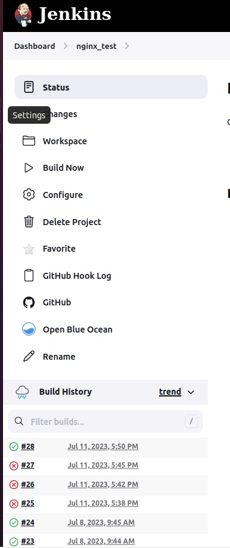  
Вывод в [console output.txt](file/output.txt).  

В Docker-Hub, добавилась новая сборка с новым тегом:  
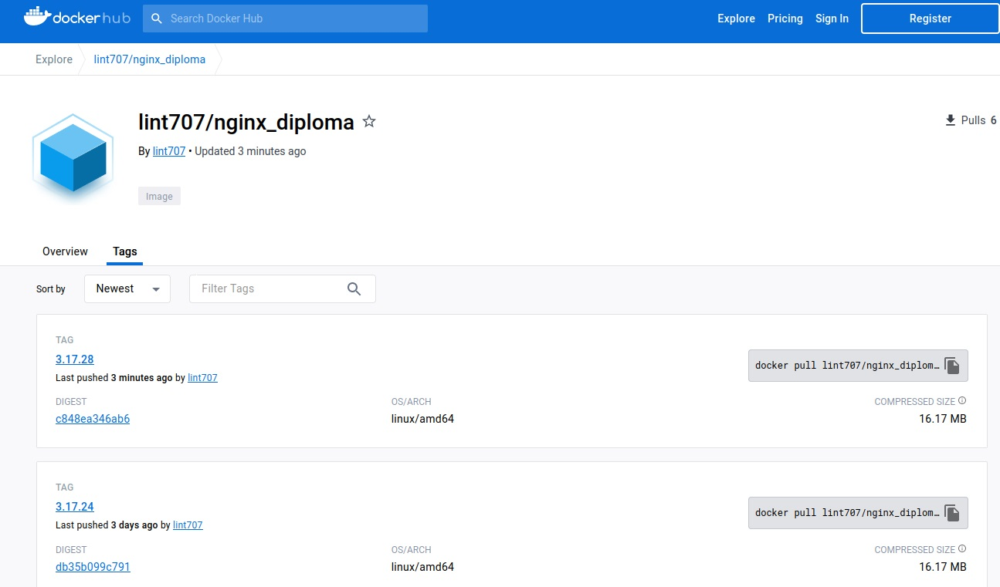  


`3. При создании тега (например, v1.0.0) происходит сборка и отправка с соответствующим label в регистр, а также деплой соответствующего Docker образа в кластер Kubernetes.`  

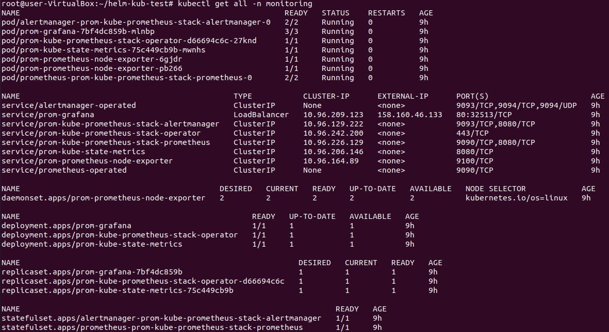  
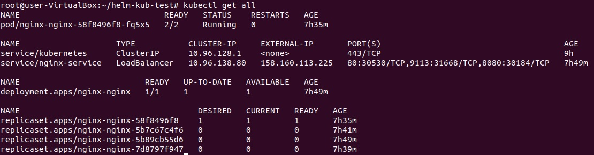  
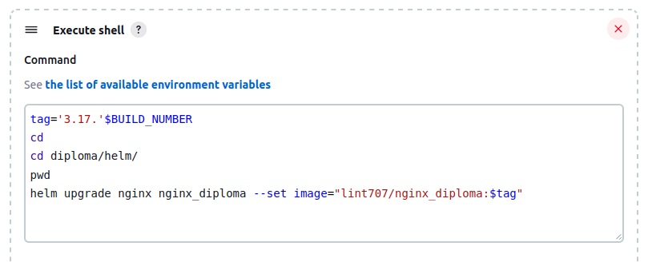  
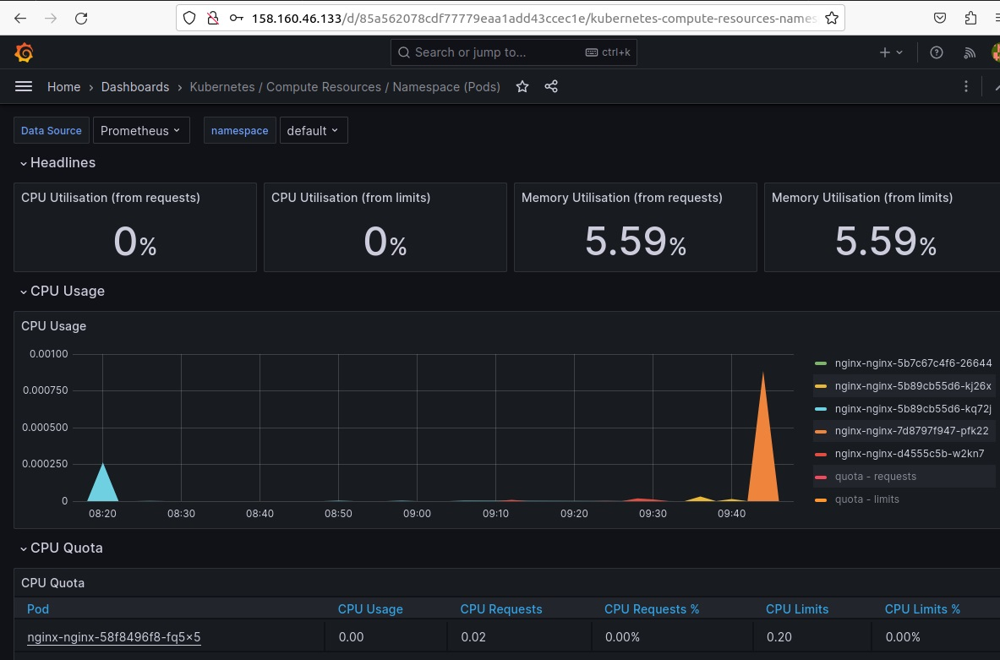  
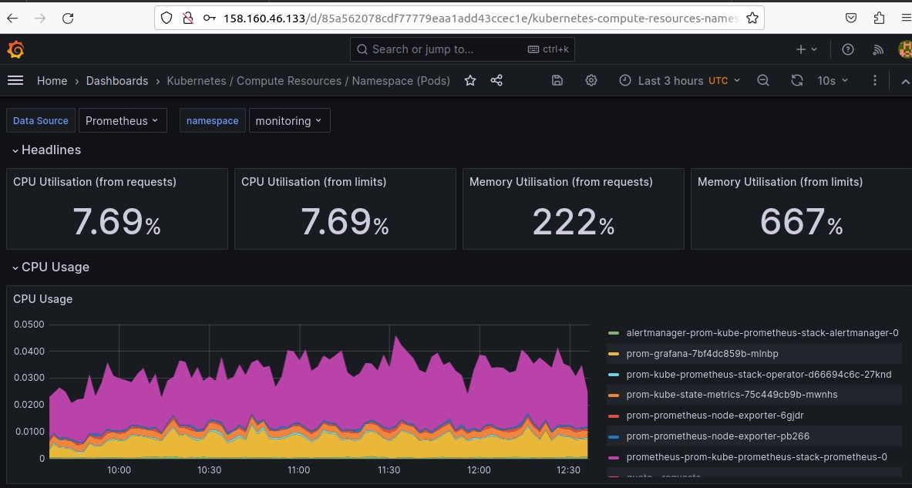  
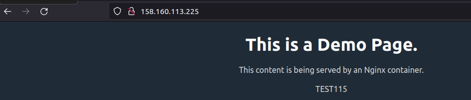  
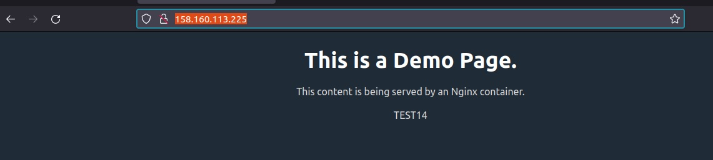  

---
